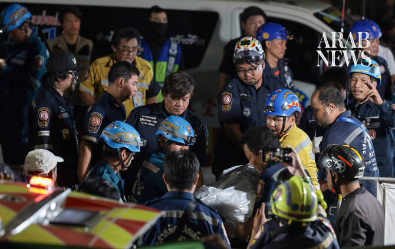

# Fire breaks out at a pub in Bangkok, killing at least 27 people

Source: https://www.arabnews.com/node/2650675/world
Captured source: https://www.arabnews.com/node/2650675/world
Published: 2026-07-13T02:05:58+03:00
Modified: 2026-07-13T03:23:10+03:00
Author: AP

## Summary

BANGKOK: A huge fire engulfed a pub in Bangkok early on Monday morning, killing at least 27 people before firefighters brought the blaze under control, officials said. Footage shared online by first responders shows a huge blaze raging and plumes coming out of the front door of the Na Ladprao pub in the northern part of the Thai capital. People are seen trying to flee as thick

## Image

## Video Or Embed URLs

- https://www.youtube.com/embed/pus4O0tow2g?si=hZo2xPnZzWWAgTaO
- https://2886c7c979c6e8ef5cb5be7667e4157d.safeframe.googlesyndication.com/safeframe/1-0-45/html/container.html
- https://static.addtoany.com/menu/sm.25.html
- about:blank
- https://gum.criteo.com/syncframe?origin=publishertagids&topUrl=www.arabnews.com&gdpr=0&gdpr_consent=&gpp=&gpp_sid=-1
- https://imasdk.googleapis.com/js/core/bridge3.774.0_en.html
- https://sync.teads.tv/wigo-no-slot
- https://www.google.com/recaptcha/api2/aframe
- https://cm.g.doubleclick.net/partnerpixels?gdpr=0&us_privacy=1---&gpp_sid=-1&url=https%3A%2F%2Fwww.arabnews.com%2Fnode%2F2650675%2Fworld

## Downloaded Video

- [01_fire-breaks-out-at-a-pub-in-bangkok-killing-at-least-27-people.mp4](../../../rendered-clips/2026-07-13/01_fire-breaks-out-at-a-pub-in-bangkok-killing-at-least-27-people.mp4)

## Text

https://arab.news/bwvwb

A huge fire broke out at a Bangkok pub, killing at least 27 people

BANGKOK: A huge fire engulfed a pub in Bangkok early on Monday morning, killing at least 27 people before firefighters brought the blaze under control, officials said. Footage shared online by first responders shows a huge blaze raging and plumes coming out of the front door of the Na Ladprao pub in the northern part of the Thai capital. People are seen trying to flee as thick black smoke billows into the sky. Rescuers said the fire was reported around midnight. Thailand Prime Minister Anutin Charnvirakul told reporters at the scene that 27 people died and that several of the injured have been taken to the hospital. He said the cause of the fire is under investigation.

Anutin said a musician who was performing at the pub told him that he saw smoke coming out of a circuit breaker near the stage before the power went out, then an explosion was heard and thick smoke quickly filled the place. Many of victims were found in the restrooms, at the back of the pub, Anutin added. Firefighters took about half an hour to bring the fire under control. Photos of the aftermath show charred tables and chairs, and the damaged interior of the pub. Thailand has seen similar tragedies in the past. In 2022, 14 people were killed by a fire at a music pub in the eastern part of the country. And more than a decade before that, 66 people were killed and more than 200 injured in a fire during a Jan. 1, 2009 New Year’s Eve celebration at the Santika nightclub in Thailand’s capital. That blaze was apparently sparked by an indoor fireworks display.
