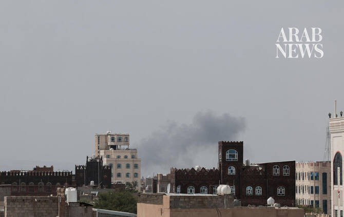

# Yemen government says it targeted Sana’a Airport to keep Iranian plane from landing

Source: https://www.arabnews.com/node/2650721/middle-east
Captured source: https://www.arabnews.com/node/2650721/middle-east
Published: 2026-07-13T14:41:20+03:00
Modified: 2026-07-13T15:04:41+03:00
Author: Arab News

## Summary

DUBAI: Yemen’s armed forces said they targeted the runway at Sana’a Airport on Monday in order to block an Iranian plane from landing. The Yemeni Ministry of Defense called for the evacuation of Sana’a Airport as authorities warned that aircraft violating Yemen’s airspace and sovereignty would be confronted. Earlier, Yemeni officials said Houthi militias had taken a Red Cross

## Image

## Video Or Embed URLs

- blob:https://www.arabnews.com/a91c51d0-b610-4467-aa54-6b6799f73224
- https://imasdk.googleapis.com/js/core/bridge3.774.0_en.html
- https://46a8e3099ee47469b4b124e51d94d372.safeframe.googlesyndication.com/safeframe/1-0-45/html/container.html
- https://static.addtoany.com/menu/sm.25.html
- about:blank
- https://gum.criteo.com/syncframe?origin=publishertagids&topUrl=www.arabnews.com&gdpr=0&gdpr_consent=&gpp=&gpp_sid=-1
- https://sync.teads.tv/wigo-no-slot
- https://www.google.com/recaptcha/api2/aframe
- https://cm.g.doubleclick.net/partnerpixels?gdpr=0&us_privacy=1---&gpp_sid=-1&url=https%3A%2F%2Fwww.arabnews.com%2Fnode%2F2650721%2Fmiddle-east

## Downloaded Video

- [01_yemen-government-says-it-targeted-sana-a-airport-to-keep-iranian-plane.mp4](../../../rendered-clips/2026-07-13/01_yemen-government-says-it-targeted-sana-a-airport-to-keep-iranian-plane.mp4)

## Text

https://arab.news/mnw6c

DUBAI: Yemen’s armed forces said they targeted the runway at Sana’a Airport on Monday in order to block an Iranian plane from landing. The Yemeni Ministry of Defense called for the evacuation of Sana’a Airport as authorities warned that aircraft violating Yemen’s airspace and sovereignty would be confronted. Earlier, Yemeni officials said Houthi militias had taken a Red Cross pilot and his assistant hostage at the airport, adding to concerns over the rapidly deteriorating situation. Chairman of the Yemeni Leadership Council Rashad Al-Alimi held the Houthi militia responsible for the latest escalation and its consequences. He said the group had insisted on proceeding with what he described as the illegal reception of an Iranian aircraft. Yemeni officials said the government had tried through several channels to persuade Iran and the Houthis to “see reason,” but warned that Tehran would be held legally and morally responsible for any violation of Yemeni airspace. “Yemen has a people and a leadership that will defend it on land, at sea, and in the air, whatever the consequences,” the armed forces said.
