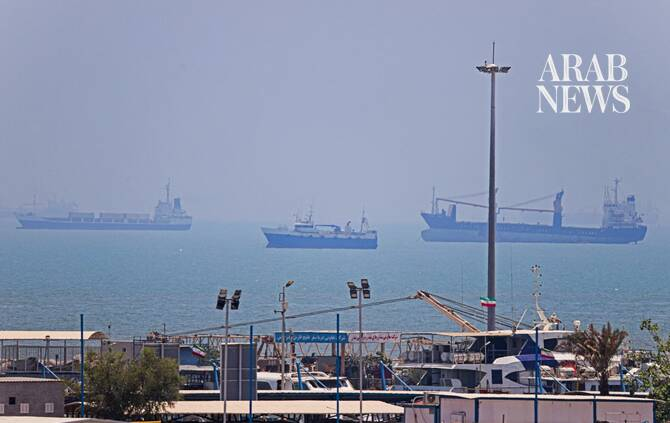

# US releases video of first sea drone strike on Iran port facility

Source: https://www.arabnews.com/node/2650771/middle-east
Captured source: https://www.arabnews.com/node/2650771/middle-east
Published: 2026-07-13T22:17:54+03:00
Modified: 2026-07-13T22:19:09+03:00
Author: Arab News

## Summary

LONDON: US forces used sea drones to strike a submarine and ship maintenance facility at Iran’s Bandar Abbas naval base on Sunday, US Central Command said on Monday. Alongside a video of the operation, the command said on X: “Yesterday, using multiple one-way attack surface drones, CENTCOM forces successfully struck a submarine and ship maintenance facility in Iran.

## Image

## Video Or Embed URLs

- blob:https://www.arabnews.com/35d1ee11-3bd5-4596-9c70-aa35c73e8a83
- https://imasdk.googleapis.com/js/core/bridge3.776.0_en.html
- https://4af1e1073d9a2347471bf9708e222fa9.safeframe.googlesyndication.com/safeframe/1-0-45/html/container.html
- https://static.addtoany.com/menu/sm.25.html
- about:blank
- https://gum.criteo.com/syncframe?origin=publishertagids&topUrl=www.arabnews.com&gdpr=0&gdpr_consent=&gpp=&gpp_sid=-1
- https://www.google.com/recaptcha/api2/aframe
- https://cm.g.doubleclick.net/partnerpixels?gdpr=0&us_privacy=1---&gpp_sid=-1&url=https%3A%2F%2Fwww.arabnews.com%2Fnode%2F2650771%2Fmiddle-east

## Downloaded Video

- [01_us-releases-video-of-first-sea-drone-strike-on-iran-port-facility.mp4](../../../rendered-clips/2026-07-14/01_us-releases-video-of-first-sea-drone-strike-on-iran-port-facility.mp4)

## Text

https://arab.news/rug7v

Operation ‘degraded Iran’s ability to continue attacking commercial shipping,’ Central Command says

Iran launches retaliatory strikes against military facilities in Kuwait, Bahrain, Jordan

LONDON: US forces used sea drones to strike a submarine and ship maintenance facility at Iran’s Bandar Abbas naval base on Sunday, US Central Command said on Monday.

Alongside a video of the operation, the command said on X: “Yesterday, using multiple one-way attack surface drones, CENTCOM forces successfully struck a submarine and ship maintenance facility in Iran.

“Three Corsair unmanned surface vessels hit the port at Bandar Abbas Naval Base, marking the first time American forces have employed sea drones in combat operations.”

The strikes “degraded Iran’s ability to continue attacking commercial shipping,” it said.

The Corsair, built by US company Saronic Technologies, is a 24-foot-long, diesel-powered autonomous vessel capable of carrying up to 1,000 pounds of payload and traveling at speeds above 35 knots, according to the Drone Warfare website.

They are part of the navy’s artificial intelligence and drone task force, which reportedly began deploying them in March.

Saronic said on X that it was proud that its technology “supported this mission” and that it remained committed to delivering autonomous maritime systems “that strengthen the security of America and its allies.”

Meanwhile, Iranian state media reported explosions on Monday in several locations, including Bandar Abbas, Sirik, Jask and Qeshm Island.

News agency IRNA said that one person was killed and four were injured when a projectile struck a water pumping station in Mahshahr county in Khuzestan province.

Iran’s Islamic Revolutionary Guard Corps said it launched retaliatory strikes against military facilities in Kuwait, Bahrain and Jordan.
