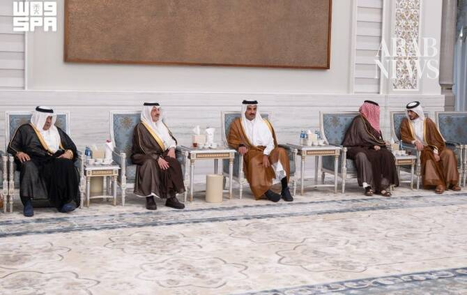

# Saudi leadership offers condolences on death of Qatar’s father emir

Source: https://www.arabnews.com/node/2650786/saudi-arabia
Captured source: https://www.arabnews.com/node/2650786/saudi-arabia
Published: 2026-07-14T01:46:24+03:00
Modified: 2026-07-14T01:59:17+03:00
Author: SPA

## Summary

RIYADH: A delegation from Saudi Arabia expressed condolences to the Emir of Qatar, Sheikh Tamim bin Hamad Al-Thani, on the passing of former Emir Sheikh Hamad bin Khalifa Al-Thani, on behalf of King Salman and Crown Prince Mohammed bin Salman. Prince Saud bin Naif bin Abdulaziz, the Governor of the Eastern Province, led the delegation to Lusail Palace in Doha on Monday, which

## Image

## Video Or Embed URLs

- blob:https://www.arabnews.com/0783a717-64ad-4f5d-96f5-367777c12a37
- https://imasdk.googleapis.com/js/core/bridge3.776.0_en.html
- https://93354821688cd1895e4009cf0a416f64.safeframe.googlesyndication.com/safeframe/1-0-45/html/container.html
- https://static.addtoany.com/menu/sm.25.html
- about:blank
- https://sync.teads.tv/wigo-no-slot
- https://www.google.com/recaptcha/api2/aframe
- https://cm.g.doubleclick.net/partnerpixels?gdpr=0&us_privacy=1---&gpp_sid=-1&url=https%3A%2F%2Fwww.arabnews.com%2Fnode%2F2650786%2Fsaudi-arabia

## Downloaded Video

- [01_saudi-leadership-offers-condolences-on-death-of-qatar-s-father-emir.mp4](../../../rendered-clips/2026-07-14/01_saudi-leadership-offers-condolences-on-death-of-qatar-s-father-emir.mp4)

## Text

https://arab.news/4prw3

Sheikh Tamim bin Hamad Al-Thani expressed his appreciation to the Saudi crown prince for his sincere fraternal sentiments

RIYADH: A delegation from Saudi Arabia expressed condolences to the Emir of Qatar, Sheikh Tamim bin Hamad Al-Thani, on the passing of former Emir Sheikh Hamad bin Khalifa Al-Thani, on behalf of King Salman and Crown Prince Mohammed bin Salman.

Prince Saud bin Naif bin Abdulaziz, the Governor of the Eastern Province, led the delegation to Lusail Palace in Doha on Monday, which included Prince Turki bin Mohammed bin Fahd bin Abdulaziz, Minister of State; Prince Abdulaziz bin Saud bin Nayef bin Abdulaziz, Minister of Interior; and Prince Saad bin Mansour bin Saad, the Saudi Ambassador to Qatar.

Earlier, Saudi crown prince expressed his condolences in a call to Sheikh Tamim on the passing of his father. Sheikh Tamim expressed his appreciation to the crown prince for his sincere fraternal sentiments.

On Monday, deputy minister for protocol affairs Abdulmajeed Al-Smari conveyed condolences to the Qatari leadership on behalf of Minister of Foreign Affairs Prince Faisal bin Farhan. He delivered the message during a visit to the Qatari embassy in Riyadh, where he met with the Qatari ambassador to Saudi Arabia, Bandar Al-Attiya.

Riyadh Governor Prince Faisal bin Bandar bin Abdulaziz has also visited the Qatari embassy to offer condolences and sympathy on the death on Sunday of Qatar’s father emir at the age of 74.
