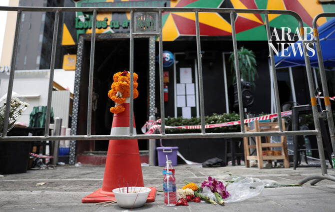

# Death toll from Bangkok music bar inferno rises to 30

Source: https://www.arabnews.com/node/2650805/world
Captured source: https://www.arabnews.com/node/2650805/world
Published: 2026-07-14T09:08:58+03:00
Modified: 2026-07-14T09:17:52+03:00
Author: AP

## Summary

BANGKOK: The death toll from a huge fire in a Bangkok music bar has increased to 30, officials said Tuesday. More than 70 people were injured, with 24 of them still in critical condition, according to a statement by the Bangkok Metropolitan Administration. The blaze at the Rong Beer Na Ladprao bar was the city’s deadliest in 17 years. It broke out late Sunday in a northern

## Image

## Video Or Embed URLs

- blob:https://www.arabnews.com/cb832ee1-12ee-445e-af0d-a6443c3e200b
- https://imasdk.googleapis.com/js/core/bridge3.776.0_en.html
- https://619221bd8cd049ec7ec58ce772995ea8.safeframe.googlesyndication.com/safeframe/1-0-45/html/container.html
- https://static.addtoany.com/menu/sm.25.html
- about:blank
- https://gum.criteo.com/syncframe?origin=publishertagids&topUrl=www.arabnews.com&gdpr=0&gdpr_consent=&gpp=&gpp_sid=-1
- https://sync.teads.tv/wigo-no-slot
- https://www.google.com/recaptcha/api2/aframe
- https://cm.g.doubleclick.net/partnerpixels?gdpr=0&us_privacy=1---&gpp_sid=-1&url=https%3A%2F%2Fwww.arabnews.com%2Fnode%2F2650805%2Fworld

## Downloaded Video

- [01_death-toll-from-bangkok-music-bar-inferno-rises-to-30.mp4](../../../rendered-clips/2026-07-14/01_death-toll-from-bangkok-music-bar-inferno-rises-to-30.mp4)

## Text

https://arab.news/mxs4k

The blaze at the Rong Beer Na Ladprao bar was the city’s deadliest in 17 years

The fire left 25 people hospitalized in critical condition, city officials said

BANGKOK: The death toll from a huge fire in a Bangkok music bar has increased to 30, officials said Tuesday.

More than 70 people were injured, with 24 of them still in critical condition, according to a statement by the Bangkok Metropolitan Administration.

The blaze at the Rong Beer Na Ladprao bar was the city’s deadliest in 17 years. It broke out late Sunday in a northern part of the Thai capital, and firefighters needed half an hour to bring it under control. The fire left 25 people hospitalized in critical condition, city officials said. Bangkok Gov. Chadchart Sittipunt said most of the deaths were caused by smoke inhalation. By daybreak Monday, the site had been cordoned off as dozens of forensic officers sought clues about what caused the fire. The bar’s street-facing windows were blown out, and debris littered the sidewalk, including charred television sets, speakers and an electric guitar. Associated Press journalists looking through the shattered windows could see empty beer bottles still sitting atop burned tables. The bar, which in Thai calls itself a brewery or beer hall, claimed to accommodate as many as 600 customers. It was not clear how many were present Sunday night. According to Bangkok’s Erawan emergency services center, 73 people were hurt. The Bangkok city government said there were 28 dead, one more than Erawan’s tally. The dead were trapped in bathrooms National Police Chief Kittharath Punpetch said most of the dead were found trapped in windowless bathrooms near one of the rear exits, where they may have sought shelter from the flames. He said the exit was not used, and people may have been blocked from reaching it by a table set up in a hall to sell candy, or because it was too dark to find the way out. Access to another exit near the kitchen might also have been narrowed by shelving units and lockers, said Kittharath, who visited the scene Monday. There were signs that at least some of the exit doors might have been locked, he added. Investigators focused on the ceiling above a performance stage, where they found materials that may have been used as decorative elements, he said. Police will examine whether flammable materials were used in the interior and how electrical wiring was installed across the ceiling. Prime Minister Anutin Charnvirakul told reporters that a musician who was performing at the bar told him he saw smoke coming out of a circuit breaker near the stage before the power went out. Then an explosion was heard, and thick smoke quickly filled the place. Video posted on social media showed people fleeing as flames shot out of the single-story building and black smoke billowed into the sky. Buddhist monks prayed for the dead Several Buddhist monks visited the site Monday to pray for the victims, while nurses handed out face masks to help protect people from lingering smoke and fumes from the building. A registration site was set up to gather information from relatives looking for loved ones. Singer Sukanya Wongwongwai said she was performing nearby when she heard about the fire and rushed to the scene because several of her bandmates were performing at the bar. She said one of them died, three were hospitalized and one had not been located. Her band later announced on Facebook that the missing member was also found hospitalized. “From what I heard from people who were inside when the fire started, everything went dark. The power was out, and there was smoke everywhere, so they couldn’t locate other people,” she said. In a statement posted on Facebook, the bar offered apologies and condolences and said it was cooperating with investigators. It said the bar’s owner suffered serious injuries and was in an intensive care unit. Mourning family members identify the dead at a morgue Family members gathered at Bangkok’s Institute of Forensic Medicine to identify the dead. Keo Oudone Poungpany, 24, was at the institute to identify his younger brother’s body. Both of the brothers, migrant workers from neighboring Laos, were working as bar employees when the fire broke out. Poungpany said he was using a restroom outside the bar when the fire began. He described walking back toward the bar and encountering dozens of people running away from the flames and hearing loud noises. From the outside the bar, he began shouting for his brother. “The heat was unbearable, I couldn’t get back in,” he said. “For now, I want to bring my younger brother’s body back home,” Poungpany said. “I want to bring him home to my parents. My parents are waiting for their kids to come back together, but now one is gone.” In 2022, 14 people were killed by a fire at a music bar in the eastern part of the country. And more than a decade before that, 67 people were killed and more than 200 injured in a fire during a Jan. 1, 2009, New Year’s Eve celebration at the Santika nightclub in Thailand’s capital. That blaze was apparently sparked by an indoor fireworks display.
