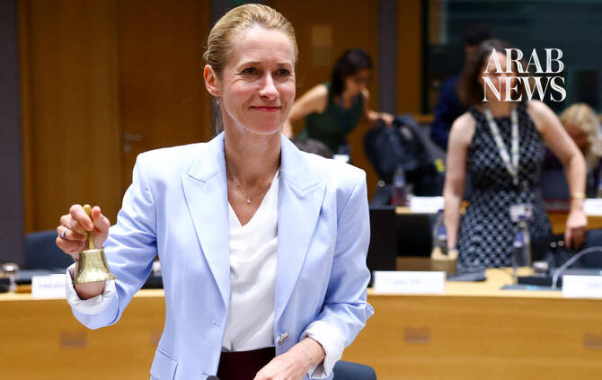

# EU scrambles to seal new Russia sanctions as deadline looms

Source: https://www.arabnews.com/node/2650829/world
Captured source: https://www.arabnews.com/node/2650829/world
Published: 2026-07-14T14:06:43+03:00
Modified: 2026-07-14T14:09:05+03:00
Author: AFP

## Summary

BRUSSELS: EU countries were scrambling Tuesday to agree a new round of sanctions on Russia, on the eve of a deadline that could weaken a key measure to tamp down Moscow’s oil revenues. Ambassadors from 27 member states were due to hold last-ditch talks in Brussels to thrash out a deal on the new package after a raft of objections held up an accord. If no agreement is found by

## Image

## Video Or Embed URLs

- blob:https://www.arabnews.com/c6f42573-93c1-4ea6-ac98-331292f73922
- https://imasdk.googleapis.com/js/core/bridge3.776.0_en.html
- https://93f9821f54ee7be10b63dc39de5b23de.safeframe.googlesyndication.com/safeframe/1-0-45/html/container.html
- https://static.addtoany.com/menu/sm.25.html
- about:blank
- https://gum.criteo.com/syncframe?origin=publishertagids&topUrl=www.arabnews.com&gdpr=0&gdpr_consent=&gpp=&gpp_sid=-1
- https://sync.teads.tv/wigo-no-slot
- https://ep2.adtrafficquality.google/sodar/sodar2/255/runner.html
- https://www.google.com/recaptcha/api2/aframe
- https://cm.g.doubleclick.net/partnerpixels?gdpr=0&us_privacy=1---&gpp_sid=-1&url=https%3A%2F%2Fwww.arabnews.com%2Fnode%2F2650829%2Fworld

## Downloaded Video

- [01_eu-scrambles-to-seal-new-russia-sanctions-as-deadline-looms.mp4](../../../rendered-clips/2026-07-14/01_eu-scrambles-to-seal-new-russia-sanctions-as-deadline-looms.mp4)

## Text

https://arab.news/4u6tu

The new round of sanctions — the 21st the EU wants to impose on Russia since its 2022 invasion of Ukraine — has faced a rocky ride

BRUSSELS: EU countries were scrambling Tuesday to agree a new round of sanctions on Russia, on the eve of a deadline that could weaken a key measure to tamp down Moscow’s oil revenues. Ambassadors from 27 member states were due to hold last-ditch talks in Brussels to thrash out a deal on the new package after a raft of objections held up an accord. If no agreement is found by Wednesday, then the EU could be forced to hike its price cap aimed at curbing the amount Russia can make from its global oil exports. Under current regulations the level of the cap should shoot up from $44 to tally more closely with international oil prices after a surge due to the Middle East war. Brussels had wanted to change those rules in the new sanctions package to maintain the current level for several more months so the Kremlin cannot take advantage of the leap in prices. But the new round of sanctions — the 21st the EU wants to impose on Russia since its 2022 invasion of Ukraine — has faced a rocky ride since it was proposed last month. Various countries have objected to different parts and sought to water them down. Bulgaria resisted placing Russian Orthodox Patriarch Kirill on the blacklist. Diplomats said Germany objected to a ban on imports of Alaskan Pollock — a fish widely used in children’s meals — from Russia. There was also a push to tone down a plan to impose a sweeping visa ban on any Russians who took part in the war in Ukraine. Diplomats say that with other sticking points still remaining to be ironed out, it was unclear if a deal could be struck before the oil price deadline. EU top diplomat Kaja Kallas said countries were “quite close” to a deal after a meeting of the bloc’s foreign ministers Monday. “Our aim is to have an agreement. If we don’t have an agreement, then we start to work on Plan B,” she said. Failure to reach an agreement could deal a blow to EU at a time Kyiv appears to be turning the tide in the war. EU chief Ursula von der Leyen is set to visit Kyiv Wednesday for talks with Ukraine’s President Volodymyr Zelensky. Russia slams ‘baseless’ EU accusations of cyberattacks Moscow also slammed as “baseless” accusations by the European Union and Britain that its intelligence agencies were behind a campaign of cyberattacks on Europe. London and Brussels announced new coordinated sanctions against Russia on Monday over what they called “the Russian state’s persistent and increasingly reckless attempts to sow chaos and division across Europe.” Moscow has for years been accused of being behind cyberattacks, election interference attempts and digital sabotage targeting NATO countries. “We do not accept any of these accusations,” Kremlin spokesman Dmitry Peskov told reporters in response to a question by AFP. “These accusations are always baseless, they are never substantiated and we never hear any evidence,” he said. He also said Russia considered the sanctions — which targeted officers of Russia’s GRU military intelligence agency — “illegal,” adding that they would have no impact on Moscow’s policy. “We have adapted to the tens of thousands of sanctions that have been imposed against our country,” he said. “We have learned how to circumvent these sanctions, we have learned how to minimize the negative impact of these sanctions. We will continue to do so in the future,” Peskov added.
