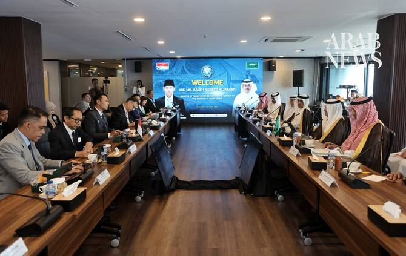

# Saudi Arabia, Indonesia step up cooperation in aviation, urban transport

Source: https://www.arabnews.com/node/2650841/world
Captured source: https://www.arabnews.com/node/2650841/world
Published: 2026-07-14T15:12:17+03:00
Modified: 2026-07-14T15:12:17+03:00
Author: Sheany Yasuko Lai

## Summary

JAKARTA: Indonesia and Saudi Arabia are stepping up cooperation in aviation and urban transportation systems, officials said on Tuesday as the Kingdom’s transport minister, Saleh Al-Jasser, visited Jakarta. Al-Jasser held meetings with various Indonesian officials during his trip, including Minister of Transport Dudy Purwaghandi, Coordinating Minister of Infrastructure and

## Image

## Video Or Embed URLs

- blob:https://www.arabnews.com/493c08a5-033a-46ae-8619-2d675ad6d9ce
- https://imasdk.googleapis.com/js/core/bridge3.776.0_en.html
- https://d555da52de56c02bb4a086c4f076bb66.safeframe.googlesyndication.com/safeframe/1-0-45/html/container.html
- https://static.addtoany.com/menu/sm.25.html
- about:blank
- https://gum.criteo.com/syncframe?origin=publishertagids&topUrl=www.arabnews.com&gdpr=0&gdpr_consent=&gpp=&gpp_sid=-1
- https://www.google.com/recaptcha/api2/aframe
- https://cm.g.doubleclick.net/partnerpixels?gdpr=0&us_privacy=1---&gpp_sid=-1&url=https%3A%2F%2Fwww.arabnews.com%2Fnode%2F2650841%2Fworld

## Downloaded Video

- [01_saudi-arabia-indonesia-step-up-cooperation-in-aviation-urban-transport.mp4](../../../rendered-clips/2026-07-14/01_saudi-arabia-indonesia-step-up-cooperation-in-aviation-urban-transport.mp4)

## Text

https://arab.news/j2dh9

Saudi transport minister Saleh Al-Jasser visited Jakarta to meet top officials

Officials set to discuss new agreements covering civil aviation, maritime transport

JAKARTA: Indonesia and Saudi Arabia are stepping up cooperation in aviation and urban transportation systems, officials said on Tuesday as the Kingdom’s transport minister, Saleh Al-Jasser, visited Jakarta.

Al-Jasser held meetings with various Indonesian officials during his trip, including Minister of Transport Dudy Purwaghandi, Coordinating Minister of Infrastructure and Regional Development Agus Harimurti Yudhoyono, and Minister of Hajj and Umrah Mochamad Irfan Yusuf, to explore further collaboration between the two nations.

The talks come following President Prabowo Subianto and Saudi Crown Prince Mohammed bin Salman’s agreement in Jeddah last July to strengthen strategic cooperation across key sectors.

“The governments of Indonesia and Saudi Arabia have had long-standing cooperation in the transportation sector. The Indonesian government, through the Ministry of Transportation, is committed to continue strengthening this cooperation and even expanding its reach,” the Indonesian Ministry of Transportation said in a statement.

Purwaghandi will assign a technical team to discuss new agreements with their Saudi counterpart, covering transport safety investigation, maritime and railway cooperation, as well as technical collaboration in civil aviation.

Indonesian officials have also been working to increase flights between the two nations to facilitate more Indonesian pilgrims.

Indonesia, the world’s largest Muslim-majority country, sends the biggest Hajj contingent and hundreds of thousands of Umrah pilgrims to Saudi Arabia every year.

“I am certain there is still plenty of room for us to continue working together in the aviation sector,” Purwaghandi said.

During Al-Jasser’s meeting with Yudhoyono, the two officials “explored opportunities to develop projects” in infrastructure, transport and logistics, exchange expertise and for broader investment potential, the Saudi Ministry of Transport and Logistics Services said on X.

Indonesia is hopeful that the “bilateral synergy” with Saudi Arabia will progress “with various concrete achievements in aviation, maritime affairs, railways and logistics,” Yudhoyono said.

Al-Jasser’s trip to Jakarta, which included an on-site visit of the city’s developing mass rapid transit system, was also aimed at “strengthening exchange of expertise and learning about leading international experiences in developing urban transport projects,” according to his office.

Recent urban transportation developments across Saudi cities have been of interest for Indonesian officials, as the projects are taking place at a time when Indonesian cities are also developing mass transport systems.
