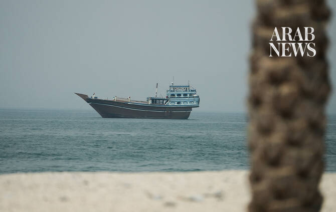

# Trump drops plan to charge Hormuz transit fee, shifts focus to Gulf investment

Source: https://www.arabnews.com/node/2650876/middle-east
Captured source: https://www.arabnews.com/node/2650876/middle-east
Published: 2026-07-14T19:21:51+03:00
Modified: 2026-07-14T21:44:23+03:00
Author: Arab News

## Summary

WASHINGTON: US President Donald Trump on Tuesday abandoned plans to impose a 20 percent fee on vessels using the Strait of Hormuz, saying he would instead pursue investment agreements with Gulf countries. The reversal came hours before the proposed charge was due to take effect and following criticism from the shipping industry amid continued military escalation from the US

## Image

## Video Or Embed URLs

- blob:https://www.arabnews.com/8905df6a-cff7-4e77-81b6-402b9a92ac82
- https://imasdk.googleapis.com/js/core/bridge3.776.0_en.html
- https://e52a04010d3c535111414b481923ae55.safeframe.googlesyndication.com/safeframe/1-0-45/html/container.html
- https://static.addtoany.com/menu/sm.25.html
- about:blank
- https://gum.criteo.com/syncframe?origin=publishertagids&topUrl=www.arabnews.com&gdpr=0&gdpr_consent=&gpp=&gpp_sid=-1
- https://www.google.com/recaptcha/api2/aframe
- https://cm.g.doubleclick.net/partnerpixels?gdpr=0&us_privacy=1---&gpp_sid=-1&url=https%3A%2F%2Fwww.arabnews.com%2Fnode%2F2650876%2Fmiddle-east

## Downloaded Video

- [01_trump-drops-plan-to-charge-hormuz-transit-fee-shifts-focus-to-gulf-inv.mp4](../../../rendered-clips/2026-07-14/01_trump-drops-plan-to-charge-hormuz-transit-fee-shifts-focus-to-gulf-inv.mp4)

## Text

https://arab.news/8cdrq

US president announced fee on Monday after Iran declared it had closed strategic waterway

WASHINGTON: US President Donald Trump on Tuesday abandoned plans to impose a 20 percent fee on vessels using the Strait of Hormuz, saying he would instead pursue investment agreements with Gulf countries.

The reversal came hours before the proposed charge was due to take effect and following criticism from the shipping industry amid continued military escalation from the US and Iran.

Trump had announced the fee on Monday after Iran declared it had closed the strategic waterway, while also ordering a blockade of Iranian shipping. However, in a social media post on Tuesday, he said the strait would remain open to all commercial traffic except Iranian vessels.

The announcement prompted oil prices to trim earlier gains after concerns over potential disruption to one of the world’s busiest energy shipping routes had pushed crude higher.

The policy shift came as US forces carried out a third consecutive night of strikes against Iranian targets, raising fresh doubts over whether a memorandum of understanding signed last month could still lead to a lasting end to the conflict.

The fighting has already disrupted global energy markets and renewed concerns about higher inflation as oil supplies face increasing uncertainty.

Iran responded to the latest US attacks by launching ballistic missiles toward Jordan, while Bahrain said its air defenses had intercepted an Iranian aerial attack. Jordan said it shot down four ballistic missiles, while explosions were heard in Bahrain’s capital Manama.

Before the conflict, the Strait of Hormuz handled about one-fifth of global oil and gas shipments each day. Analysts estimated the proposed 20 percent transit fee could have generated around $240 million in daily revenue.

The International Maritime Organization, the UN agency responsible for shipping, said it opposed the introduction of fees for international straits, adding there was no legal basis for imposing mandatory transit charges on vessels using such waterways.
