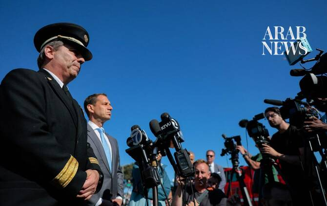

# One dead, 2 missing after boat sinks near San Francisco’s Alcatraz

Source: https://www.arabnews.com/node/2650947/world
Captured source: https://www.arabnews.com/node/2650947/world
Published: 2026-07-15T10:35:41+03:00
Modified: 2026-07-15T10:34:16+03:00
Author: AFP

## Summary

SAN FRANCISCO, United States: One person was dead and two were missing after a boat carrying 19 people sank near Alcatraz, the former prison and tourist site in San Francisco Bay, US officials said Tuesday. Helicopters, planes and rescue boats operated by local fire and police teams were working alongside US Coast Guard to find the missing. Fire Chief Dean Crispen said

## Image

## Video Or Embed URLs

- blob:https://www.arabnews.com/6cb17424-9929-46c0-8bf9-9179b8e21b4a
- https://imasdk.googleapis.com/js/core/bridge3.776.0_en.html
- https://5266fbbd539203ae75d7610fa601f5fc.safeframe.googlesyndication.com/safeframe/1-0-45/html/container.html
- https://static.addtoany.com/menu/sm.25.html
- about:blank
- https://sync.teads.tv/wigo-no-slot
- https://www.google.com/recaptcha/api2/aframe
- https://cm.g.doubleclick.net/partnerpixels?gdpr=0&us_privacy=1---&gpp_sid=-1&url=https%3A%2F%2Fwww.arabnews.com%2Fnode%2F2650947%2Fworld

## Downloaded Video

- [01_one-dead-2-missing-after-boat-sinks-near-san-francisco-s-alcatraz.mp4](../../../rendered-clips/2026-07-15/01_one-dead-2-missing-after-boat-sinks-near-san-francisco-s-alcatraz.mp4)

## Text

https://arab.news/v8cxc

Helicopters, planes and rescue boats operated by local fire and police teams were working alongside US Coast Guard to find the missing

SAN FRANCISCO, United States: One person was dead and two were missing after a boat carrying 19 people sank near Alcatraz, the former prison and tourist site in San Francisco Bay, US officials said Tuesday. Helicopters, planes and rescue boats operated by local fire and police teams were working alongside US Coast Guard to find the missing. Fire Chief Dean Crispen said rescuers first responded to a report of “a boat on fire, 600 yards off Alcatraz” Island around 3:35 p.m. (1035 GMT), according to a short Instagram video posted by San Francisco’s mayor. When rescuers approached, the boat had capsized and efforts were made to resuscitate the person who died. “They immediately initiated CPR, transported that patient to the shore. They were declared deceased,” Crispen said. “We still have two missing and one deceased dog.” San Francisco Fire Department Lt. Elias Mariano told AFP the search for the two people still missing will continue “through the night.” The boat was a privately owned cabin cruiser motorboat from Stockton, California, Mariano said. Authorities did not know if the boat was headed to Alcatraz, a major tourist attraction, where shuttered buildings of the famous former prison still stand. At least one person was severely injured in the water when rescuers arrived, the Los Angeles Times reported. Authorities confirmed the remaining 16 passengers were rescued. Local television stations aired footage of the final moments of the boat sinking in the San Francisco Bay.
