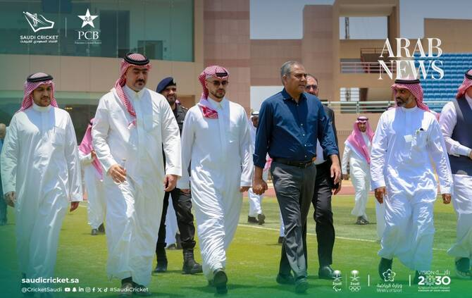

# Pakistani cricket stars hail Kingdom’s plans for international stadium in Jeddah

Source: https://www.arabnews.com/node/2651046/sport
Captured source: https://www.arabnews.com/node/2651046/sport
Published: 2026-07-15T19:41:14+03:00
Modified: 2026-07-15T21:11:03+03:00
Author: Waseem Abbasi & Ismail Dilawar

## Summary

ISLAMABAD/KARACHI: Pakistani cricket stars have welcomed Saudi Arabia’s plans to build an international-standard cricket stadium in Jeddah, describing the project as a milestone that could accelerate the game’s growth in the Kingdom and across the wider Gulf. The Pakistan Cricket Board and the Saudi Arabian Cricket Federation signed a memorandum of understanding this month to

## Image

## Video Or Embed URLs

- blob:https://www.arabnews.com/e4a345b7-cfa8-46aa-b34b-6ff920eab495
- https://imasdk.googleapis.com/js/core/bridge3.777.0_en.html
- https://2b67238bda41b514497a69ee6b3f16e2.safeframe.googlesyndication.com/safeframe/1-0-45/html/container.html
- https://static.addtoany.com/menu/sm.25.html
- about:blank
- https://gum.criteo.com/syncframe?origin=publishertagids&topUrl=www.arabnews.com&gdpr=0&gdpr_consent=&gpp=&gpp_sid=-1
- https://www.google.com/recaptcha/api2/aframe
- https://cm.g.doubleclick.net/partnerpixels?gdpr=0&us_privacy=1---&gpp_sid=-1&url=https%3A%2F%2Fwww.arabnews.com%2Fnode%2F2651046%2Fsport

## Downloaded Video

- [01_pakistani-cricket-stars-hail-kingdom-s-plans-for-international-stadium.mp4](../../../rendered-clips/2026-07-16/01_pakistani-cricket-stars-hail-kingdom-s-plans-for-international-stadium.mp4)

## Text

https://arab.news/b9tsz

PCB, SACF signed agreement this month to develop ICC-standard venue

Players say project could boost cricket in Saudi Arabia, inspire new generation

ISLAMABAD/KARACHI: Pakistani cricket stars have welcomed Saudi Arabia’s plans to build an international-standard cricket stadium in Jeddah, describing the project as a milestone that could accelerate the game’s growth in the Kingdom and across the wider Gulf.

For the latest updates, follow us @ArabNewsSport

The Pakistan Cricket Board and the Saudi Arabian Cricket Federation signed a memorandum of understanding this month to jointly develop the stadium, with the PCB providing technical expertise on infrastructure, venue planning and the operational standards required to host international cricket.

The agreement is part of a broader partnership to develop cricket in Saudi Arabia through competitions, technical programs and exchanges of expertise. The stadium is expected to support the Kingdom’s ambitions to host international matches while contributing to sports investment and tourism as part of Vision 2030.

Cricket has grown steadily in Saudi Arabia over the past two decades, driven largely by expatriate communities from Pakistan, India and Bangladesh. The Kingdom established the SACF in 2020 and has expanded grassroots programs as it seeks to develop national teams and strengthen the sport’s domestic profile.

Shahid Afridi, the former captain of Pakistan, said the stadium would provide an important boost to the Kingdom’s efforts.

He told Arab News: “I think it’s a fantastic initiative. Saudi Arabia has made great progress in developing sports and investing in cricket is another exciting step.

“There is already a strong passion for cricket in the Kingdom and having an international stadium will help inspire young players, develop local talent, and contribute to the growth of cricket in the region.”

Afridi added: “It would be a privilege to play at the stadium once it is completed. I hope to play there one day and be a part of this exciting new chapter for cricket in Saudi Arabia.”

Imran Khan Sr., the Pakistani cricketer who made his Test debut for the national side in 2014, said the stadium could help provide the foundations for long-term development.

He said: “The construction of a cricket stadium in Jeddah under a memorandum of understanding between the Pakistani and Saudi cricket bodies is a great initiative for cricketers in Saudi Arabia.

“This will promote young talent and the game of cricket itself.”

Jalal Uddin, the former Pakistani bowler and coach, said the project highlighted the growing role of sport in international relations.

He said: “It’s a very good initiative by the Saudi government and the PCB in collaborating to build this stadium.

“Now the word is sports diplomacy and this stadium will help them to make sports diplomacy, especially in cricket.”

SACF Chairman Prince Saud bin Mishal Al-Saud said on July 1 the partnership was not just about developing an international cricket stadium in Jeddah. He said: “It is about building a long-term future for cricket in Saudi Arabia through shared ambition, trusted partnerships and sustainable investment.”
