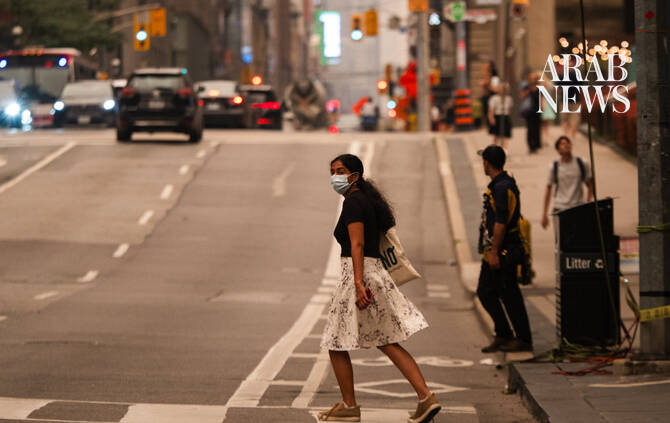

# Canadian wildfire smoke chokes Toronto, threatens US cities

Source: https://www.arabnews.com/node/2651076/world
Captured source: https://www.arabnews.com/node/2651076/world
Published: 2026-07-16T10:59:01+03:00
Modified: 2026-07-16T11:03:17+03:00
Author: Reuters

## Summary

TORONTO/NEW YORK: Toronto’s air quality ranked the worst among major cities globally on Wednesday as wildfire smoke from northwestern Ontario blackened skies and spread into the northeastern United States, prompting health warnings and calls for residents to limit outdoor activities. Environment Canada reported an Air Quality Health Index (AQHI) reading of 10+, classified as

## Image

## Video Or Embed URLs

- blob:https://www.arabnews.com/2a06139b-9340-421c-b93a-a2cbbeb5be12
- https://imasdk.googleapis.com/js/core/bridge3.777.0_en.html
- https://82f142f9673ec7f8ebd82c97769d8125.safeframe.googlesyndication.com/safeframe/1-0-45/html/container.html
- about:blank
- https://static.addtoany.com/menu/sm.25.html
- https://gum.criteo.com/syncframe?origin=publishertagids&topUrl=www.arabnews.com&gdpr=0&gdpr_consent=&gpp=&gpp_sid=-1
- https://sync.teads.tv/wigo-no-slot
- https://www.google.com/recaptcha/api2/aframe
- https://cm.g.doubleclick.net/partnerpixels?gdpr=0&us_privacy=1---&gpp_sid=-1&url=https%3A%2F%2Fwww.arabnews.com%2Fnode%2F2651076%2Fworld

## Downloaded Video

- [01_canadian-wildfire-smoke-chokes-toronto-threatens-us-cities.mp4](../../../rendered-clips/2026-07-16/01_canadian-wildfire-smoke-chokes-toronto-threatens-us-cities.mp4)

## Text

https://arab.news/bs4nd

Canada has been a common summer occurrence across wide swaths of the United States in recent years

TORONTO/NEW YORK: Toronto’s air quality ranked the worst among major cities globally on Wednesday as wildfire smoke from northwestern Ontario blackened skies and spread into the northeastern United States, prompting health warnings and calls for residents to limit outdoor activities. Environment Canada reported an Air Quality Health Index (AQHI) reading of 10+, classified as “very high risk,” for Toronto, while forecasts suggested hazardous conditions could persist through Thursday night. New York City began feeling the effects days before neighboring New Jersey is scheduled to host the World Cup final on Sunday. Local authorities issued an alert as air quality reached an unhealthy level and urged residents ‌to reduce “strenuous outdoor ‌activity” and take extra breaks if they are outside on Wednesday ​and ‌Thursday. The ⁠National Weather ​Service ⁠said smoke could linger into the end of the week. IQAir, a Swiss air quality technology company, ranked Toronto as having the worst air quality across the globe, surpassing Kinshasa and Delhi. New York ranked No. 5. Wildfire smoke from Northern Canada has been a common summer occurrence across wide swaths of the United States in recent years. A video shared on social media showing a Canadian National train surrounded by fire near Armstrong, Ontario, went viral. Canadian National employees in the area and residents of Armstrong were evacuated on Monday night, CN said in a statement. ⁠The company suspended rail operations near Armstrong, more than 500 kilometers north of ‌Toronto, as a precaution due to wildfires. The City of Toronto canceled ‌the FIFA Fan Festival and the England-Argentina World Cup watch party ​at Nathan Phillips Square because of poor air ‌quality. In the New York City area, more than 80,000 people are expected to attend the World Cup ‌final at an open-air stadium in New Jersey on Sunday. Another 50,000 plan to watch the game from Central Park in Manhattan, where skies appeared hazy. New York State Governor Kathy Hochul said on social media that smoke and haze from Canadian wildfires were creating unhealthy air conditions across the state and encouraged people, especially those with health conditions, to ‌exercise caution. The Government of Canada has said that wildfire season began more slowly in 2026 than in 2023 or 2025 — the two worst seasons for ⁠wildfires — but warned that ⁠fires were likely due to warmer than usual temperatures across the country. Some 835 active fires were burning in the country on Wednesday, and 112 according were considered out of control, according to the government. So far, 1.9 million hectares (4.7 million acres) have burned. Most of the fires were in the central provinces of Manitoba, Saskatchewan, and Ontario. Greg Evans, professor at University of Toronto, Chemical Engineering & Applied Chemistry, noted Toronto had been simultaneously hit with severe heat and wildfire smoke. “I expect that this will occur more frequently over the coming decades so cities and residents need to prepare for this in the future,” he said. Paula Oreskovich, a Toronto resident, said she noticed the haze and smell of smoke when she stepped outside in the morning. She said the poor air quality was concerning, particularly as wildfire smoke has become a recurring feature ​of recent summers. “I think you have to be ​silly if you’re not going to be concerned about climate change. It’s definitely here, it’s definitely happening, and it’s happening globally,” Oreskovich said.
