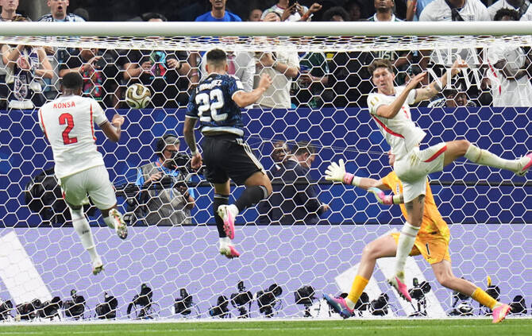

# Messi’s Argentina stun England in comeback to reach World Cup final

Source: https://www.arabnews.com/node/2651078/sport
Captured source: https://www.arabnews.com/node/2651078/sport
Published: 2026-07-16T08:55:15+03:00
Modified: 2026-07-16T08:56:11+03:00
Author: AFP

## Summary

ATLANTA: Lautaro Martinez scored a 92nd minute winner as Lionel Messi inspired World Cup holders Argentina to a stunning comeback to beat England 2-1 on Wednesday and set up a final with European champions Spain. England had been on course to reach their first World Cup final since 1966 after Anthony Gordon fired them into the lead 10 minutes after half-time in the semifinal

## Image

## Video Or Embed URLs

- blob:https://www.arabnews.com/75d4e564-2a23-41e5-899c-c0d501d4bfe1
- https://imasdk.googleapis.com/js/core/bridge3.777.0_en.html
- https://09f9c4e74f2090899f73f6f935d94982.safeframe.googlesyndication.com/safeframe/1-0-45/html/container.html
- https://static.addtoany.com/menu/sm.25.html
- about:blank
- https://gum.criteo.com/syncframe?origin=publishertagids&topUrl=www.arabnews.com&gdpr=0&gdpr_consent=&gpp=&gpp_sid=-1
- https://sync.teads.tv/wigo-no-slot
- https://www.google.com/recaptcha/api2/aframe
- https://cm.g.doubleclick.net/partnerpixels?gdpr=0&us_privacy=1---&gpp_sid=-1&url=https%3A%2F%2Fwww.arabnews.com%2Fnode%2F2651078%2Fsport

## Downloaded Video

- [01_messi-s-argentina-stun-england-in-comeback-to-reach-world-cup-final.mp4](../../../rendered-clips/2026-07-16/01_messi-s-argentina-stun-england-in-comeback-to-reach-world-cup-final.mp4)

## Text

https://arab.news/y378e

Messi had waited until the age of 39 to get the chance to play against England, and now he will face Spain for the first time in a competitive game

ATLANTA: Lautaro Martinez scored a 92nd minute winner as Lionel Messi inspired World Cup holders Argentina to a stunning comeback to beat England 2-1 on Wednesday and set up a final with European champions Spain. For the latest updates, follow us @ArabNewsSport England had been on course to reach their first World Cup final since 1966 after Anthony Gordon fired them into the lead 10 minutes after half-time in the semifinal in front of 68,239 fans in Atlanta. But the great rivalry between these nations has produced several memorable contests on the World Cup stage down the years and this will be remembered as the stuff of legends in Argentina as the South Americans denied England with two late sucker punches. Messi set up Enzo Fernandez to fire in an 85th-minute equalizer and then, with extra time looming, crossed for substitute Lautaro Martinez to head in the winner in the second minute of stoppage time. It was maybe not quite up there with Diego Maradona’s legendary display in putting England to the sword in 1986, but the goals this time brought Argentina back from the dead and kept alive their hopes of winning back-to-back World Cups. No team has retained the trophy since Brazil in 1962, and now Messi will become just the second player after Brazilian great Cafu to appear in three World Cup finals. The game will take place at the MetLife Stadium on Sunday in New Jersey, as the first 48-team World Cup boils down to a controntation between the reigning champions of Europe and South America. Messi had waited until the age of 39 to get the chance to play against England, and now he will face Spain for the first time in a competitive game. His career appeared to be complete when he dragged Argentina to glory in 2022 in Qatar, but he is clearly not done yet. England, though, will have huge regrets as they head to Miami to play France in Saturday’s third-place play-off, a game neither team will want to contest. The prospect of a first World Cup final appearance since their sole triumph 60 years ago was a momentous one, and they were so close, but will live to regret sitting back after Gordon’s opener. The key men for Thomas Tuchel’s side during this campaign have been Jude Bellingham and captain Harry Kane, yet they failed to deliver on this occasion, and England’s players slumped to the turf at full time.

For the latest updates, follow us @ArabNewsSport

Given the deep-rooted rivalry between these nations, this was always likely to be a game with an edge and there was a tangible feeling of tension in the Mercedes-Benz Stadium. Argentina’s players were clearly fired up, partly by a determination to hold onto their World Cup crown but also by a sense of what this fixture means. That translated into a niggly contest pockmarked by fouls in the first half, including Elliot Anderson being booked for scything down Messi. There were no real chances to speak of in the first half, but England struck in the 55th minute. Kane was involved in the build-up as the ball eventually came to Morgan Rogers on the right, and he whipped in a low cross toward the back post where Gordon stole in front of Nahuel Molina to score. But this was the stadium where Argentina produced a stunning comeback from 2-0 down to beat Egypt in the last 16, and they were not done. They threw everything at their opponents, as Jordan Pickford made a great save from a Nico Gonzalez header, and Alexis Mac Allister was then denied by the post in the 76th minute. Fernandez was denied from range by Pickford, but moments later he equalized, controlling a Messi pass on the edge of the area and letting fly past the goalkeeper. Argentina smelled blood, and Mac Allister again hit the post before England failed to clear and Lautaro Martinez headed in the winner from an exquisite Messi cross to spark chaotic scenes of celebration and leave England completely deflated.
