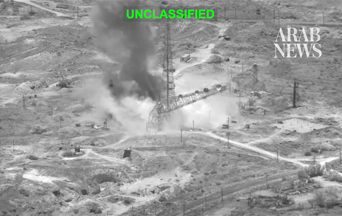

# Mediator Pakistan says encouraging US, Iran to resume talks

Source: https://www.arabnews.com/node/2651127/middle-east
Captured source: https://www.arabnews.com/node/2651127/middle-east
Published: 2026-07-16T13:00:52+03:00
Modified: 2026-07-16T13:01:32+03:00
Author: AFP

## Summary

ISLAMABAD: Pakistan said on Thursday it would encourage the United States and Iran to stop violence and resume talks under a memorandum of understanding (MoU) it helped mediate last month. “While the implementation of the MoU is facing challenges, Pakistan will continue to encourage all sides to end violence and resume technical-level talks in accordance with the MoU,” Tahir

## Image

## Video Or Embed URLs

- blob:https://www.arabnews.com/818767ec-c9e4-48cd-98cd-d58051e2454e
- https://imasdk.googleapis.com/js/core/bridge3.777.0_en.html
- https://b3103302bdf753e1d8ea18d434381df4.safeframe.googlesyndication.com/safeframe/1-0-45/html/container.html
- https://static.addtoany.com/menu/sm.25.html
- about:blank
- https://gum.criteo.com/syncframe?origin=publishertagids&topUrl=www.arabnews.com&gdpr=0&gdpr_consent=&gpp=&gpp_sid=-1
- https://sync.teads.tv/wigo-no-slot
- https://www.google.com/recaptcha/api2/aframe
- https://cm.g.doubleclick.net/partnerpixels?gdpr=0&us_privacy=1---&gpp_sid=-1&url=https%3A%2F%2Fwww.arabnews.com%2Fnode%2F2651127%2Fmiddle-east

## Downloaded Video

- [01_mediator-pakistan-says-encouraging-us-iran-to-resume-talks.mp4](../../../rendered-clips/2026-07-16/01_mediator-pakistan-says-encouraging-us-iran-to-resume-talks.mp4)

## Text

https://arab.news/rkygc

The United States has this week been striking Iran, drawing retaliatory Iranian attacks on US interest in the Gulf

ISLAMABAD: Pakistan said on Thursday it would encourage the United States and Iran to stop violence and resume talks under a memorandum of understanding (MoU) it helped mediate last month. “While the implementation of the MoU is facing challenges, Pakistan will continue to encourage all sides to end violence and resume technical-level talks in accordance with the MoU,” Tahir Andrabi, Pakistan’s foreign office spokesman, told reporters in Islamabad. “We express the hope for an early normalization of the situation in Strait of Hormuz and underscore the importance of ensuring the continued safety, security and freedom of maritime navigation,” he added. The United States has this week been striking Iran, drawing retaliatory Iranian attacks on US interest in the Gulf as they battle over the strategic Hormuz shipping route. That sent global oil prices soaring and led to concerns of spikes in inflation even in nations far from the conflict. The key oil and gas artery, which Iran insists it controls, is central to the rekindled fighting that has entered its sixth day despite a preliminary deal in June aiming to end the war. “Pakistan recognizes the urgent need to address the impact of the current situation on global energy supplies and other economic commodities including trade and food security,” Andrabi said.
