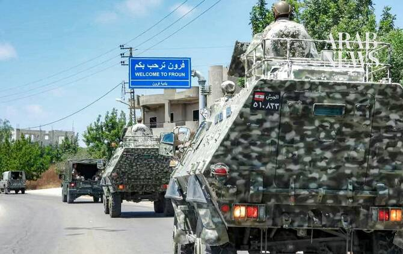

# Military talks to finalize pilot zones for Israeli withdrawal in southern Lebanon

Source: https://www.arabnews.com/node/2651160/middle-east
Captured source: https://www.arabnews.com/node/2651160/middle-east
Published: 2026-07-16T16:58:19+03:00
Modified: 2026-07-16T18:52:17+03:00
Author: NAJIA HOUSSARI

## Summary

BEIRUT: Lebanese and Israeli military officials are set to meet virtually on Friday under US sponsorship to finalize a list of pilot zones, agree on a timetable for Israel’s withdrawal from them and expand the Lebanese Army’s deployment in southern Lebanon. The technical talks follow the conclusion on Wednesday of the latest round of Lebanese-Israeli negotiations in Rome,

## Image

## Video Or Embed URLs

- blob:https://www.arabnews.com/cd741484-1552-4ca0-80c7-9f186d439447
- https://imasdk.googleapis.com/js/core/bridge3.777.0_en.html
- https://90f30e1caa34525d3638a3728867e44b.safeframe.googlesyndication.com/safeframe/1-0-45/html/container.html
- https://static.addtoany.com/menu/sm.25.html
- about:blank
- https://gum.criteo.com/syncframe?origin=publishertagids&topUrl=www.arabnews.com&gdpr=0&gdpr_consent=&gpp=&gpp_sid=-1
- https://ep2.adtrafficquality.google/sodar/sodar2/255/runner.html
- https://www.google.com/recaptcha/api2/aframe
- https://cm.g.doubleclick.net/partnerpixels?gdpr=0&us_privacy=1---&gpp_sid=-1&url=https%3A%2F%2Fwww.arabnews.com%2Fnode%2F2651160%2Fmiddle-east

## Downloaded Video

- [01_military-talks-to-finalize-pilot-zones-for-israeli-withdrawal-in-south.mp4](../../../rendered-clips/2026-07-16/01_military-talks-to-finalize-pilot-zones-for-israeli-withdrawal-in-south.mp4)

## Text

https://arab.news/2a9a8

Technical talks follow the conclusion on Wednesday of the latest round of Lebanese-Israeli negotiations in Rome

Military source: The whole point of pilot zones is for the Israeli army to pull out of territory it occupies

BEIRUT: Lebanese and Israeli military officials are set to meet virtually on Friday under US sponsorship to finalize a list of pilot zones, agree on a timetable for Israel’s withdrawal from them and expand the Lebanese Army’s deployment in southern Lebanon.

The technical talks follow the conclusion on Wednesday of the latest round of Lebanese-Israeli negotiations in Rome, where officials focused on mechanisms for implementing the June 26 framework agreement.

A military source told Arab News that media reports identifying the proposed pilot zones were inaccurate, adding that the areas cited are not under Israeli occupation.

“The whole point of pilot zones is for the Israeli army to pull out of territory it occupies, so the Lebanese Army can move in, keep order and bring weapons under state control,” the source said.

Over the past 24 hours, the source added, the Lebanese Army has reinforced its presence along Israel’s so-called “Yellow Line” and around areas believed to be under consideration as pilot zones. Troops have conducted security operations, cleared unexploded ordnance and detained armed individuals as part of preparations for the next phase.

Troops have mounted patrols and set up checkpoints and observation posts in the towns of Froun, Ghandourieh, Qalaouiyeh, Burj Qalaouiyeh and Kfar Dounine, in the Bint Jbeil district; Qaaqaiyet Al-Jisr, near Nabatieh; and Srifa, near Tyre.

A source familiar with Rome talks told Arab News that the diplomatic track had laid the groundwork for military negotiators to finalize the first phase of the plan, with implementation expected within the next few days.

However, the source preferred to leave any announcement of the pilot zones to the military negotiators.

“The diplomatic talks are about stopping Israel’s ceasefire violations, which are many,” the source told Arab News. “But the Israeli side keeps hiding behind the phrase ‘intended threat’.”

Negotiations over the two pilot zones, he said, are moving toward a phased approach, testing how the arrangements work before extending them elsewhere, as a way to measure Israel’s commitment on the ground and avoid any misstep that could unravel the entire process.

The US State Department said in a statement on Wednesday that the talks in Rome were “productive” and the parties “agreed on the structure and guidelines for the pilot zone process, to be finalized and implemented in the coming days.”

A third party will be responsible for monitoring the implementation of the pilot plan.

An Israeli official, quoted by the Israeli newspaper Yedioth Ahronoth, said the third party will be neither UNIFIL nor the United Nations Truce Supervision Organization.

Meanwhile, Israeli forces on Thursday set fire to several homes and plots of land on the outskirts of Beit Yahoun in the Bint Jbeil district, hours after Israeli jets struck the outskirts of Beit Yahoun and the nearby town of Baraashit before dawn. One of the strikes killed three civilians in Beit Yahoun.

The military source said that among the Israeli violations that have not yet been addressed is the issue of Israeli jets flying over Lebanese airspace, specifically over the capital and its suburbs.

Meanwhile, the Lebanese Army continued its operations in the Beddawi Palestinian refugee camp in northern Lebanon for a second day, after taking control of the Fatah Al-Intifada movement’s offices at the entrance to the camp on Wednesday.

The military source said the operation, unrelated to the measures being made in southern Lebanon, was part of the Lebanese government’s decision to place all weapons under state control.

“The delay in implementation is due to logistical issues,” the source said.
