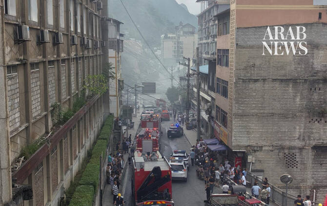

# Landslide buries residents in southwest China’s Chongqing

Source: https://www.arabnews.com/node/2651247/world
Captured source: https://www.arabnews.com/node/2651247/world
Published: 2026-07-17T10:14:55+03:00
Modified: 2026-07-17T10:14:32+03:00
Author: Reuters

## Summary

BEIJING: An unknown ‌number of people were buried after a landslide struck a county in the southwestern Chinese city of Chongqing on Friday, causing multiple residential buildings downhill to collapse, according to state media. Preliminary verification indicated that a Pengshui county community worker spotted scattered falling rocks around 8 a.m. local time (0000 GMT) and

## Image

## Video Or Embed URLs

- blob:https://www.arabnews.com/e436150e-9004-46b9-8756-781474728d41
- https://imasdk.googleapis.com/js/core/bridge3.777.0_en.html
- https://758d4de51657c5c6e22e8fb326bb31d2.safeframe.googlesyndication.com/safeframe/1-0-45/html/container.html
- https://static.addtoany.com/menu/sm.25.html
- about:blank
- https://gum.criteo.com/syncframe?origin=publishertagids&topUrl=www.arabnews.com&gdpr=0&gdpr_consent=&gpp=&gpp_sid=-1
- https://www.google.com/recaptcha/api2/aframe
- https://sync.teads.tv/wigo-no-slot
- https://cm.g.doubleclick.net/partnerpixels?gdpr=0&us_privacy=1---&gpp_sid=-1&url=https%3A%2F%2Fwww.arabnews.com%2Fnode%2F2651247%2Fworld

## Downloaded Video

- [01_landslide-buries-residents-in-southwest-china-s-chongqing.mp4](../../../rendered-clips/2026-07-17/01_landslide-buries-residents-in-southwest-china-s-chongqing.mp4)

## Text

https://arab.news/6zftu

The exact number of those trapped was still being confirmed, report says

Nine people had been pulled from the rubble, with none in life-threatening condition

BEIJING: An unknown ‌number of people were buried after a landslide struck a county in the southwestern Chinese city of Chongqing on Friday, causing multiple residential buildings downhill to collapse, according to state media. Preliminary verification indicated that a Pengshui county community worker spotted scattered falling rocks around 8 a.m. local time (0000 GMT) and issued an emergency warning, state broadcaster CCTV said. Authorities ordered ‌an evacuation ‌of more than 60 residents, but ‌the ⁠landslide occurred during ⁠the evacuation at 9:08 a.m., burying some people. The exact number of those trapped was still being confirmed, the report said. Nine people had been pulled from the rubble, with none in life-threatening condition, according to ⁠the official Xinhua news agency. It ‌was not immediately ‌clear what caused the landslide. Aerial footage from ‌CCTV showed rock and debris falling ‌on a cluster of riverside residential buildings, while people could be seen fleeing with a thick plume of dust billowing behind them. A dashcam video posted ‌on X, verified by Reuters, showed a section of hillside collapsing onto ⁠homes ⁠and businesses below, sending debris across the road and forcing passing cars and a motorcycle to stop. China’s Ministry of Emergency Management activated a level-two emergency response and dispatched a 100-member rescue team to the scene, the ministry said in a statement. Some 206 personnel and 49 vehicles from China’s fire and rescue force were sent to the site to assist in rescue efforts, the ministry said.
