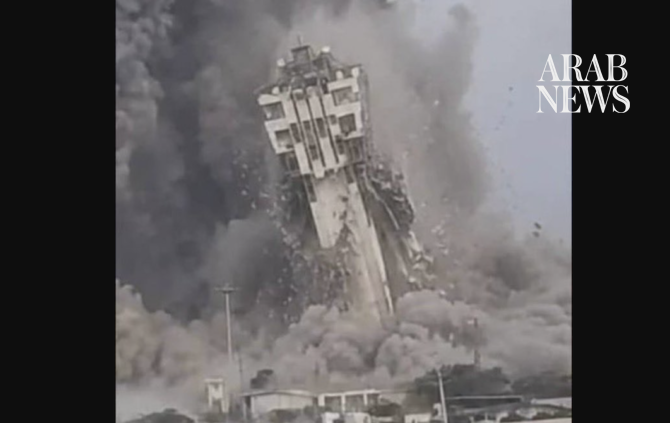

# US forces launch new strikes against Iran: CENTCOM

Source: https://www.arabnews.com/node/2651299/middle-east
Captured source: https://www.arabnews.com/node/2651299/middle-east
Published: 2026-07-17T18:00:09+03:00
Modified: 2026-07-17T23:21:06+03:00
Author: Agencies

## Summary

WASHINGTON: US forces launched strikes against Iran for a seventh night in a row on Friday, the US military said. US Central Command, in a post on X, said the strikes, which began at 1900 GMT, were designed to “continue degrading Iranian military capabilities.” CENTCOM launched a round of strikes against Iran at 3 p.m. ET today for the seventh consecutive night. The strikes

## Image

## Video Or Embed URLs

- blob:https://www.arabnews.com/34cfcd7f-72e5-40b5-84a3-23fafb0de1e8
- https://imasdk.googleapis.com/js/core/bridge3.777.0_en.html
- https://platform.twitter.com/embed/Tweet.html?creatorScreenName=Arab_News&creatorUserId=69172612&dnt=false&embedId=twitter-widget-0&features=eyJ0ZndfdGltZWxpbmVfbGlzdCI6eyJidWNrZXQiOltdLCJ2ZXJzaW9uIjpudWxsfSwidGZ3X2ZvbGxvd2VyX2NvdW50X3N1bnNldCI6eyJidWNrZXQiOnRydWUsInZlcnNpb24iOm51bGx9LCJ0ZndfdHdlZXRfZWRpdF9iYWNrZW5kIjp7ImJ1Y2tldCI6Im9uIiwidmVyc2lvbiI6bnVsbH0sInRmd19yZWZzcmNfc2Vzc2lvbiI6eyJidWNrZXQiOiJvbiIsInZlcnNpb24iOm51bGx9LCJ0ZndfZm9zbnJfc29mdF9pbnRlcnZlbnRpb25zX2VuYWJsZWQiOnsiYnVja2V0Ijoib24iLCJ2ZXJzaW9uIjpudWxsfSwidGZ3X21peGVkX21lZGlhXzE1ODk3Ijp7ImJ1Y2tldCI6InRyZWF0bWVudCIsInZlcnNpb24iOm51bGx9LCJ0ZndfZXhwZXJpbWVudHNfY29va2llX2V4cGlyYXRpb24iOnsiYnVja2V0IjoxMjA5NjAwLCJ2ZXJzaW9uIjpudWxsfSwidGZ3X3Nob3dfYmlyZHdhdGNoX3Bpdm90c19lbmFibGVkIjp7ImJ1Y2tldCI6Im9uIiwidmVyc2lvbiI6bnVsbH0sInRmd19kdXBsaWNhdGVfc2NyaWJlc190b19zZXR0aW5ncyI6eyJidWNrZXQiOiJvbiIsInZlcnNpb24iOm51bGx9LCJ0ZndfdXNlX3Byb2ZpbGVfaW1hZ2Vfc2hhcGVfZW5hYmxlZCI6eyJidWNrZXQiOiJvbiIsInZlcnNpb24iOm51bGx9LCJ0ZndfdmlkZW9faGxzX2R5bmFtaWNfbWFuaWZlc3RzXzE1MDgyIjp7ImJ1Y2tldCI6InRydWVfYml0cmF0ZSIsInZlcnNpb24iOm51bGx9LCJ0ZndfbGVnYWN5X3RpbWVsaW5lX3N1bnNldCI6eyJidWNrZXQiOnRydWUsInZlcnNpb24iOm51bGx9LCJ0ZndfdHdlZXRfZWRpdF9mcm9udGVuZCI6eyJidWNrZXQiOiJvbiIsInZlcnNpb24iOm51bGx9fQ%3D%3D&frame=false&hideCard=false&hideThread=false&id=2078206333640233200&lang=en&origin=https%3A%2F%2Fwww.arabnews.com%2Fnode%2F2651299%2Fmiddle-east&sessionId=8eda9bde16792474fceb3b745f512143aa09afa7&siteScreenName=Arab_News&siteUserId=69172612&theme=light&widgetsVersion=6a3ad42b224df%3A1778106238597&width=600px
- https://bb45d6ff68b3ee6231b5a9bdc627fada.safeframe.googlesyndication.com/safeframe/1-0-45/html/container.html
- about:blank
- https://static.addtoany.com/menu/sm.25.html
- https://platform.twitter.com/widgets/widget_iframe.1227a5674072e080ffb1ba14ac0c1079.html?origin=https%3A%2F%2Fwww.arabnews.com
- https://gum.criteo.com/syncframe?origin=publishertagids&topUrl=www.arabnews.com&gdpr=0&gdpr_consent=&gpp=&gpp_sid=-1
- https://www.google.com/recaptcha/api2/aframe
- https://cm.g.doubleclick.net/partnerpixels?gdpr=0&us_privacy=1---&gpp_sid=-1&url=https%3A%2F%2Fwww.arabnews.com%2Fnode%2F2651299%2Fmiddle-east

## Downloaded Video

- [01_us-forces-launch-new-strikes-against-iran-centcom.mp4](../../../rendered-clips/2026-07-18/01_us-forces-launch-new-strikes-against-iran-centcom.mp4)

## Text

https://arab.news/wvf69

CENTCOM said strikes were designed to ‘continue degrading Iranian military capabilities’

IRGC targeted a Thai-flagged vessel in Strait of Hormuz on Friday

WASHINGTON: US forces launched strikes against Iran for a seventh night in a row on Friday, the US military said.

US Central Command, in a post on X, said the strikes, which began at 1900 GMT, were designed to “continue degrading Iranian military capabilities.”

The strikes came after CENTCOM said Friday that it had destroyed the Chabahar Shahid Kalantari Port surveillance tower in Iran on Thursday.

US Central Command said in a post on X that the tower was part of a maritime surveillance network along Iran’s Gulf of Oman coastline used by the Islamic Revolutionary Guard Corps to track and target commercial vessels transiting the Strait of Hormuz.

The Iranian Revolutionary Guard Corps (IRGC) targeted a Thai-flagged vessel in the Strait of Hormuz on Friday, Iran’s Tasnim news agency said.

Tasnim said the ship ignored warnings and tried to pass through the strait without seeking permission from the IRGC.

Mohsen Rezaei, an advisor to Iran's supreme leader, was later quoted as saying that if the US seized any points in Iran, “we may enter an offensive war, instead of a defensive one.”

He added: “If US strikes continue for several more days, we will move into a phase of full-scale offensive operations.”

Meanwhile, the IRGC also said on Friday they had attacked a US special operations command center at ​Al-Tanf in Syria in retaliation for the killing of Iranian soldiers in Iranshahr, state media reported.

Reuters could not independently verify the claim, and there was no immediate comment from the Syrian government or the ‌US military.

Iran’s Islamic Revolutionary Guard Corps said Friday that they had targeted US radar systems and military aircraft in Qatar to “punish the aggressor” following overnight US strikes on Iran.

One ​of Kuwait’s power generation and water desalination ‌stations ‌was ​hit ‌in ⁠an ​Iranian attack, causing ⁠damage to facilities, a fire ⁠and ‌the ‌disruption ​of a large ‌number ‌of electricity generation units, ‌Kuwait’s Ministry of Electricity, ⁠Water and ⁠Renewable Energy said on Friday.

Iran’s Revolutionary Guards said Friday they had struck US military aircraft stationed in Jordan with ballistic missiles and drones in retaliation for overnight US strikes.

In a statement, they claimed to have destroyed “several US refueling aircraft and fighter jets” and caused “serious damage to many more.” They also called on Jordanians to target “the interests of the aggressive and anti-Islamic Americans” in their country.

* With Reuters and AFP
