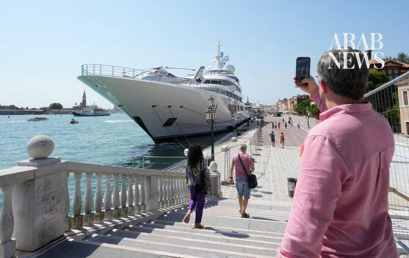

# Trump’s envoy faces protests in Venice on latest stop of super yacht diplomacy tour

Source: https://www.arabnews.com/node/2651318/world
Captured source: https://www.arabnews.com/node/2651318/world
Published: 2026-07-17T20:29:03+03:00
Modified: 2026-07-19T03:14:37+03:00
Author: AP

## Summary

VENICE: The billionaire US ambassador to Italy faced protests when he arrived in Venice on Friday aboard his luxury yacht as part of a coastal diplomacy tour marking the 250th anniversary of American independence. Activists described hospitality mogul Tilman Fertitta’s arrival as an unwelcome display of American wealth and influence for many Italians at a time when they see

## Image

## Video Or Embed URLs

- https://www.youtube.com/embed/um-sJuxJLmA?si=CvLTKTsBUItn7aEf
- https://5c45d75d3ad4ad612d3125e66f5f90fa.safeframe.googlesyndication.com/safeframe/1-0-45/html/container.html
- https://static.addtoany.com/menu/sm.25.html
- about:blank
- https://gum.criteo.com/syncframe?origin=publishertagids&topUrl=www.arabnews.com&gdpr=0&gdpr_consent=&gpp=&gpp_sid=-1
- https://imasdk.googleapis.com/js/core/bridge3.777.0_en.html
- https://sync.teads.tv/wigo-no-slot
- https://www.google.com/recaptcha/api2/aframe
- https://cm.g.doubleclick.net/partnerpixels?gdpr=0&us_privacy=1---&gpp_sid=-1&url=https%3A%2F%2Fwww.arabnews.com%2Fnode%2F2651318%2Fworld

## Downloaded Video

- [01_trump-s-envoy-faces-protests-in-venice-on-latest-stop-of-super-yacht-d.mp4](../../../rendered-clips/2026-07-19/01_trump-s-envoy-faces-protests-in-venice-on-latest-stop-of-super-yacht-d.mp4)

## Text

https://arab.news/69e7t

Activists described hospitality mogul Tilman Fertitta’s arrival as an unwelcome display of American wealth and influence

Hundreds of protesters carrying inflatable pool toys gathered nearby to march toward the yacht

VENICE: The billionaire US ambassador to Italy faced protests when he arrived in Venice on Friday aboard his luxury yacht as part of a coastal diplomacy tour marking the 250th anniversary of American independence. Activists described hospitality mogul Tilman Fertitta’s arrival as an unwelcome display of American wealth and influence for many Italians at a time when they see the Trump administration as upending the post-World War II international order. Hundreds of protesters carrying inflatable pool toys gathered nearby to march toward the yacht that dwarfed buildings on the banks of St. Mark’s Basin. Signs read “Make America Read Again” and “Oligarch in saor,” a reference to a Venetian specialty with sardines. There was a heavy police presence on foot, with some in riot gear, while at least three police boats circled the yacht. The so-called Coastal Diplomacy 250 tour of 13 Italian coastal regions on a super yacht is intended to celebrate “our shared history, our economic partnership, and the cultural bonds that make the US-Italy relationship so special,” Fertitta said in a social media post. In Venice, many of the same groups that protested the wedding last year of Jeff Bezos to Lauren Sanchez mobilized against Fertitta’s arrival aboard the 117-meter (384-foot) luxury yacht, Boardwalk, which features two helipads, a pair of swimming pools and a fully equipped spa and gym.

On July 4, protest organizers unfurled a banner reading “Venezia non si USA,” which is a play on words combining the Italian phrase “Venice is not to be used” with the acronym USA. The banner was as long as Fertitta’s yacht to illustrate what the protesters called “the dimensions of his arrogance.” “It’s arrogant to think he can do what he wants in a city that is ever more sold to the single culture of tourism,’’ organizer Stella Morion told The Associated Press. She said protesters are also opposed to President Donald Trump’s international politics, including US strikes on Iran, which she said have prompted a spike in energy prices. “It is the umpteenth slap in the face of a city and all of the people in Venice who struggle to reach the end of the month due to an increase in prices caused by Trump’s war,” she said. Fertitta has declined a request for an interview to discuss the tour and the planned protest. The billionaire owner of Fertitta Entertainment was sworn in as ambassador to Italy in 2025. He made his fortune in the hospitality industry, including restaurants, hotels and casinos. He also owns the NBA’s Houston Rockets. His official biography puts his net worth at $11.3 billion, while Forbes ranks him among the 100 wealthiest Americans. Details of who Fertitta will meet while in Venice have not been released, but he is expected to attend the famed Redentore festival on Saturday, which commemorates the end of the plague in 1576 culminating with celebratory fireworks over St. Mark’s Basin. He has already stopped over in the Sicilian port town of Cefalu, where his family’s roots trace back to 1566, and met with the governor in Palermo. Other stops have included the Calabrian port of Le Castella and sailed along the coast of Puglia and up the Adriatic coastline to Venice. Fertitta’s tenure includes navigating a cooling in the once warm relationship between Italian Premier Giorgia Meloni and Trump, who has made a series of social media attacks against her. Meloni, who was once seen as a close political ally in Europe with similar views on such issues as immigration, did not attend 250th celebrations at the US Embassy.
