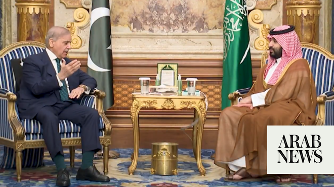

# Saudi crown prince, Pakistan PM discuss US-Iran mediation, regional stability

Source: https://www.arabnews.com/node/2640000/saudi-arabia
Captured source: https://www.arabnews.com/node/2640000/saudi-arabia
Published: 2026-04-15T18:53:41+03:00
Modified: 2026-04-16T10:30:07+03:00
Author: Arab News

## Summary

RIYADH/JEDDAH: Crown Prince Mohammed bin Salman met Pakistan’s Prime Minister Shehbaz Sharif in Jeddah on Wednesday, with talks focusing on regional diplomacy and efforts to advance negotiations between the United States and Iran. The meeting underscored Pakistan’s role in facilitating dialogue, as the two leaders reviewed developments surrounding US-Iran talks hosted by

## Image

## Video Or Embed URLs

- blob:https://www.arabnews.com/ac62fae4-7f7f-4d69-bd34-621972aab53d
- https://imasdk.googleapis.com/js/core/bridge3.770.1_en.html
- https://static.addtoany.com/menu/sm.25.html
- about:blank
- https://www.google.com/recaptcha/api2/aframe
- https://cm.g.doubleclick.net/partnerpixels?gdpr=0&us_privacy=1---&gpp_sid=-1&url=https%3A%2F%2Fwww.arabnews.com%2Fnode%2F2640000%2Fsaudi-arabia

## Downloaded Video

- Skipped: No candidate video URL could be downloaded.

## Text

https://arab.news/6eux2

Jeddah talks highlight push for renewed negotiations

Pakistan’s mediation efforts take center stage

RIYADH/JEDDAH: Crown Prince Mohammed bin Salman met Pakistan’s Prime Minister Shehbaz Sharif in Jeddah on Wednesday, with talks focusing on regional diplomacy and efforts to advance negotiations between the United States and Iran.

The meeting underscored Pakistan’s role in facilitating dialogue, as the two leaders reviewed developments surrounding US-Iran talks hosted by Islamabad and stressed the importance of sustained diplomatic engagement to restore stability in the region.

They also discussed close bilateral relations, exploring ways to expand cooperation across various fields, with the crown prince commending Sharif’s efforts to support Pakistan’s economic growth and strengthen the Saudi-Pakistani strategic partnership.

The crown prince further praised the diplomatic efforts of Prime Minister Sharif and Pakistan’s Chief of Army Staff, Field Marshal Asim Munir.

Video footage from the Saudi Press Agency showed the leaders holding talks accompanied by Saudi Foreign Minister Prince Faisal bin Farhan and his Pakistani counterpart Ishaq Dar. The meeting was also attended by Minister of Defense Prince Khalid bin Salman, Minister of State and National Security Adviser Musaed Al-Aiban, and senior Pakistani officials.

Sharif arrived in Jeddah earlier in the day, the first stop on a four-day diplomatic tour to Saudi Arabia, Qatar and Turkiye, part of a broader push to build momentum ahead of a possible second round of US-Iran negotiations in Pakistan.

“Prime Minister Muhammad Shehbaz Sharif will undertake official visits to the Kingdom of Saudi Arabia, the State of Qatar and the Republic of Turkiye from 15-18 April 2026,” Pakistan’s foreign ministry said earlier in a statement.

Sharif will participate in the Antalya Diplomacy Forum while in Turkiye.

He will also hold bilateral meetings with President Recep Tayyip Erdogan and other leaders on the sidelines of the Antalya forum, the statement said.

Washington and Tehran held their first face-to-face talks in decades in Islamabad at the weekend, with mediation efforts underway to end the war that began when the United States and Israel attacked Iran on February 28.

The conflict has heightened tensions across the Middle East, with Iran targeting US allies in the Gulf — including Saudi Arabia and Qatar — in retaliation and disrupting energy flows from the region.

The Islamabad talks ended without a breakthrough, but US President Donald Trump said negotiations could resume this week in the Pakistani capital.

A fragile ceasefire remains in place until next week, despite the United States ordering a naval blockade of Iran.

Sharif was accompanied by Dar — a key figure in the mediation effort — and other senior officials on his visits, his office said on Wednesday afternoon.

Pakistan and Saudi Arabia share close ties, and Islamabad’s finance ministry announced on Wednesday that Riyadh would provide Pakistan with $3 billion to help bolster its foreign reserves.

The finance ministry said an existing $5 billion Saudi deposit would also be extended for an unspecified period.
