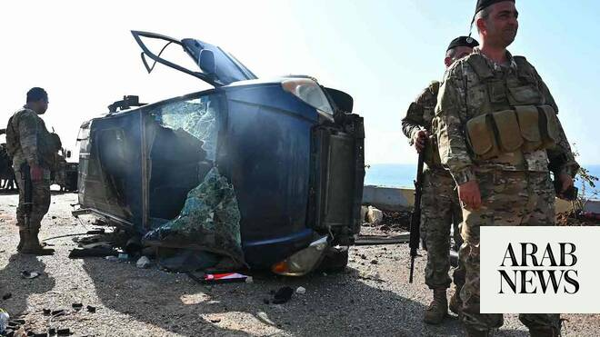

# Israel and Lebanon agree to 10-day ceasefire in push for permanent peace deal

Source: https://www.arabnews.com/node/2640092/middle-east
Captured source: https://www.arabnews.com/node/2640092/middle-east
Published: 2026-04-16T18:09:53+03:00
Modified: 2026-04-17T00:10:12+03:00
Author: Arab News

## Summary

BEIRUT: Israel and Lebanon agreed to a 10-day ceasefire on Thursday, Donald Trump said, with the US hoping the truce will lead to a permanent peace deal. The truce took effect at 2100 GMT on Thursday and Trump said he expected Israeli Prime Minister Benjamin Netanhyahu and Lebanese President Joseph Aoun to visit the White House for direct talks in the next "four or five days."

## Image

## Video Or Embed URLs

- blob:https://www.arabnews.com/7dddd012-b93d-42c1-98f8-e7c83f48b7bd
- https://imasdk.googleapis.com/js/core/bridge3.773.0_en.html
- https://truthsocial.com/@realDonaldTrump/116415122630904602/embed
- https://platform.twitter.com/embed/Tweet.html?creatorScreenName=Arab_News&creatorUserId=69172612&dnt=false&embedId=twitter-widget-0&features=eyJ0ZndfdGltZWxpbmVfbGlzdCI6eyJidWNrZXQiOltdLCJ2ZXJzaW9uIjpudWxsfSwidGZ3X2ZvbGxvd2VyX2NvdW50X3N1bnNldCI6eyJidWNrZXQiOnRydWUsInZlcnNpb24iOm51bGx9LCJ0ZndfdHdlZXRfZWRpdF9iYWNrZW5kIjp7ImJ1Y2tldCI6Im9uIiwidmVyc2lvbiI6bnVsbH0sInRmd19yZWZzcmNfc2Vzc2lvbiI6eyJidWNrZXQiOiJvbiIsInZlcnNpb24iOm51bGx9LCJ0ZndfZm9zbnJfc29mdF9pbnRlcnZlbnRpb25zX2VuYWJsZWQiOnsiYnVja2V0Ijoib24iLCJ2ZXJzaW9uIjpudWxsfSwidGZ3X21peGVkX21lZGlhXzE1ODk3Ijp7ImJ1Y2tldCI6InRyZWF0bWVudCIsInZlcnNpb24iOm51bGx9LCJ0ZndfZXhwZXJpbWVudHNfY29va2llX2V4cGlyYXRpb24iOnsiYnVja2V0IjoxMjA5NjAwLCJ2ZXJzaW9uIjpudWxsfSwidGZ3X3Nob3dfYmlyZHdhdGNoX3Bpdm90c19lbmFibGVkIjp7ImJ1Y2tldCI6Im9uIiwidmVyc2lvbiI6bnVsbH0sInRmd19kdXBsaWNhdGVfc2NyaWJlc190b19zZXR0aW5ncyI6eyJidWNrZXQiOiJvbiIsInZlcnNpb24iOm51bGx9LCJ0ZndfdXNlX3Byb2ZpbGVfaW1hZ2Vfc2hhcGVfZW5hYmxlZCI6eyJidWNrZXQiOiJvbiIsInZlcnNpb24iOm51bGx9LCJ0ZndfdmlkZW9faGxzX2R5bmFtaWNfbWFuaWZlc3RzXzE1MDgyIjp7ImJ1Y2tldCI6InRydWVfYml0cmF0ZSIsInZlcnNpb24iOm51bGx9LCJ0ZndfbGVnYWN5X3RpbWVsaW5lX3N1bnNldCI6eyJidWNrZXQiOnRydWUsInZlcnNpb24iOm51bGx9LCJ0ZndfdHdlZXRfZWRpdF9mcm9udGVuZCI6eyJidWNrZXQiOiJvbiIsInZlcnNpb24iOm51bGx9fQ%3D%3D&frame=false&hideCard=false&hideThread=false&id=2044852243204042838&lang=en&origin=https%3A%2F%2Fwww.arabnews.com%2Fnode%2F2640092%2Fmiddle-east&sessionId=e693f56c9171c00e4a010bf3684473c99b255aa1&siteScreenName=Arab_News&siteUserId=69172612&theme=light&widgetsVersion=6a3ad42b224df%3A1778106238597&width=600px
- https://static.addtoany.com/menu/sm.25.html
- https://platform.twitter.com/widgets/widget_iframe.1227a5674072e080ffb1ba14ac0c1079.html?origin=https%3A%2F%2Fwww.arabnews.com
- about:blank
- https://ep2.adtrafficquality.google/sodar/sodar2/254/runner.html
- https://www.google.com/recaptcha/api2/aframe
- https://cm.g.doubleclick.net/partnerpixels?gdpr=0&us_privacy=1---&gpp_sid=-1&url=https%3A%2F%2Fwww.arabnews.com%2Fnode%2F2640092%2Fmiddle-east

## Downloaded Video

- [02_israel-and-lebanon-agree-to-10-day-ceasefire-in-push-for-permanent-pea.mp4](../../../rendered-clips/2026-06-23/02_israel-and-lebanon-agree-to-10-day-ceasefire-in-push-for-permanent-pea.mp4)

## Text

https://arab.news/zubpu

Truce took effect at 2100 GMT on Thursday, and follows "excellent conversations" between Trump and Lebanese and Israeli premiers

US president invites President Aoun and Prime Minister Netanyahu to the White House for talks

BEIRUT: Israel and Lebanon agreed to a 10-day ceasefire on Thursday, Donald Trump said, with the US hoping the truce will lead to a permanent peace deal.

The truce took effect at 2100 GMT on Thursday and Trump said he expected Israeli Prime Minister Benjamin Netanhyahu and Lebanese President Joseph Aoun to visit the White House for direct talks in the next "four or five days."

"We have a ceasefire with Israel and Lebanon. And that'll be great. And they'll be meeting," Trump told reporters.

The agreement comes two days after Lebanon and Israel held their first direct diplomatic talks in decades in Washington and aims to end more than a month of war between Israel and the Iran-backed Hezbollah militant group.

The two countires said they are not at war and would "commit to engaging in good-faith direct negotiations, facilitated by the United States, with the objective of achieving a comprehensive agreement that ensures lasting security, stability, and peace between the two countries," the ceasfire text, published by the State Department, said.

The ceasefire period may be extended by mutual agreement and once the ceasefire takes effect, the Lebanese government will take steps to prevent Hezbollah and all other non-state armed groups in its territory from carrying out any attacks against Israel. "All parties recognize Lebanon's ‌security forces as having exclusive responsibility for ​Lebanon's sovereignty and national defense; ‌no other country or group has claim ‌to be the guarantor of Lebanon's sovereignty," the agreement reads.

Israel can take necessary measures in self-defense against planned, imminent, or ongoing attacks during the ceasefire period, but it agreed not ‌to carry out any offensive military operations in Lebanon during the ten days. The ⁠two countries ⁠have requested the United States to facilitate further direct negotiations between them to resolve all remaining issues, including demarcation of the international land boundary, according to the ceasefire agreement. The agreement was reached after Trump held "excellent conversations" with Lebanese President Joseph Aoun and Israeli Prime Minister Benjamin Netanyahu.

"These two Leaders have agreed that in order to achieve PEACE between their Countries, they will formally begin a 10 Day CEASEFIRE at 5 P.M. EST," Trump said on his Truth Social network, without mentioning Lebanon's Hezbollah movement.

Lebanon has repeatedly insisted that a ceasefire between Hezbollah and Israel should precede negotiations.

Trump said he had directed US Vice President JD Vance, Secretary of State Marco Rubio, and top US military officer Dan Caine to work with the two countries "to achieve a Lasting PEACE."

“Both sides want to see PEACE, and I believe that will happen, quickly,” Trump wrote in his post.

"It has been my Honor to solve 9 Wars across the World, and this will be my 10th, so let's, GET IT DONE!" said Trump, who launched the war on Iran alongside Israel on February 28.

Since then, Israeli strikes on Lebanon have killed more than 2,000 people and displaced more than one million, and Israeli ground forces have invaded the country's south, AFP reported.

Netanyahu said that the ceasefire offered an opportunity for a "historic peace agreement" with Beirut, but insisted that the disarmament of militant group Hezbollah remained a precondition.

"This opportunity exists because... we have fundamentally changed the balance of power in Lebanon," Netanyahu said in a televised speech, highlighting Israel's military achievements against Hezbollah since the war first broke out in October 2023. "This balance has shifted to such an extent that in the past month we have begun receiving calls from Lebanon to hold direct peace talks - something that had not happened for over 40 years," he said. The premier said Israel will maintain a 10-kilometer "security zone" along the border in southern Lebanon. He added that Israel maintained two conditions for the ceasefire: Hezbollah's disarmament, and a lasting peace agreement "based on strength". The premier said he rejected the two conditions posed by Hezbollah: Israel's full withdrawal from Lebanese territory, and a ceasefire based on the principle of "quiet in return for quiet."

Hezbollah responded to the ceasefire by saying that the ​presence of Israeli troops on Lebanese territory would grant Lebanon and its people "the ‌right to ‌resist." The group added that any truce must not allow Israel freedom ⁠of movement ‌within ‌Lebanon. In a ​written ‌statement, Hezbollah ‌ally and speaker of Lebanon's Parliament Nabih Berri urged ‌Lebanese to "postpone their return to their towns ⁠and ⁠villages until the situation becomes clearer, in accordance with the ceasefire agreement."

Trump said late Wednesday that Aoun and Netanyahu were due to speak on Thursday, but there was no confirmation that any such call had happened.

Fighting in south Lebanon continues

Ahead of the ceasefire, fighting continued to rage in south Lebanon on Thursday, notably in the Lebanese border town of Bint ‌Jbeil, a Hezbollah stronghold and strategic prize. A senior Lebanese official said Lebanon believed Israel wanted to secure a victory in Bint Jbeil before diplomatic progress could be made, Reuters reported.

An Israeli ⁠strike destroyed the last bridge ⁠over the Litani River into the south, a senior Lebanese security source said, fully severing almost a tenth of Lebanon from the rest of the country after Israel destroyed other crossings during the war.

An end to hostilities

The ceasefire agreement follows a flurry of diplomacy since the Washington meeting.

Earlier on Thursday, President Aoun stressed the importance of a ceasefire before any direct negotiations took place. “The ceasefire requested by Lebanon with Israel is the natural starting point for direct negotiations between the two countries,” Aoun said in a statement.

Aoun received a phone call from US Secretary of State Marco Rubio, according to the Lebanese presidency, in which he thanked Rubio for the "efforts Washington is undertaking to reach a ceasefire and its support at all levels.”

The post added: “For his part, Rubio affirmed his continuation of the ongoing efforts to achieve a ceasefire as a prelude to establishing peace, security, and stability in Lebanon, confirming his support and appreciation for President Aoun’s positions.”

A senior US administration official said earlier that Trump would “welcome” an end to hostilities between Israel and Hezbollah in Lebanon, but stressed that any such outcome is not part of talks between Washington and Tehran. However, Iran’s prominent speaker of parliament Mohammad Bagher Ghalibaf told his Lebanese counterpart on Thursday that a ceasefire in Lebanon was “as important” as in Iran, according to a statement posted on Telegram. Ghalibaf said Tehran has “been striving to compel our enemies to establish a permanent ceasefire in all the conflict zones, in accordance with the agreement. For us, a ceasefire in Lebanon is just as important as a ceasefire in Iran,” he said, in a phone conversation with Nabih Berri.

A Lebanese official told Arab News reporters on Wednesday that intensive contacts were underway with international and regional actors to secure a halt to the hostilities, with a ceasefire a non-negotiable condition for moving forward.

“Lebanon is insisting on a full ceasefire before entering any formal negotiations,” the source said, adding that the government “will not relinquish a single inch of Lebanese territory.”

- With Reuters, AP and AFP and additional reporting by Najia Houssari
