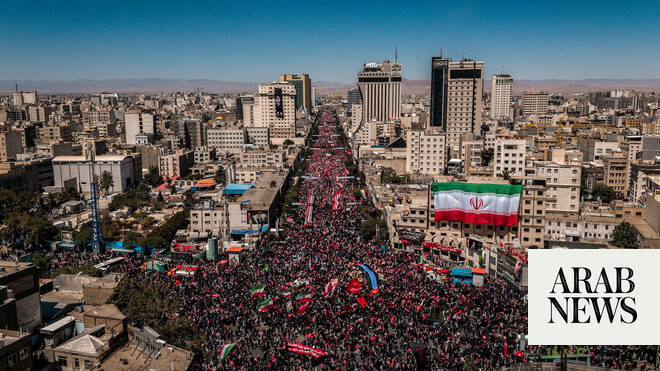

# Body of slain Iranian supreme leader buried at Shiite shrine

Source: https://www.arabnews.com/node/2650210/middle-east
Captured source: https://www.arabnews.com/node/2650210/middle-east
Published: 2026-07-10T09:30:49+03:00
Modified: 2026-07-10T09:47:36+03:00
Author: Reuters

## Summary

DUBAI: Former Iranian supreme leader Ali Khamenei was buried Friday in his home city of Mashhad, state television reported, following a ceremony at which his son and successor was not seen.

## Image

## Video Or Embed URLs

- blob:https://www.arabnews.com/b9b7330b-b79d-4235-ae36-731a71eb42e1
- https://imasdk.googleapis.com/js/core/bridge3.774.0_en.html
- https://f8dada169d16ef691bdf548bf01cd07c.safeframe.googlesyndication.com/safeframe/1-0-45/html/container.html
- about:blank
- https://static.addtoany.com/menu/sm.25.html
- https://www.google.com/recaptcha/api2/aframe
- https://cm.g.doubleclick.net/partnerpixels?gdpr=0&us_privacy=1---&gpp_sid=-1&url=https%3A%2F%2Fwww.arabnews.com%2Fnode%2F2650210%2Fmiddle-east

## Downloaded Video

- [02_body-of-slain-iranian-supreme-leader-buried-at-shiite-shrine.mp4](../../../rendered-clips/2026-07-10/02_body-of-slain-iranian-supreme-leader-buried-at-shiite-shrine.mp4)

## Text

https://arab.news/wa5aw

Mojtaba Khamenei not seen in public since he was injured in the airstrike that killed his father’s death

Mourners in Mashhad chanted revenge slogans against ‌Trump and America

DUBAI: Former Iranian supreme leader Ali Khamenei was buried Friday in his home city of Mashhad, state television reported, following a ceremony at which his son and successor was not seen.

The funeral procession of Iran’s slain Supreme Leader Ayatollah Ali Khamenei had reached the country’s holiest ​shrine for his burial on the Thursday with a huge crowd packing the courtyard, some bearing banners reading “We Will Kill Trump.” As a week of funeral events reached its culmination, Khamenei’s son and successor Mojtaba Khamenei is still hidden from public view after being disfigured in the February 28 strike that killed his father, a sign of the unease still gripping Iran. Khamenei’s body was carried by truck slowly through the crammed streets of Mashhad in northeastern Iran toward the gilt dome and minarets of the Shrine of Imam Reza, flanked by white-turbaned clerics.

Black-clad mourners pressed in close behind, waving Iranian flags, photographs of the late Khamenei and red placards with revolutionary slogans. A helicopter lifted his coffin the final short stretch with the truck unable to pass through the thick crowds. It then lay on a carpet as clerics stood praying behind. Hostilities with the United States burst out again this week despite a truce, ‌with Iran still ‌controlling the vital Strait of Hormuz waterway and proclaiming its victory in having survived a months-long assault ​by ‌its ⁠most powerful ​enemies, ⁠Israel and the US. Iranian authorities are presenting Khamenei’s burial and the huge crowds attending his funeral as evidence of the popularity of their theocratic state and its lasting ideological fire, nearly half a century after the 1979 Islamic revolution.

‘Kill Trump’ placards appear at burial ceremony

But beneath the surface, Iran faces huge internal challenges and the legacy of Khamenei’s 37-year rule is bitterly disputed in a country where large numbers have repeatedly risen up to protest poverty and repression in recent years.

The whereabouts of Mojtaba Khamenei, proclaimed supreme leader by a clerical assembly in early March, a week after his father’s death, has remained a mystery to Iranians. He has not appeared in public since the war began with the strike that killed Ali Khamenei. While he has issued written statements, no image, video or voice ⁠recording of him has been issued.

Senior sources in Tehran ‌have said he is recovering but that he has not yet been ‌well enough to manage public appearances and state security services are ​also trying to limit his exposure in case of ‌more US attacks. As crowds jostled in Mashhad awaiting Khamenei’s funeral cortege, the crowd chanted slogans demanding revenge on ‌US President Donald Trump for his killing.

“I swear by the blood of the Supreme Leader, Trump, we will kill you!” they shouted, with women holding up placards reading “Kill Trump.” Khamenei’s remains, along with those of four family members killed alongside him, have already been paraded through Tehran, the Shiite Muslim clerical center of Qom, and the Iraqi shrine cities of Najaf and Karbala. At ‌each event, huge crowds have thronged the streets to the mournful accompaniment of sung Shiite laments and chanted revolutionary slogans.

Martydom holds a central place in Shiite ⁠theology and Khamenei’s death at ⁠the hands of foreign enemies has played into a religious and political tradition that runs deep through the Islamic Republic.

He suffered debilitating injuries in that same strike, his face disfigured and limbs ‌badly wounded. Senior sources in Tehran have said he is recovering but that he has not yet ‌been well enough to manage public appearances. State security services are also trying to limit ​his exposure in case of more US attacks. As crowds jostled in Mashhad ‌awaiting Khamenei’s funeral cortege, the crowd chanted slogans demanding revenge on US President Donald Trump for his killing. “I swear by the blood of the ‌supreme leader, Trump, we will kill you!” they shouted, with women holding up placards reading “Kill Trump.”

Chants against America

The shrine’s courtyard was a sea of mourners as dusk fell, their defiant chants of “Death to America” ringing out above the lyrical funeral laments and sorrowful string music broadcast by loudspeakers. Senior ayatollahs sat waiting on a raised dais, under the intricate blue tiling of an arched recess. Imam Reza was one of Shiite Islam’s holiest figures and the shrine complex in Mashhad, Khamenei’s hometown, is a center ‌for pilgrimage with its golden dome and another azure domed mosque among Iran’s most recognizable buildings. As the crowds awaited the coffins of Khamenei and his family in the sweltering July heat, hoses pumped water high ⁠into the air to spray across the ⁠mourners and keep them cool. Khamenei’s remains, along with those of four family members killed alongside him, have already been paraded through Tehran, the Shiite Muslim clerical center of Qom and the Iraqi shrine cities of Najaf and Karbala. At each event, huge crowds have thronged the streets to the mournful accompaniment of sung Shiite laments and chanted revolutionary slogans. Martyrdom holds a central place in Shiite theology, and Khamenei’s death at the hands of foreign enemies has played into a religious and political tradition that runs deep through the Islamic Republic.

Khamenei’s disputed legacy

The funeral comes at a critical moment for Iran, turning the page of nearly four decades of Khamenei’s rule and months after the latest round of mass nationwide protests against the Islamic Republic.

Security forces put down that unrest, sparked by anger over the sanctions-throttled economy, by killing thousands of demonstrators in a wave of repression that echoed other bouts of violence over recent years. While analysts see Iran as having emerged from the war strategically strengthened, with its grip over the vital Strait of Hormuz intact, it has suffered widespread damage that has added to internal economic woes.

The late Khamenei was appointed supreme leader in 1989, a decade after the Islamic revolution, and over the decades he consolidated political, economic and military power in his office.

That effort, which ​increasingly marginalized the elected president and parliament, was conducted ​in concert with the Islamic Revolutionary Guard Corps that grew in influence throughout Khamenei’s rule.

Mojtaba Khamenei was appointed with the backing of the Guards, who are now seen as the dominant force in Iranian political and strategic thinking.
