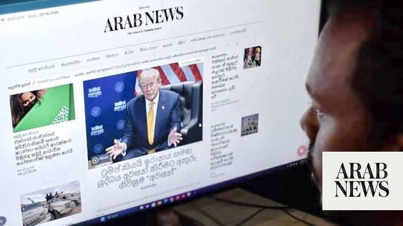

# How Arab News in Sinhalese expands news access for Sri Lankans in Middle East

Source: https://www.arabnews.com/node/2650236/world
Captured source: https://www.arabnews.com/node/2650236/world
Published: 2026-07-09T14:25:19+03:00
Modified: 2026-07-09T14:25:19+03:00
Author: MOHAMMED RASOLDEEN

## Summary

COLOMBO: The newly launched Sinhalese version of Arab News is making global and regional developments more accessible to Sri Lankan migrant workers in the Middle East, their representatives say, as for many, language has until now been the main barrier to obtaining news. The Sinhalese are the largest ethno-linguistic group in Sri Lanka, constituting about 75 percent of the

## Image

## Video Or Embed URLs

- blob:https://www.arabnews.com/4de7308b-c0c1-45c1-ba4c-7f45e18abb47
- https://imasdk.googleapis.com/js/core/bridge3.774.0_en.html
- https://cbbd60e9b7c508d142aabf12c6c2b55e.safeframe.googlesyndication.com/safeframe/1-0-45/html/container.html
- https://static.addtoany.com/menu/sm.25.html
- about:blank
- https://www.google.com/recaptcha/api2/aframe
- https://cm.g.doubleclick.net/partnerpixels?gdpr=0&us_privacy=1---&gpp_sid=-1&url=https%3A%2F%2Fwww.arabnews.com%2Fnode%2F2650236%2Fworld

## Downloaded Video

- [02_how-arab-news-in-sinhalese-expands-news-access-for-sri-lankans-in-midd.mp4](../../../rendered-clips/2026-07-09/02_how-arab-news-in-sinhalese-expands-news-access-for-sri-lankans-in-midd.mp4)

## Text

https://arab.news/rd48z

Arab News in Sinhalese is part of AI-powered feature translating articles into 50 languages

Sinhalese are the largest ethnic group in Sri Lanka, constituting about 75% of population

COLOMBO: The newly launched Sinhalese version of Arab News is making global and regional developments more accessible to Sri Lankan migrant workers in the Middle East, their representatives say, as for many, language has until now been the main barrier to obtaining news.

The Sinhalese are the largest ethno-linguistic group in Sri Lanka, constituting about 75 percent of the multi-ethnic island nation’s population.

Arab News launched its Sinhalese version as part of the artificial intelligence-powered feature it introduced in 2025 to allow readers to translate articles into 50 languages.

The launch was officiated in Riyadh on July 5, 2026, by Sri Lanka’s ambassador to Saudi Arabia, Ameer Ajwad, who said it made the region’s “leading English-language newspaper more accessible to a large number of Sinhalese-speaking Sri Lankan migrant workers in the Kingdom who are not proficient enough in English.”

Some 1.2 million Sri Lankan workers are employed in the Middle East, mostly in the six GCC countries.

To be able to read the most relevant news to the region where they live and work is a welcome development to them, said Nihal Gamage, a Sri Lankan entrepreneur who has been living in Saudi Arabia for over four decades.

“Arab News understands the pulse of the various migrant communities who are working in these countries,” he said. “They can read global news in their own language.”

As the publication offers coverage not only of global events, but also of the main news in their native country and developments that are related to expat communities in the region, it appeals to the Sri Lankan reader.

“The Sinhala edition is good news to more than 75 percent of the population since they read Sinhalese as their mother tongue,” said Dr. H. M. Rafeek, former president of the Sri Lankan Expatriates Society.

“They are interested to know what is happening in Saudi Arabia and the problems, if any, faced by foreign workers. They are also eager to know the current US-Iran moves and Arab News is giving good coverage on the current affairs in the Middle East.”
