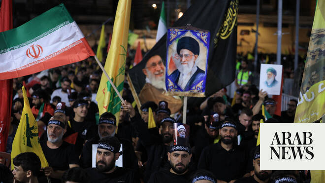

# Khamenei mourners gather in southern Beirut as Hezbollah chief vows fight against Israel

Source: https://www.arabnews.com/node/2650275/middle-east
Captured source: https://www.arabnews.com/node/2650275/middle-east
Published: 2026-07-09T18:17:51+03:00
Modified: 2026-07-09T18:20:06+03:00
Author: Arab News

## Summary

LONDON: People gathered on Wednesday night in Beirut’s southern suburbs to mourn Iran’s late Supreme Leader Ayatollah Ali Khamenei, who was killed in a joint US-Israeli attack on Iran in late February. In a speech broadcast by the group’s Al-Manar TV, Hezbollah Secretary-General Naim Qassem reaffirmed the Iran-backed group’s commitment to the June 17 Tehran-Washington

## Image

## Video Or Embed URLs

- blob:https://www.arabnews.com/e6b413be-ee22-4e4f-8bf9-1a14f1d47939
- https://imasdk.googleapis.com/js/core/bridge3.774.0_en.html
- https://31c27103ca21fb2d0e7cdcd33d8358c5.safeframe.googlesyndication.com/safeframe/1-0-45/html/container.html
- about:blank
- https://static.addtoany.com/menu/sm.25.html
- https://ep2.adtrafficquality.google/sodar/sodar2/255/runner.html
- https://www.google.com/recaptcha/api2/aframe
- https://cm.g.doubleclick.net/partnerpixels?gdpr=0&us_privacy=1---&gpp_sid=-1&url=https%3A%2F%2Fwww.arabnews.com%2Fnode%2F2650275%2Fmiddle-east

## Downloaded Video

- [02_khamenei-mourners-gather-in-southern-beirut-as-hezbollah-chief-vows-fi.mp4](../../../rendered-clips/2026-07-09/02_khamenei-mourners-gather-in-southern-beirut-as-hezbollah-chief-vows-fi.mp4)

## Text

https://arab.news/bk4jw

Naim Qassem says Iran-backed group backs diplomacy but will stay on the battlefield

Thousands accompanied Khamenei’s coffin through Najaf before his burial in Mashhad

LONDON: People gathered on Wednesday night in Beirut’s southern suburbs to mourn Iran’s late Supreme Leader Ayatollah Ali Khamenei, who was killed in a joint US-Israeli attack on Iran in late February.

In a speech broadcast by the group’s Al-Manar TV, Hezbollah Secretary-General Naim Qassem reaffirmed the Iran-backed group’s commitment to the June 17 Tehran-Washington memorandum of understanding roadmap, but said his group would continue fighting Israeli forces.

“We remain committed to the Iranian-American memorandum of understanding path, and with it, we will remain in the field,” Qassem said.

“We will not submit, and just as we thwarted their plan by preventing them from achieving their goal of ending the resistance, we will remain standing with our people in the field.

“The Israelis will not settle,” he added, “and we will do everything in our power to liberate this land, and we will liberate it.”

US President Donald Trump said earlier on Wednesday that the MoU signed with Iran to end the conflict was “over,” Reuters reported. “I don’t want to deal with them,” he said ahead of a NATO summit in the Turkish capital, Ankara.

Thousands of mourners accompanied Khamenei’s coffin through the Iraqi holy city of Najaf on Wednesday as his six-day funeral procession continued toward Karbala ahead of his burial in Mashhad on Thursday.

Lebanon has suffered deadly spillover from the US-Israeli war with Iran since Hezbollah opened a front in support of Tehran on March 2, triggering an Israeli offensive and ground incursion into southern Lebanon.

Israeli attacks have displaced more than 1.2 million Lebanese and killed at least 4,257 people, including more than 250 children, according to official figures.

In northern Israel, residents have reportedly been sheltering from Hezbollah rocket fire.

By June, the UN welcomed a new ceasefire announcement after Israeli and Lebanese representatives met in Washington, while warning that hostilities had not fully ended and urging all sides to respect the cessation of hostilities.

Amnesty International said Thursday that it had a reasonable basis to conclude that “Israeli forces violated international humanitarian law” during their military campaign in Lebanon.

The rights group said Israeli forces failed to distinguish between civilians and military targets, carried out attacks directed at civilians or civilian objects, or failed to take all feasible precautions to minimize civilian harm.

Israel says its operations are aimed at degrading Hezbollah’s military infrastructure and neutralizing the group’s threat to northern Israel.

It also cites UN Resolution 1701, which called for armed groups other than the Lebanese state and UN peacekeepers to remain out of the area south of the Litani River, arguing that Hezbollah should be pushed back from the frontier.

On June 26, Israel and Lebanon signed a framework agreement in Washington after several days of US-brokered negotiations. US Secretary of State Marco Rubio said the deal would begin establishing a framework for lasting peace and security.

Under the June framework, the Lebanese Armed Forces would gradually restore control across the country and disarm Hezbollah and other militant groups, with implementation beginning in pilot zones tied to civilian return and reconstruction.

The deal does not require an immediate full withdrawal of Israeli troops from what Israel calls a “security zone” in southern Lebanon, Reuters reported.

Hezbollah reportedly rejected the framework agreement, accusing the Lebanese government of undermining sovereignty and giving up key bargaining leverage in negotiations over the country’s future.
