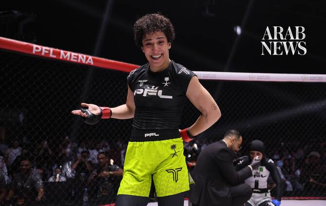

# ‘So happy, so proud’: Saudi’s Hattan Alsaif thrills home crowd with professional debut win at PFL MENA: Riyadh

Source: https://www.arabnews.com/node/2650501/sport
Captured source: https://www.arabnews.com/node/2650501/sport
Published: 2026-07-11T12:56:27+03:00
Modified: 2026-07-11T19:08:39+03:00
Author: Lama Al-Hamawi

## Summary

RIYADH: Saudi Arabia’s rising MMA star Hattan Alsaif delighted her home crowd with a hugely impressive win at PFL Mena: Riyadh on her professional debut at Boulevard Studios. Alsaif has been making a name for herself over the last two years with string of victories and came into the bout with clean record of four wins and no losses. It took her 3 minutes and 38 seconds to

## Image

## Video Or Embed URLs

- blob:https://www.arabnews.com/3966d9b3-9709-4700-895e-e72c3144eae2
- https://imasdk.googleapis.com/js/core/bridge3.774.0_en.html
- https://48e90f98f75ecfab066d26c6d4d4e113.safeframe.googlesyndication.com/safeframe/1-0-45/html/container.html
- https://static.addtoany.com/menu/sm.25.html
- about:blank
- https://www.google.com/recaptcha/api2/aframe
- https://cm.g.doubleclick.net/partnerpixels?gdpr=0&us_privacy=1---&gpp_sid=-1&url=https%3A%2F%2Fwww.arabnews.com%2Fnode%2F2650501%2Fsport

## Downloaded Video

- [02_so-happy-so-proud-saudi-s-hattan-alsaif-thrills-home-crowd-with-profes.mp4](../../../rendered-clips/2026-07-11/02_so-happy-so-proud-saudi-s-hattan-alsaif-thrills-home-crowd-with-profes.mp4)

## Text

https://arab.news/zx9e5

Hazem Kayyali puts on a show against Hassan Shaaban to advance to the welterweight tournament semifinals on Oct. 2

RIYADH: Saudi Arabia’s rising MMA star Hattan Alsaif delighted her home crowd with a hugely impressive win at PFL Mena: Riyadh on her professional debut at Boulevard Studios.

For the latest updates, follow us @ArabNewsSport

Alsaif has been making a name for herself over the last two years with string of victories and came into the bout with clean record of four wins and no losses.

It took her 3 minutes and 38 seconds to complete a TKO win over Algeria’s Dania Ouhachi.

“It feels amazing, and I wasn’t expecting that at ll,” a delight Alsaif told Arab News. “My coaches and a lot of people told me that I’m going to win it by a knockout in the second round. For me I entered the fight not trying to finish it, or Tyron to find the knockout. I entered the fight because I just want to enjoy it and have my fight.”

Alsaif entered the Catchweight Showcase Main Event knowing she count on massive support against Ouhachi. She went on to thrill the audience with an early takedown afte her opponent threatened with an armbar but the Saudi-born striker worked back to her feet. In the second round, Alsaif scored with a thunderous overhand right which sent her Algerian-born opponent down.

“I was surprised when she got down,” Alsaif added. “ You can rewatch the fight and you’re going to see me shocked that she fell down. And then I tried to just catch the knockout. So happy, so proud.”

In the co-main event, Lebanon’s Hassan Shaaban (7-2) met Jordan’s Hazem Kayyali (3-0-2) in a pivotal welterweight matchup. Kayyali countered with a barrage of kicks to the legs and head of his opponent to control the opening round, followed by the two men battling for control of the final two rounds.

Also on the main card, Jeddah’s own Malik Basahel (4-0) showed a frenetically superior display of grappling as he had his hand raised in a unanimous decision victory over Morocco’s Imad El-Azami (1-1). The crowd celebrated as their hometown fighter kept his undefeated record intact in the flyweight division, scoring 30-27 across two judges’ scorecards, the third scoring 29-28.

In the PFL MENA welterweight tournament, Abdelkrim Zouad (8-2) and Omar Hussein (12-7) secured their places in the semifinals with victories over Wissame Akhmouch and Ahmed Darwish, respectively. Morocco’s fan favorite, Badreddine Diani also advanced to the semifinals after defeating Egypt’s Yousef Adel, while Kayyali defeated Shaaban in the co-main event, cementing his next fight on Oct. 2 in Riyadh.

Algeria’s Elias Boudegzdame (21-9) defeated Hussein Salem (12-7) to advance to the PFL MENA featherweight semifinals, while Syria’s Shadi Kabbani (4-0) earned his semifinal spot with a victory over Ahmed Tarek (7-2).

PFL MENA: RIYADH Results:

Hattan Alsaif (1-0) defeated Dania Ouhachi (1-2) via TKO (ground and pound) at 3:38 in round two

Hazem Kayyali (3-0-2) defeated Hassan Shaaban (7-2) via unanimous decision (29-28 x2, 29-27)

Malik Basahel (4-0) defeated Imad El-Azami (1-1) via unanimous decision (30-27 x2, 29-28)

Badreddine Diani (11-4) defeated Yousef Adel (5-1) via unanimous decision (29-28 x3)

Abdelkrim Zouad (8-2) defeated Wissame Akhmouch (7-3) via submission (rear-naked choke) at 3:08 in round two

Shadi Kabbani (4-0) defeated Ahmed Tarek (7-2) via unanimous decision (29-28 x3)

Omar Hussein (12-7) defeated Ahmed Darwish (3-2) via TKO (referee stoppage) at 3:49 in round two

Elias Boudegzdame (21-9) defeated Hussein Salem (12-7) via technical submission (triangle choke) at 2:55 in round one

Rayan Atmani (6-3) defeated Eslam Mostafa (5-3) via KO at 4:50 in round one

Saud Al-Molhem (2-1) defeated Abdelhalim Elhoufy (0-1) via unanimous decision (30-27 x3)
