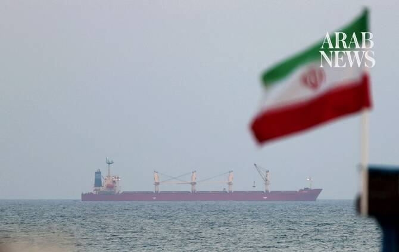

# Fresh attacks hit Iran as Tehran and US square off over Hormuz

Source: https://www.arabnews.com/node/2650633/middle-east
Captured source: https://www.arabnews.com/node/2650633/middle-east
Published: 2026-07-12T16:41:30+03:00
Modified: 2026-07-12T22:48:00+03:00
Author: AFP

## Summary

TEHRAN: Fresh attacks rocked Iran on Sunday evening as Tehran and Washington squared off over the Strait of Hormuz, offering contradicting statements as to whether the vital waterway was open to traffic. Iran reported strikes on two of its southern islands. The strikes came hours after Tehran and Washington exchanged fire for the third time this week, with control of Hormuz

## Image

## Video Or Embed URLs

- blob:https://www.arabnews.com/48cc094b-7dd1-4a7a-9f12-620625c84c40
- https://imasdk.googleapis.com/js/core/bridge3.774.0_en.html
- https://d4fade6365f3db541d8ab234ab745d5b.safeframe.googlesyndication.com/safeframe/1-0-45/html/container.html
- https://static.addtoany.com/menu/sm.25.html
- about:blank
- https://sync.teads.tv/wigo-no-slot
- https://www.google.com/recaptcha/api2/aframe
- https://cm.g.doubleclick.net/partnerpixels?gdpr=0&us_privacy=1---&gpp_sid=-1&url=https%3A%2F%2Fwww.arabnews.com%2Fnode%2F2650633%2Fmiddle-east

## Downloaded Video

- [02_fresh-attacks-hit-iran-as-tehran-and-us-square-off-over-hormuz.mp4](../../../rendered-clips/2026-07-12/02_fresh-attacks-hit-iran-as-tehran-and-us-square-off-over-hormuz.mp4)

## Text

https://arab.news/maks9

On Sunday evening, Iranian state media reported at least 10 “enemy projectiles” hitting Qeshm Island, which sits on the Strait of Hormuz

It also reported strikes on the island of Farur, to the east of Qeshm in the Gulf

TEHRAN: Fresh attacks rocked Iran on Sunday evening as Tehran and Washington squared off over the Strait of Hormuz, offering contradicting statements as to whether the vital waterway was open to traffic. Iran reported strikes on two of its southern islands. The strikes came hours after Tehran and Washington exchanged fire for the third time this week, with control of Hormuz again the central issue, plunging into further question negotiations aimed at building on a preliminary deal and ending the Middle East war for good. Before the war began with surprise US-Israeli strikes against Iran on February 28, there was free passage through Hormuz, but Tehran now insists that it will control the strait, while Washington is adamant it cannot. The exchanges earlier in the day were prompted by an Iranian attack on a commercial ship in the waterway whose crew was forced to abandon it after it went up in flames. Iran’s Revolutionary Guards said after the incident that “the Strait of Hormuz will be closed until further notice and until the end of American interventions in this region,” according to state news agency IRNA. The US military’s Central Command countered on X that the strait was “open to all vessels seeking to lawfully transit.” It said US forces were “positioned and prepared to ensure” freedom of navigation, adding: “Iran does not control the strait. Traffic is flowing.” Control of the waterway has become key leverage for Iran, with an adviser to the country’s supreme leader on Sunday saying it was more important than “dozens of atomic bombs.”

‘Hit them very hard’

On Sunday evening, Iranian state media reported at least 10 “enemy projectiles” hitting Qeshm Island, which sits on the Strait of Hormuz. It also reported strikes on the island of Farur, to the east of Qeshm in the Gulf, that it said killed a telecommunications worker and wounded two others. Shortly after, Kuwait said three of its land border posts in the north were damaged in an attack, and that an offshore drilling platform “was targeted by a hostile drone,” with one person injured. Tehran said it had targeted two ships in Hormuz earlier Sunday, including the one that caught fire. The American military said it had responded with strikes on about 140 targets, and Iranian media reported explosions in Bandar Abbas, Sirik, Jask and on Qeshm, as well as in Khuzestan province, with one soldier reported killed in the southern city of Jask. US President Donald Trump told CNN that “we hit them very hard last night,” maintaining the two sides had been close to a deal on Saturday. “They were giving up everything, and then all of a sudden two hours after that they hit a ship with a drone,” he said. Iran’s response to the US strikes came quickly, with sirens and explosions heard in Qatar, the United Arab Emirates and Bahrain, AFP journalists and local authorities reported. Kuwait said it was working to intercept an attack, while Jordan said three Iranian missiles fell inside the kingdom. Iran’s Guards said they also hit Oman, which has rarely been targeted. Muscat summoned the Iranian ambassador and handed him a formal protest — a rare move for the sultanate, which has been attempting to balance competing demands from Washington and Tehran. The attack came just hours after the country hosted Iran’s foreign minister to discuss the Strait of Hormuz.

Sunday’s attack on a Cyprus-flagged container ship in the waterway left one Indian sailor missing, New Delhi said. Muscat, meanwhile, said it had rescued 23 crew members from a commercial ship. The crew abandoned ship and were on a lifeboat, British maritime agency UKMTO reported, around 17 kilometers (10 miles) east of Oman. Separate Iranian strikes on ships in Hormuz had triggered fighting earlier this week, along with heated rhetoric. Iran’s supreme leader Mojtaba Khamenei has vowed revenge for the killing of his father and predecessor on the first day of the war, and said Iran had compiled a list of individuals to be targeted. Trump on Saturday said any attempt to assassinate him would lead the United States to “completely decimate” Iran. He has declared an April ceasefire over — while leaving the door open for further talks — and mediators have been trying to salvage a diplomatic solution. The top diplomat for Pakistan, which has been mediating, called for “de-escalation” on Sunday during a phone call with his Iranian counterpart, Islamabad said. “Dialogue and diplomacy remain the only viable path to resolving disputes and achieving lasting peace,” said Foreign Minister Ishaq Dar. UN Secretary-General Antonio Guterres also called for peace, with his spokesman saying “these attacks must stop.”
