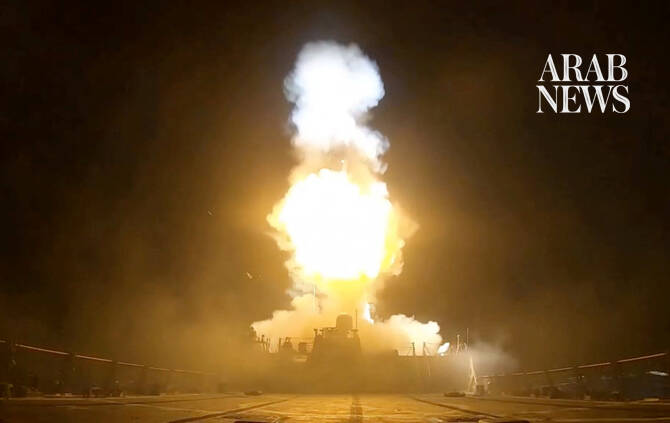

# US says completed strikes on dozens of Iranian targets

Source: https://www.arabnews.com/node/2650673/middle-east
Captured source: https://www.arabnews.com/node/2650673/middle-east
Published: 2026-07-13T00:52:26+03:00
Modified: 2026-07-13T07:37:38+03:00
Author: AFP

## Summary

WASHINGTON: The US military said on Monday it completed a new round of strikes in Iran aimed at preventing the Islamic republic from attacking shipping in the vital Strait of Hormuz. “CENTCOM forces struck Iranian military air-defense systems, coastal radar sites, missile and drone capabilities, and small boats using US fighter aircraft, naval vessels, one-way attack aerial

## Image

## Video Or Embed URLs

- blob:https://www.arabnews.com/c65bae33-34dd-4250-b77e-a453ccef5fc9
- https://imasdk.googleapis.com/js/core/bridge3.774.0_en.html
- https://platform.twitter.com/embed/Tweet.html?creatorScreenName=Arab_News&creatorUserId=69172612&dnt=false&embedId=twitter-widget-0&features=eyJ0ZndfdGltZWxpbmVfbGlzdCI6eyJidWNrZXQiOltdLCJ2ZXJzaW9uIjpudWxsfSwidGZ3X2ZvbGxvd2VyX2NvdW50X3N1bnNldCI6eyJidWNrZXQiOnRydWUsInZlcnNpb24iOm51bGx9LCJ0ZndfdHdlZXRfZWRpdF9iYWNrZW5kIjp7ImJ1Y2tldCI6Im9uIiwidmVyc2lvbiI6bnVsbH0sInRmd19yZWZzcmNfc2Vzc2lvbiI6eyJidWNrZXQiOiJvbiIsInZlcnNpb24iOm51bGx9LCJ0ZndfZm9zbnJfc29mdF9pbnRlcnZlbnRpb25zX2VuYWJsZWQiOnsiYnVja2V0Ijoib24iLCJ2ZXJzaW9uIjpudWxsfSwidGZ3X21peGVkX21lZGlhXzE1ODk3Ijp7ImJ1Y2tldCI6InRyZWF0bWVudCIsInZlcnNpb24iOm51bGx9LCJ0ZndfZXhwZXJpbWVudHNfY29va2llX2V4cGlyYXRpb24iOnsiYnVja2V0IjoxMjA5NjAwLCJ2ZXJzaW9uIjpudWxsfSwidGZ3X3Nob3dfYmlyZHdhdGNoX3Bpdm90c19lbmFibGVkIjp7ImJ1Y2tldCI6Im9uIiwidmVyc2lvbiI6bnVsbH0sInRmd19kdXBsaWNhdGVfc2NyaWJlc190b19zZXR0aW5ncyI6eyJidWNrZXQiOiJvbiIsInZlcnNpb24iOm51bGx9LCJ0ZndfdXNlX3Byb2ZpbGVfaW1hZ2Vfc2hhcGVfZW5hYmxlZCI6eyJidWNrZXQiOiJvbiIsInZlcnNpb24iOm51bGx9LCJ0ZndfdmlkZW9faGxzX2R5bmFtaWNfbWFuaWZlc3RzXzE1MDgyIjp7ImJ1Y2tldCI6InRydWVfYml0cmF0ZSIsInZlcnNpb24iOm51bGx9LCJ0ZndfbGVnYWN5X3RpbWVsaW5lX3N1bnNldCI6eyJidWNrZXQiOnRydWUsInZlcnNpb24iOm51bGx9LCJ0ZndfdHdlZXRfZWRpdF9mcm9udGVuZCI6eyJidWNrZXQiOiJvbiIsInZlcnNpb24iOm51bGx9fQ%3D%3D&frame=false&hideCard=false&hideThread=false&id=2076495252454584794&lang=en&origin=https%3A%2F%2Fwww.arabnews.com%2Fnode%2F2650673%2Fmiddle-east&sessionId=e36b3f90ecb734b0c68216e966ae9acf348bf84e&siteScreenName=Arab_News&siteUserId=69172612&theme=light&widgetsVersion=6a3ad42b224df%3A1778106238597&width=600px
- https://96adc652920ebdff0787b8990c572710.safeframe.googlesyndication.com/safeframe/1-0-45/html/container.html
- about:blank
- https://static.addtoany.com/menu/sm.25.html
- https://platform.twitter.com/widgets/widget_iframe.1227a5674072e080ffb1ba14ac0c1079.html?origin=https%3A%2F%2Fwww.arabnews.com
- https://www.google.com/recaptcha/api2/aframe
- https://cm.g.doubleclick.net/partnerpixels?gdpr=0&us_privacy=1---&gpp_sid=-1&url=https%3A%2F%2Fwww.arabnews.com%2Fnode%2F2650673%2Fmiddle-east

## Downloaded Video

- [02_us-says-completed-strikes-on-dozens-of-iranian-targets.mp4](../../../rendered-clips/2026-07-13/02_us-says-completed-strikes-on-dozens-of-iranian-targets.mp4)

## Text

https://arab.news/p7w7p

Tehran says attacks derail diplomacy as Gulf tensions escalate

Commercial shipping continues despite mounting military confrontation

WASHINGTON: The US military said on Monday it completed a new round of strikes in Iran aimed at preventing the Islamic republic from attacking shipping in the vital Strait of Hormuz.

“CENTCOM forces struck Iranian military air-defense systems, coastal radar sites, missile and drone capabilities, and small boats using US fighter aircraft, naval vessels, one-way attack aerial drones, and one-way attack sea drones for the first time,” the US military said in a post on X.

Iran condemned the latest US attacks, saying they had “rendered futile” months of diplomatic efforts aimed at ending the conflict.

“The US regime has also caused the return of insecurity in the Strait of Hormuz and disruption of international commercial shipping by openly interfering in the process of Iran implementing the necessary arrangements in the Strait of Hormuz,” Iran’s foreign ministry said in a statement.

Despite the escalating military confrontation, commercial traffic continued through the strategic waterway. Over the past 24 hours, about 20 commercial vessels transited the Strait of Hormuz in coordination with the US military, while several others made the passage independently, Axios reported, citing a US official.

The flare-up is the latest to undermine an interim agreement between Washington and Tehran aimed at ending their war, which has caused global economic shockwaves since it began in late February.

The latest salvo by US forces began at 2100 GMT on Sunday, Central Command (CENTCOM) said on X, following approximately 140 strikes the previous night.

Iranian state media reported US strikes targeting large areas across southern and western Iran, including Qeshm island and Bandar Abbas near the strait, and in Khuzestan province bordering Iraq.

The governor of Qeshm Island near the strait told Iran’s state-run IRNA news agency that projectiles targeted military facilities without causing casualties. Explosions were also reported in Bandar Abbas and Hajjiabad.

A US official, speaking on condition of anonymity, said the strikes targeted missile batteries, air defense systems and boats belonging to Iran’s paramilitary Revolutionary Guard.

Iran also reported strikes Sunday evening on two of its southern islands while Kuwait, where Tehran has repeatedly targeted US installations, said border posts and an offshore oil platform had been attacked.

The renewed fighting followed an Iranian attack early Sunday on a commercial ship in the Strait of Hormuz, whose crew was forced to abandon it after it went up in flames.

Iran’s Revolutionary Guards said after the incident that “the Strait of Hormuz will be closed until further notice and until the end of American interventions in this region,” according to state news agency IRNA.

CENTCOM countered on X that the strait was “open to all vessels seeking to lawfully transit.”

The military command added that US forces were “positioned and prepared to ensure” freedom of navigation, saying: “Iran does not control the strait. Traffic is flowing.”

Control of the strategic waterway has become key leverage for Iran, with an adviser to the country’s supreme leader on Sunday saying it was more important than “dozens of atomic bombs.”

Mediators have been trying to salvage a diplomatic solution to ending the war after President Donald Trump this week declared a ceasefire over.

Iran’s foreign ministry said the US attacks on Sunday had “caused the return of insecurity in the Strait of Hormuz” and “have rendered futile all efforts” at establishing peace in the region.

‘Hit them very hard’

On Sunday evening, Iranian state media reported at least 10 “enemy projectiles” hitting Qeshm Island, which sits on the Strait of Hormuz.

It also reported strikes on the island of Farur, to the east of Qeshm in the Gulf, that it said killed a telecommunications worker and wounded two others.

Official news agency IRNA also reported early on Monday morning that US strikes had killed one person and wounded four at a water pumping station in the southwest city of Mahshahr.

On Sunday, Kuwait said three of its land border posts in the north were damaged in an attack, and that an offshore drilling platform “was targeted by a hostile drone,” with one person injured.

Tehran said it had targeted two ships in Hormuz early Sunday, including one that caught fire.

The American military said it had responded with strikes on about 140 targets, and Iranian media reported explosions in Bandar Abbas, Sirik, Jask and on Qeshm, as well as in Khuzestan province, with one soldier reported killed.

Iran’s response to the US strikes came quickly, with sirens and explosions heard in Qatar, the United Arab Emirates and Bahrain, AFP journalists and local authorities reported.

Kuwait said it was working to intercept an attack, while Jordan said three Iranian missiles fell inside the kingdom.

Iran’s Guards said they also hit Oman, which has rarely been targeted.

Muscat summoned the Iranian ambassador and handed him a formal protest — a rare move for the sultanate, which has been attempting to balance competing demands from Washington and Tehran.

The attack came just hours after the country hosted Iran’s foreign minister to discuss the Strait of Hormuz.

Sunday’s attack on a Cyprus-flagged container ship in the waterway left one Indian sailor missing, New Delhi said.

Muscat, meanwhile, said it had rescued 23 crew members from a commercial ship.

The crew abandoned ship and were on a lifeboat, around 17 kilometers (10 miles) east of Oman, British maritime agency UKMTO reported.

Separate Iranian strikes on ships in Hormuz had triggered fighting earlier this week, along with heated rhetoric.

Iran’s supreme leader Mojtaba Khamenei has vowed revenge for the killing of his father and predecessor on the first day of the war, and said Iran had compiled a list of individuals to be targeted.

Trump on Saturday said any attempt to assassinate him would lead the United States to “completely decimate” Iran.

The top diplomat for Pakistan, which has been mediating, called for “de-escalation” on Sunday during a phone call with his Iranian counterpart, Islamabad said.

“Dialogue and diplomacy remain the only viable path to resolving disputes and achieving lasting peace,” said Foreign Minister Ishaq Dar.

UN Secretary-General Antonio Guterres also called for peace, with his spokesman saying “these attacks must stop.”
