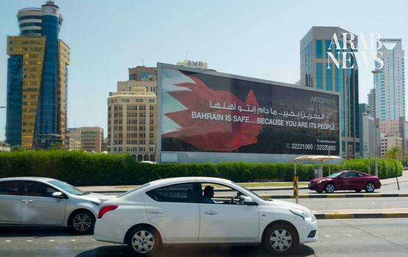

# Iran’s Guards say struck US military bases in Jordan, Bahrain, Kuwait

Source: https://www.arabnews.com/node/2650687/middle-east
Captured source: https://www.arabnews.com/node/2650687/middle-east
Published: 2026-07-13T09:50:36+03:00
Modified: 2026-07-13T09:56:21+03:00
Author: AFP

## Summary

MANAMA/TEHRAN: Iran’s Revolutionary Guards said they had struck US military targets and bases in Jordan, Bahrain and Kuwait, state media reported on Monday. The official news agency IRNA cited several statements released by the Guards saying they had attacked Prince Hassan Air Base in Jordan, a US military drone command center in Bahrain and air bases including Ali Al-Salem in

## Image

## Video Or Embed URLs

- https://3161c5e2a4174caf0916a1bd495d8267.safeframe.googlesyndication.com/safeframe/1-0-45/html/container.html
- https://static.addtoany.com/menu/sm.25.html
- about:blank
- https://imasdk.googleapis.com/js/core/bridge3.774.0_en.html
- https://www.google.com/recaptcha/api2/aframe
- https://cm.g.doubleclick.net/partnerpixels?gdpr=0&us_privacy=1---&gpp_sid=-1&url=https%3A%2F%2Fwww.arabnews.com%2Fnode%2F2650687%2Fmiddle-east

## Downloaded Video

- [02_iran-s-guards-say-struck-us-military-bases-in-jordan-bahrain-kuwait.mp4](../../../rendered-clips/2026-07-13/02_iran-s-guards-say-struck-us-military-bases-in-jordan-bahrain-kuwait.mp4)

## Text

https://arab.news/87kjz

Radar systems in Oman were also destroyed in the latest retaliatory attacks

Jordan intercepts, shoots down four rockets fired from Iran

MANAMA/TEHRAN: Iran’s Revolutionary Guards said they had struck US military targets and bases in Jordan, Bahrain and Kuwait, state media reported on Monday.

The official news agency IRNA cited several statements released by the Guards saying they had attacked Prince Hassan Air Base in Jordan, a US military drone command center in Bahrain and air bases including Ali Al-Salem in Kuwait.

Radar systems in Oman were also destroyed in the latest retaliatory attacks.

Iranian missiles entered the country’s airspace, the Jordanian army said Monday, with four rockets fired from Iranian territory intercepted and shot down. No injuries or material damage has been reported.

Any attempt to undermine the country's sovereignty will be met with a firm response, the Jordanian army said.

Kuwait’s armed forces said they were responding to “hostile aerial targets” on Monday.

“The Armed Forces are currently intercepting hostile aerial targets within Kuwaiti airspace,” the head of Kuwait’s army said in a statement published by the state-run news agency KUNA.

Bahrain meanwhile sounded its missile alert sirens for a second time as air raid sirens went off earlier on Monday, the interior ministry said, instructing residents to take shelter following attacks on the island nation..

“The siren has been sounded... citizens and residents are urged to remain calm and head to the nearest safe place,” the Ministry of Interior posted on X.

Iran said Sunday it was closing the Strait of Hormuz and launched missiles and drones at Gulf neighbors after the US carried out a new round of strikes as their conflict escalated.

The latest exchange of fire was sparked by another Iranian attack on a commercial ship in the strait, whose crew were forced to abandon the vessel after it went up in flames.

The escalation is the latest to undermine an interim agreement between Washington and Tehran aimed at ending their war, which broke out in late February with US-Israeli strikes that killed Iran’s supreme leader.

Mediators have been trying to salvage a diplomatic solution after President Donald Trump this week declared a ceasefire over.
