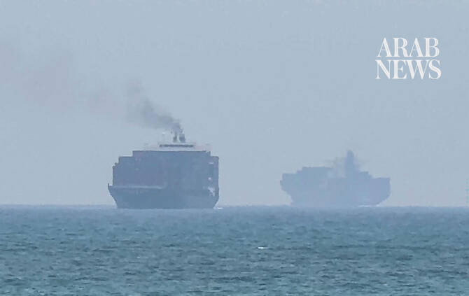

# State TV says Iran fired ‘warning shots’ at two ships in Hormuz

Source: https://www.arabnews.com/node/2650698/middle-east
Captured source: https://www.arabnews.com/node/2650698/middle-east
Published: 2026-07-13T14:14:50+03:00
Modified: 2026-07-13T14:20:24+03:00
Author: AFPReuters

## Summary

SINGAPORE/TEHRAN: Iran on Monday fired “warning shots” at two ships attempting to cross the Strait of Hormuz, state television reported, as Tehran and Washington battle for control of the strategic waterway. “This morning, two ships that were attempting to cross the Strait of Hormuz illegally were targeted and stopped by warning shots fired by the navy of the Revolutionary

## Image

## Video Or Embed URLs

- blob:https://www.arabnews.com/0fd075fb-ce6b-4d89-9133-b1f828965f05
- https://imasdk.googleapis.com/js/core/bridge3.774.0_en.html
- https://81d19b3d416c1e0ab5dbc54a0d4b98e3.safeframe.googlesyndication.com/safeframe/1-0-45/html/container.html
- about:blank
- https://static.addtoany.com/menu/sm.25.html
- https://www.google.com/recaptcha/api2/aframe
- https://cm.g.doubleclick.net/partnerpixels?gdpr=0&us_privacy=1---&gpp_sid=-1&url=https%3A%2F%2Fwww.arabnews.com%2Fnode%2F2650698%2Fmiddle-east

## Downloaded Video

- [02_state-tv-says-iran-fired-warning-shots-at-two-ships-in-hormuz.mp4](../../../rendered-clips/2026-07-13/02_state-tv-says-iran-fired-warning-shots-at-two-ships-in-hormuz.mp4)

## Text

https://arab.news/bveqc

Six vessels transited the strait on Sunday, ship-tracking data from Kpler showed

Iran said on Monday that its navy stopped two ships in the strait the previous night

SINGAPORE/TEHRAN: Iran on Monday fired “warning shots” at two ships attempting to cross the Strait of Hormuz, state television reported, as Tehran and Washington battle for control of the strategic waterway.

“This morning, two ships that were attempting to cross the Strait of Hormuz illegally were targeted and stopped by warning shots fired by the navy of the Revolutionary Guards,” said a correspondent on national television based near the strait.

The number ‌of vessels transiting the Strait of Hormuz fell to multi-week lows on Sunday, shipping data showed, as renewed strikes between the US and Iran and attacks on ships in the Middle East heightened safety concerns.

Six vessels transited the strait on Sunday, ship-tracking data from Kpler showed, the lowest number in five weeks.

Tankers that exited the strait included the Very Large Crude Carrier Humanity, laden ‌with 2 ‌million barrels of Iranian oil and ‌another ⁠tanker, Capetan Andreas, ⁠carrying about 500,000 barrels of Kuwaiti oil products, the data showed, while three empty tankers entered the Gulf to load oil.

Most of the tankers switched off their transponders when crossing the strait.

There were no liquefied natural gas ⁠tankers that entered the strait over the ‌weekend that were ‌visible on ship-tracking data.

One tanker controlled by the Abu ‌Dhabi National Oil Co. exited the strait ‌between July 10 and July 12, Kpler data showed. The vessel is heading for Dahej port in India. US forces completed another wave of strikes against ‌Iran on Sunday, hitting dozens of targets at multiple locations with precision munitions, the ⁠Central ⁠Command said.

US President Donald Trump said on Sunday that the Strait of Hormuz is open to commercial traffic, although Iran declared earlier that it closed the strait after a vessel traveled on an unapproved route and was struck. Iran’s Revolutionary Guards said on Monday that its navy stopped two ships in the Strait of Hormuz last night by shutting down their systems. It did not name the ships involved.
