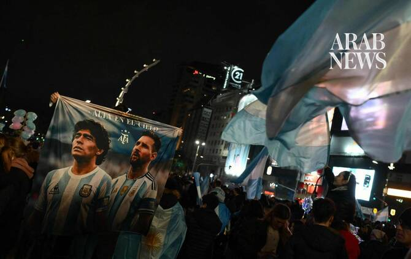

# Messi takes on England for a place in the World Cup final

Source: https://www.arabnews.com/node/2650800/sport
Captured source: https://www.arabnews.com/node/2650800/sport
Published: 2026-07-14T11:18:23+03:00
Modified: 2026-07-14T11:24:15+03:00
Author: AFP

## Summary

ATLANTA: Lionel Messi has done just about everything possible in a glorious career, but the 39-year-old Argentinian great has never taken on England — he will finally get the chance in Wednesday’s World Cup semifinal. Messi won his 200th cap for the Albiceleste in the group-stage victory against Algeria and dreams of leading his country to the final once again. The diminutive

## Image

## Video Or Embed URLs

- blob:https://www.arabnews.com/d7767165-7abf-41d9-b8a1-fffb5bafa611
- https://imasdk.googleapis.com/js/core/bridge3.776.0_en.html
- https://901cdaf1a45e2c5a390b7cede595e76c.safeframe.googlesyndication.com/safeframe/1-0-45/html/container.html
- https://static.addtoany.com/menu/sm.25.html
- about:blank
- https://sync.teads.tv/wigo-no-slot
- https://www.google.com/recaptcha/api2/aframe
- https://cm.g.doubleclick.net/partnerpixels?gdpr=0&us_privacy=1---&gpp_sid=-1&url=https%3A%2F%2Fwww.arabnews.com%2Fnode%2F2650800%2Fsport

## Downloaded Video

- [02_messi-takes-on-england-for-a-place-in-the-world-cup-final.mp4](../../../rendered-clips/2026-07-14/02_messi-takes-on-england-for-a-place-in-the-world-cup-final.mp4)

## Text

https://arab.news/phmfd

Lionel Messi has done just about everything possible in a glorious career, but the 39-year-old Argentinian great has never taken on England

ATLANTA: Lionel Messi has done just about everything possible in a glorious career, but the 39-year-old Argentinian great has never taken on England — he will finally get the chance in Wednesday’s World Cup semifinal. For the latest updates, follow us @ArabNewsSport Messi won his 200th cap for the Albiceleste in the group-stage victory against Algeria and dreams of leading his country to the final once again. The diminutive playmaker is surely in the final days of a remarkable international career which began when he was a fresh-faced 18-year-old in 2005. Having broken into the Barcelona team late the previous year, Messi had just starred for Argentina as they won the Under-20 World Cup in the Netherlands. He was handed his Argentina bow by Jose Pekerman in a friendly against Hungary in Budapest that August, replacing Lisandro Lopez in the 64th minute and joining Hernan Crespo up front. Ninety seconds later he was sent off for what the referee saw as an elbow. It was quite the ignominious way for his Argentina career to begin. “An 18-year-old kid who is making his debut for the national team and has so much hope — he can’t be punished like that. The referee needed to be more understanding,” said Crespo. Messi might look back now and laugh at that incident, which led to him being suspended for a friendly against England in Geneva three months later. The nations have not met since, and so Messi will play against the Three Lions for the very first time under the roof of the Mercedes-Benz Stadium in Atlanta. “I have played against everyone except England and it is special because they are a major nation, a powerhouse, and it is always nice to play against a side like that, especially in a World Cup semifinal,” said Messi after Argentina beat Switzerland in Kansas City in the last eight. Emulating Maradona The man who emulated Diego Maradona by inspiring Argentina to World Cup glory in Qatar four years ago will now hope to leave a similar mark on England as his legendary predecessor. Any meeting of these countries evokes memories of the 1986 quarter-final at the Estadio Azteca in Mexico City, when Maradona punched in to score the ‘Hand of God’ opener and then ran past half the England defense for his team’s second goal — perhaps the greatest World Cup goal of all time. Messi has not scored one quite like that, but ahead of the semifinals of the current tournament he had scored more World Cup goals than any other player. With 21 goals from a tournament record 32 appearances, he led France skipper Kylian Mbappe by one after the quarter-finals. The Inter Miami player had found the net in nine consecutive World Cup matches before the Switzerland game, when he let others — notably Julian Alvarez — take over the goalscoring duties. Argentina are now one game away from reaching another World Cup final, as they aim to become the first team to retain the trophy since Brazil in 1962. It would be a third final in four World Cups, and Messi could follow in the footsteps of Brazil great Cafu. The full-back played in three in a row from 1994 to 2002 — even Maradona only played in two. “Getting to another semifinal is not a normal, mundane thing, so this is something we should really enjoy because we don’t know if it will happen again,” Messi said. The England players will hope to enjoy it as well. “It’s a once-in-a-lifetime opportunity,” Nico O’Reilly, who is likely to come up against Messi if he starts at left-back, told BBC Radio 5 Live. “He’s coming toward the end of his career. For me personally, he’s the best player to ever touch a football pitch. And yeah, I can’t wait for the challenge.”

For the latest updates, follow us @ArabNewsSport
