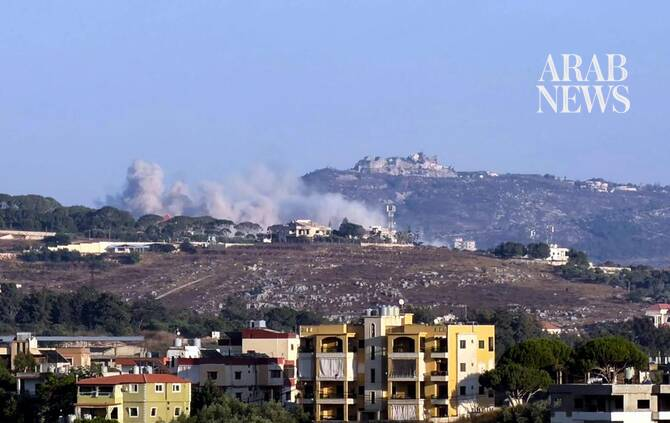

# Lebanon and Israel hold talks in Rome amid renewed Mideast fighting

Source: https://www.arabnews.com/node/2650820/middle-east
Captured source: https://www.arabnews.com/node/2650820/middle-east
Published: 2026-07-14T13:15:46+03:00
Modified: 2026-07-14T13:41:26+03:00
Author: Arab NewsAFP

## Summary

BEIRUT: Lebanon and Israel are holding new negotiations under US auspices in Rome on Tuesday, against the backdrop of a regional escalation between Washington and Tehran. The two countries, officially at war for decades, reached a framework agreement on June 26, after five rounds of negotiations in Washington, aimed at ending the war between Israel and Iran-backed Hezbollah

## Image

## Video Or Embed URLs

- blob:https://www.arabnews.com/ee02e44e-bb9f-4e7d-84f0-fdbc12303e9e
- https://imasdk.googleapis.com/js/core/bridge3.776.0_en.html
- https://2a531f43fabf717ad59f90c8bd5a8d27.safeframe.googlesyndication.com/safeframe/1-0-45/html/container.html
- about:blank
- https://static.addtoany.com/menu/sm.25.html
- https://sync.teads.tv/wigo-no-slot
- https://www.google.com/recaptcha/api2/aframe
- https://cm.g.doubleclick.net/partnerpixels?gdpr=0&us_privacy=1---&gpp_sid=-1&url=https%3A%2F%2Fwww.arabnews.com%2Fnode%2F2650820%2Fmiddle-east

## Downloaded Video

- [02_lebanon-and-israel-hold-talks-in-rome-amid-renewed-mideast-fighting.mp4](../../../rendered-clips/2026-07-14/02_lebanon-and-israel-hold-talks-in-rome-amid-renewed-mideast-fighting.mp4)

## Text

https://arab.news/r3htb

Lebanon and Israel are holding new negotiations under US auspices in Rome on Tuesday, against the backdrop of a regional escalation between Washington and Tehran

The talks come despite the Israeli army continuing to entrench its occupation of the south of the country

BEIRUT: Lebanon and Israel are holding new negotiations under US auspices in Rome on Tuesday, against the backdrop of a regional escalation between Washington and Tehran. The two countries, officially at war for decades, reached a framework agreement on June 26, after five rounds of negotiations in Washington, aimed at ending the war between Israel and Iran-backed Hezbollah and paving the way for peace.

The talks come despite the Israeli army continuing to entrench its occupation of the south of the country with Lebanese state-run NNA reporting the demolishon and burning of homes in southern neighbourhoods of the town of Hadatha on Monday. NNA also said Israeli forces had carried out a large explosion in the southern city of Bint Jbeil a day prior. The Lebanese presidency announced on Monday that its delegation to Rome had been instructed “to demand the immediate start of Israeli forces’ withdrawal from the two pilot zones before any further discussion.” According to a Lebanese diplomatic source familiar with the content of the talks, “the Lebanese army is ready to gradually take control of the localities from which the Israeli army would withdraw.” “Israel is willing to withdraw gradually,” analyst Orna Mizrahi of the Institute for National Security Studies (INSS) in Tel Aviv told AFP’s Jerusalem bureau, but on the condition “that there will be no presence of Hezbollah in the areas that Israel is withdrawing from.” She added that Israel also seeks to ensure “that the Lebanese army will have the ability... to keep it as a neutralized zone and a neutralized place that Hezbollah cannot come in again.” A US military delegation began discussions with the Lebanese army in Beirut on Saturday on the process for Israeli withdrawal from one of these “pilot zones despite Hezbollah rejecting the agreement.

Limited prospects The framework agreement was concluded after a fragile ceasefire came into effect in the war between Hezbollah and Israel. The Israeli army has nonetheless continued limited strikes in the south and has been carrying out demolitions in villages it occupies, according to official Lebanese media. Israel’s strikes and ground invasion have killed more than 4,300 people since the war started in early March, according to Lebanese authorities. “The chances of a breakthrough in Rome are quite limited,” Karim Bitar, a lecturer at Sciences Po Paris, told AFP. “What we might see instead is a kind of opportunity to show that the process is still in place... that there are negotiations continuing despite the opposition and the obstacles that are beginning to emerge,” he continued. Tehran had demanded the ceasefire in Lebanon in order to conclude a memorandum of understanding with Washington on June 17. But the region has seen a renewed escalation in recent days, with the US carrying out a third consecutive night of strikes against Iran ahead of the planned reimposition on Tuesday of its naval blockade of Iranian ports. Iran wants to establish a link between negotiations over the regional war and Lebanon, “but we have the wish to disconnect it,” the INSS’s Mizrahi said. She added that Tehran’s priorities today are the Strait of Hormuz and the nuclear file. “The Iranians are using Lebanon as an excuse. They will always use it as an excuse.” Hezbollah drew Lebanon into the regional war on March 2 by launching missiles as Israel in support of Iran. Bitar, for his part, said that the risk of major fighting returning to Lebanon as a result of the regional escalation “is, of course, not negligible.” “But I think that Iran today will think twice before asking Hezbollah to launch new strikes against Israel,” he said. Tehran “wants to maintain Hezbollah as a long-term deterrent tool and does not want to use it immediately to open a new front,” he said.
