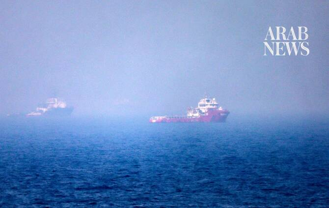

# Indian seafarer death toll from US-Iranian attacks in Hormuz rises to 8

Source: https://www.arabnews.com/node/2650840/world
Captured source: https://www.arabnews.com/node/2650840/world
Published: 2026-07-14T15:05:32+03:00
Modified: 2026-07-14T15:05:32+03:00
Author: Sanjay Kumar

## Summary

NEW DELHI: The death toll among Indian seafarers due to US and Iranian attacks on vessels in the Strait of Hormuz has risen to eight after another was killed when Iran’s missile struck a tanker on Tuesday. Two oil tankers operated by a subsidiary of the UAE oil company ADNOC, MT Mombasa and MT Al-Bahiyah, were hit by Iranian cruise missiles while transiting the southern route

## Image

## Video Or Embed URLs

- blob:https://www.arabnews.com/e77d90b1-1025-488b-bc1d-cc068668f125
- https://imasdk.googleapis.com/js/core/bridge3.776.0_en.html
- https://4ce4ea0d2ce91d13a9a13817c1bfa901.safeframe.googlesyndication.com/safeframe/1-0-45/html/container.html
- https://static.addtoany.com/menu/sm.25.html
- about:blank
- https://www.google.com/recaptcha/api2/aframe
- https://cm.g.doubleclick.net/partnerpixels?gdpr=0&us_privacy=1---&gpp_sid=-1&url=https%3A%2F%2Fwww.arabnews.com%2Fnode%2F2650840%2Fworld

## Downloaded Video

- [02_indian-seafarer-death-toll-from-us-iranian-attacks-in-hormuz-rises-to-.mp4](../../../rendered-clips/2026-07-14/02_indian-seafarer-death-toll-from-us-iranian-attacks-in-hormuz-rises-to-.mp4)

## Text

https://arab.news/cg6kz

MT Mombasa and MT Al-Bahiyah hit on Tuesday were operated by ADNOC subsidiary

10 civilian ships staffed by Indian seafarers targeted by US and Iranian forces since March

NEW DELHI: The death toll among Indian seafarers due to US and Iranian attacks on vessels in the Strait of Hormuz has risen to eight after another was killed when Iran’s missile struck a tanker on Tuesday.

Two oil tankers operated by a subsidiary of the UAE oil company ADNOC, MT Mombasa and MT Al-Bahiyah, were hit by Iranian cruise missiles while transiting the southern route through the Strait of Hormuz.

“The attack resulted in the death of one Indian crew member aboard the Mombasa tanker and the injury of eight others, including four who sustained serious injuries. The injured comprise six Indian nationals and two Ukrainian nationals,” the UAE Ministry of Defense said in a statement.

Ten civilian ships staffed by Indian seafarers — MT Settebello, MT Celestial, MT Marivex, MT Jalveer, Galaxy, Sky Light, Safe Sea, MT Safesea Vishnu, MT Mombasa, and MT Al-Bahiyah — have been targeted by American and Iranian forces since March, according to the Forward Seamen’s Union of India, a labor union representing sailors working aboard commercial vessels.

The first attack took place on March 1, at the beginning of the US-Israeli war on Iran, when the Sky Light oil tanker was hit while anchored about 5 nautical miles north of the Omani coastline.

It has not been conclusively established whether the ship was hit by Iranian or US forces, but two Indian sailors, including the ship’s captain, were killed. Since then, at least another six were killed in similar attacks.

In mid-June, the US Navy hit three vessels with Indian seafarers on board within just one week.

“It’s over eight people starting from Skylight to Mombasa today,” Manoj Yadav, the FSUI’s secretary-general, told Arab News.

“Starting from the Skylight, where two Indian seafarers died, through Vishnu, where one seafarer died, and the Settebello — three. And yesterday, one from the Galaxy is still missing. And today morning, one got hit. Apart from that, the Celestial crew who got ill and was not able to receive any treatment died on the boat.”

While India’s Ministry of External Affairs summoned Iran’s envoy to lodge a protest over Tuesday’s attack, Yadav believed more action was needed.

“All the vessels that get attacked by both parties are where Indian seafarers are on board. I don’t know whether they are not aware of the Indian seafarers on board or whether they are intentionally doing it,” he said.

“I believe the Indian government should take it forward very strongly, either with Iran or with the US, along with Israel as well … We have more than 15,000 Indian seafarers in those areas, and they are not going to be scapegoated every time.”
