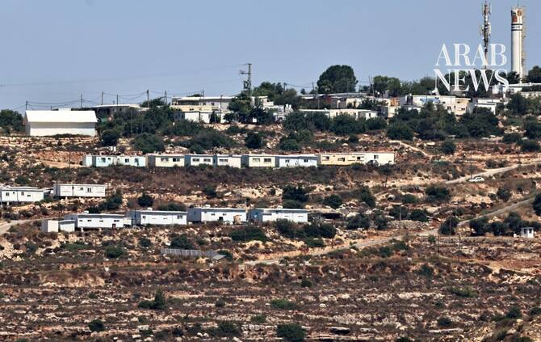

# Israel allocates $434m to build 34 new settlements in occupied West Bank

Source: https://www.arabnews.com/node/2650916/middle-east
Captured source: https://www.arabnews.com/node/2650916/middle-east
Published: 2026-07-15T10:25:01+03:00
Modified: 2026-07-15T10:58:17+03:00
Author: Arab News

## Summary

Israel allocated on Tuesday a budget of 1.3 billion shekels ($434 million) to build 34 new settlements in the occupied West Bank

## Image

## Video Or Embed URLs

- blob:https://www.arabnews.com/83a91d3a-b15a-4104-a194-6264957b83da
- https://imasdk.googleapis.com/js/core/bridge3.776.0_en.html
- https://547108bbe82c74717ff31ad5acbf1622.safeframe.googlesyndication.com/safeframe/1-0-45/html/container.html
- https://static.addtoany.com/menu/sm.25.html
- about:blank
- https://www.google.com/recaptcha/api2/aframe
- https://cm.g.doubleclick.net/partnerpixels?gdpr=0&us_privacy=1---&gpp_sid=-1&url=https%3A%2F%2Fwww.arabnews.com%2Fnode%2F2650916%2Fmiddle-east

## Downloaded Video

- [02_israel-allocates-434m-to-build-34-new-settlements-in-occupied-west-ban.mp4](../../../rendered-clips/2026-07-15/02_israel-allocates-434m-to-build-34-new-settlements-in-occupied-west-ban.mp4)

## Text

https://arab.news/yc6wd

Government decision is ‘historic,’ says far-right minister Bezalel Smotrich

Already 279 illegal settlements in West Bank, 14 in East Jerusalem

LONDON: Israel allocated on Tuesday a budget of 1.3 billion shekels ($434 million) to build 34 new settlements in the occupied West Bank.

Far-right Finance Minister Bezalel Smotrich described the government’s decision for the new settlements drive as “historic.”

“We are strengthening the security of the State of Israel, killing the idea of establishing a terrorist state in the heart of the country, and strengthening our hold on the homeland in Judea and Samaria,” he said, using the Biblical names for the West Bank.

The Palestinian said that the name “Judea and Samaria” attempts to present a facade of historical and religious legitimacy for Israel’s claim over the territory, according to the Palestine News Agency.

There are already 279 settlements in the West Bank, including 14 in East Jerusalem, which Israel occupied in 1967. Almost 737,000 settlers live in these settlements, among 3.43 million Palestinians.

Israeli settlement building and expansion in the West Bank and East Jerusalem have long been condemned by many members of the UN, and is widely considered to be illegal under international law.

Some European leaders, including French President Emmanuel Macron, have described Israel’s land grab of Palestinian territory as a threat to peace and the establishment of a Palestinian state.
