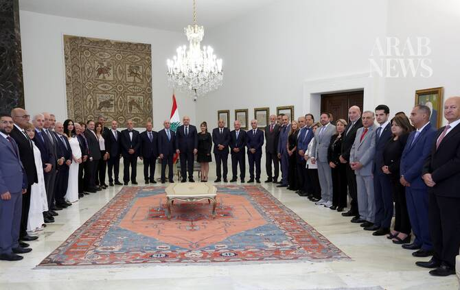

# President Aoun says Lebanon will not compromise on its rights, defends framework deal

Source: https://www.arabnews.com/node/2650969/middle-east
Captured source: https://www.arabnews.com/node/2650969/middle-east
Published: 2026-07-15T12:10:48+03:00
Modified: 2026-07-15T12:10:06+03:00
Author: Arab News

## Summary

DUBAI: The proposed Trilateral framework between the United States, Israel and Lebanon remains the best available option and has already begun producing results, Lebanese president Joseph Aoun told a delegation from the Orthodox Meeting on Wednesday, adding that Washington had started paying attention to Lebanon’s position and that the Lebanese file was now before US President

## Image

## Video Or Embed URLs

- blob:https://www.arabnews.com/3eb645b5-0704-4a29-ad8e-91e2b9507265
- https://imasdk.googleapis.com/js/core/bridge3.776.0_en.html
- https://31c768c4c1607aa13d3eb7988997a925.safeframe.googlesyndication.com/safeframe/1-0-45/html/container.html
- https://static.addtoany.com/menu/sm.25.html
- about:blank
- https://sync.teads.tv/wigo-no-slot
- https://ep2.adtrafficquality.google/sodar/sodar2/255/runner.html
- https://www.google.com/recaptcha/api2/aframe
- https://cm.g.doubleclick.net/partnerpixels?gdpr=0&us_privacy=1---&gpp_sid=-1&url=https%3A%2F%2Fwww.arabnews.com%2Fnode%2F2650969%2Fmiddle-east

## Downloaded Video

- [02_president-aoun-says-lebanon-will-not-compromise-on-its-rights-defends-.mp4](../../../rendered-clips/2026-07-15/02_president-aoun-says-lebanon-will-not-compromise-on-its-rights-defends-.mp4)

## Text

https://arab.news/z5crz

DUBAI: The proposed Trilateral framework between the United States, Israel and Lebanon remains the best available option and has already begun producing results, Lebanese president Joseph Aoun told a delegation from the Orthodox Meeting on Wednesday, adding that Washington had started paying attention to Lebanon’s position and that the Lebanese file was now before US President Donald Trump. Aoun said Lebanon’s objectives were clear and that there would be no concessions on issues related to the country’s rights. He emphasized that differences of opinion were legitimate as long as they did not lead to division, calling for dialogue among Lebanese under the banner of the national interest rather than personal agendas. The president also warned that hatred undermined states and institutions instead of building them, urging Lebanese to make choices that safeguarded their country and shielded it from external ambitions. While acknowledging that the road ahead was difficult and full of challenges, he expressed confidence that positive outcomes could be achieved to bring an end to the bloodshed. Following the meeting with President Aoun, Orthodox Meeting Secretary-General and former MP Marwan Abu Fadel said the group supported the president’s position and the constructive steps he was taking to help Lebanon overcome its crisis. He added that any attempt to undermine the presidency’s standing constitutes an affront to national dignity. Abu Fadel further stressed that Lebanese unity and support for constitutional institutions were essential to securing the desired outcomes and preserving Lebanon during this sensitive period.
