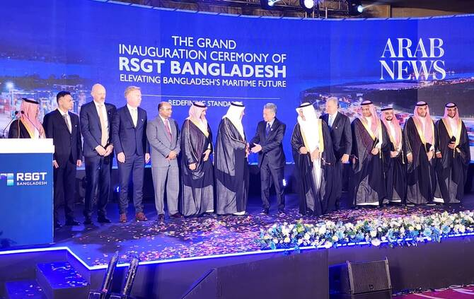

# Saudi port developer plans up to $1bn investment in Bangladesh logistics

Source: https://www.arabnews.com/node/2651000/world
Captured source: https://www.arabnews.com/node/2651000/world
Published: 2026-07-15T15:28:31+03:00
Modified: 2026-07-15T15:28:59+03:00
Author: SHEHAB SUMON

## Summary

DHAKA: Saudi developer Red Sea Gateway Terminal has announced plans to invest up to $1 billion in Bangladesh’s logistics sector, as it launched full-capacity operations at the country’s largest port in Chittagong. Chittagong Port is the main gateway for Bangladesh’s ocean cargo import and export, and the busiest container port on the Bay of Bengal. RSGT has been running the

## Image

## Video Or Embed URLs

- blob:https://www.arabnews.com/c874f24d-9908-4891-9d82-a70f414a0e4a
- https://imasdk.googleapis.com/js/core/bridge3.777.0_en.html
- https://4542934448b5fea6f7eb8c57c913ccbf.safeframe.googlesyndication.com/safeframe/1-0-45/html/container.html
- https://static.addtoany.com/menu/sm.25.html
- about:blank
- https://www.google.com/recaptcha/api2/aframe
- https://cm.g.doubleclick.net/partnerpixels?gdpr=0&us_privacy=1---&gpp_sid=-1&url=https%3A%2F%2Fwww.arabnews.com%2Fnode%2F2651000%2Fworld

## Downloaded Video

- [02_saudi-port-developer-plans-up-to-1bn-investment-in-bangladesh-logistic.mp4](../../../rendered-clips/2026-07-15/02_saudi-port-developer-plans-up-to-1bn-investment-in-bangladesh-logistic.mp4)

## Text

https://arab.news/9ecbf

RSGT completed installation of major equipment at Chittagong terminal last month

It has so far invested $170m in the busiest container port on the Bay of Bengal

DHAKA: Saudi developer Red Sea Gateway Terminal has announced plans to invest up to $1 billion in Bangladesh’s logistics sector, as it launched full-capacity operations at the country’s largest port in Chittagong.

Chittagong Port is the main gateway for Bangladesh’s ocean cargo import and export, and the busiest container port on the Bay of Bengal.

RSGT has been running the port’s Patenga Container Terminal since June 2024, under a 22-year agreement with the Chittagong Port Authority.

After two years preparing the site’s infrastructure with an investment of $170 million, the company last month installed the final major pieces of equipment needed to scale up its presence.

“This project reflects a strong belief in Bangladesh’s continued growth and the strategic importance of the regional and global trade. Our investment of $170 million demonstrates our commitment to supporting the country’s maritime infrastructure, improving operational efficiency and enhancing Bangladesh competitiveness as a regional logistic gateway to the world,” Lars Vang Christensen, group CEO and chairman of RSGT Bangladesh, said during the RSGT Bangladesh Terminal opening ceremony in Dhaka on Tuesday evening.

“Building on the confidence that we have gained to our partnership with Bangladesh, we aspire to invest up to $1 billion in the country’s port and logistics sector.”

The Saudi developer is the first foreign company operating at Bangladeshi ports and this year plans to handle 400,000 TEU (20-foot equivalent units) — about 12 percent of total container operations in Chittagong.

Next year, it is expected to exceed 500,000 TEUs, or 17 percent of the port’s traffic.

It is also increasing the number of Bangladeshi employees.

“When Red Sea Gateway Terminal decided to invest in Bangladesh, we did that with clear conviction that this country possesses enormous economic potential and a bright future. Through a period of market and global uncertainty and challenging economic conditions, our confidence in Bangladesh remained unwavering,” RSGT Executive Chairman Aamer Abdullah Zainal Alireza said during the ceremony, which was attended by Bangladesh’s Finance Minister Amir Khasru Mahmud Chowdhury and Dr. Rumaih bin Mohammed Al-Rumaih, Saudi Arabia’s deputy minister of transport.

“We remain committed to investing in modern infrastructure, advanced logistic solutions, sustainable technologies, and operational excellence to create employment opportunities and generate long-term value for Bangladesh and its people.”
