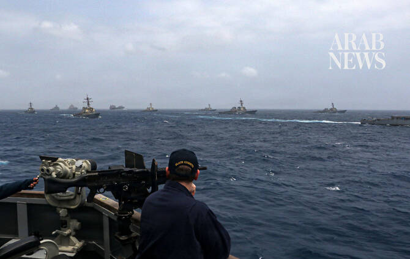

# US expands attacks deeper into Iran as Tehran retaliates against Jordan, Bahrain and Kuwait

Source: https://www.arabnews.com/node/2651085/middle-east
Captured source: https://www.arabnews.com/node/2651085/middle-east
Published: 2026-07-16T15:20:12+03:00
Modified: 2026-07-16T14:35:34+03:00
Author: Agencies

## Summary

DUBAI/CAIRO: Iran launched missile and drone attacks on Bahrain, Kuwait and Jordan early Thursday after the United States expanded its military campaign with strikes deeper inside Iran and tightened its naval blockade around the Islamic Republic, marking another sharp escalation in the conflict centered on the Strait of Hormuz. The Iranian army said on Thursday that it

## Image

## Video Or Embed URLs

- blob:https://www.arabnews.com/f3953eff-8102-42b6-9ccb-383edc1a28c3
- https://imasdk.googleapis.com/js/core/bridge3.777.0_en.html
- https://platform.twitter.com/embed/Tweet.html?creatorScreenName=Arab_News&creatorUserId=69172612&dnt=false&embedId=twitter-widget-0&features=eyJ0ZndfdGltZWxpbmVfbGlzdCI6eyJidWNrZXQiOltdLCJ2ZXJzaW9uIjpudWxsfSwidGZ3X2ZvbGxvd2VyX2NvdW50X3N1bnNldCI6eyJidWNrZXQiOnRydWUsInZlcnNpb24iOm51bGx9LCJ0ZndfdHdlZXRfZWRpdF9iYWNrZW5kIjp7ImJ1Y2tldCI6Im9uIiwidmVyc2lvbiI6bnVsbH0sInRmd19yZWZzcmNfc2Vzc2lvbiI6eyJidWNrZXQiOiJvbiIsInZlcnNpb24iOm51bGx9LCJ0ZndfZm9zbnJfc29mdF9pbnRlcnZlbnRpb25zX2VuYWJsZWQiOnsiYnVja2V0Ijoib24iLCJ2ZXJzaW9uIjpudWxsfSwidGZ3X21peGVkX21lZGlhXzE1ODk3Ijp7ImJ1Y2tldCI6InRyZWF0bWVudCIsInZlcnNpb24iOm51bGx9LCJ0ZndfZXhwZXJpbWVudHNfY29va2llX2V4cGlyYXRpb24iOnsiYnVja2V0IjoxMjA5NjAwLCJ2ZXJzaW9uIjpudWxsfSwidGZ3X3Nob3dfYmlyZHdhdGNoX3Bpdm90c19lbmFibGVkIjp7ImJ1Y2tldCI6Im9uIiwidmVyc2lvbiI6bnVsbH0sInRmd19kdXBsaWNhdGVfc2NyaWJlc190b19zZXR0aW5ncyI6eyJidWNrZXQiOiJvbiIsInZlcnNpb24iOm51bGx9LCJ0ZndfdXNlX3Byb2ZpbGVfaW1hZ2Vfc2hhcGVfZW5hYmxlZCI6eyJidWNrZXQiOiJvbiIsInZlcnNpb24iOm51bGx9LCJ0ZndfdmlkZW9faGxzX2R5bmFtaWNfbWFuaWZlc3RzXzE1MDgyIjp7ImJ1Y2tldCI6InRydWVfYml0cmF0ZSIsInZlcnNpb24iOm51bGx9LCJ0ZndfbGVnYWN5X3RpbWVsaW5lX3N1bnNldCI6eyJidWNrZXQiOnRydWUsInZlcnNpb24iOm51bGx9LCJ0ZndfdHdlZXRfZWRpdF9mcm9udGVuZCI6eyJidWNrZXQiOiJvbiIsInZlcnNpb24iOm51bGx9fQ%3D%3D&frame=false&hideCard=false&hideThread=false&id=2077471044093296884&lang=en&origin=https%3A%2F%2Fwww.arabnews.com%2Fnode%2F2651085%2Fmiddle-east&sessionId=64c165018e1c5fb4519481bff8a636a977e995c6&siteScreenName=Arab_News&siteUserId=69172612&theme=light&widgetsVersion=6a3ad42b224df%3A1778106238597&width=600px
- https://2efa96edde1cf9eddb198d7755709654.safeframe.googlesyndication.com/safeframe/1-0-45/html/container.html
- https://static.addtoany.com/menu/sm.25.html
- https://platform.twitter.com/widgets/widget_iframe.1227a5674072e080ffb1ba14ac0c1079.html?origin=https%3A%2F%2Fwww.arabnews.com
- about:blank
- https://www.google.com/recaptcha/api2/aframe
- https://cm.g.doubleclick.net/partnerpixels?gdpr=0&us_privacy=1---&gpp_sid=-1&url=https%3A%2F%2Fwww.arabnews.com%2Fnode%2F2651085%2Fmiddle-east

## Downloaded Video

- [02_us-expands-attacks-deeper-into-iran-as-tehran-retaliates-against-jorda.mp4](../../../rendered-clips/2026-07-16/02_us-expands-attacks-deeper-into-iran-as-tehran-retaliates-against-jorda.mp4)

## Text

https://arab.news/9e72b

Iranian forces targeted US military facilities in Jordan using suicide (kamikaze) drones, state television IRIB says

“The export of oil and gas from the region will be either for everyone or for no one,” Iran's IRGC says

US ‌Central Command said its forces struck Iranian command centers, air defense sites, missile and drone capabilities, and coastal surveillance facilities

DUBAI/CAIRO: Iran launched missile and drone attacks on Bahrain, Kuwait and Jordan early Thursday after the United States expanded its military campaign with strikes deeper inside Iran and tightened its naval blockade around the Islamic Republic, marking another sharp escalation in the conflict centered on the Strait of Hormuz.

The Iranian army said on Thursday that it targeted US military facilities in Jordan with drones, state media reported, after the US carried out another wave of strikes on Iran.

Jordan’s military said Thursday it shot down eight missiles launched by Iran targeting the kingdom. The military made the announcement via the kingdom’s state-run Petra news agency.

“The Army of the Islamic Republic of Iran announced that... in response to the enemy aggression, it targeted the communication systems and fuel storage facilities of the US military in Jordan using suicide (kamikaze) drones,” state television IRIB said.

Iran’s military said it targeted “radar systems, a Patriot air defense system, and fuel storage facilities at Ali Al-Salem Air Base” in Kuwait and US military facilities at the Sheikh Isa Air Base in Bahrain, IRIB reported.

Kuwait said its air defenses intercepted Iranian missiles and drones aimed at the country, while air raid sirens sounded across neighboring Bahrain as authorities urged residents to seek shelter. The attacks followed another night of US airstrikes on military targets across Iran, including areas around Tehran.

Just before daybreak on Thursday, the US military announced that it had completed its ​latest wave of strikes.

In a post on X, the US ‌Central Command said its forces struck Iranian command centers, air defense sites, missile and drone capabilities, and coastal surveillance facilities.

The ⁠statement said ​the ⁠US military hit targets in multiple locations, including Bandar Abbas, home to Iran’s largest port and key navy and Revolutionary Guards facilities on the Strait of Hormuz.

The retaliatory strikes underscored the widening regional dimensions of the conflict, with the Islamic Revolutionary Guard Corps saying it had targeted US military facilities in Bahrain, Kuwait and Jordan. Kuwaiti authorities said four missiles and 21 drones were intercepted, causing material damage but no casualties.

More than 35 people have been killed and more than 300 wounded by US airstrikes in recent days, said Hossein Kermanpour, a spokesperson for the Iranian Health Ministry. Kermanpour did not break down the figures between civilians and combatants. The announcement marked the first overall toll given by Iranian authorities for this round of fighting. The number of wounded was far larger than for any other recent violence between Iran and the US The army said it would make “a decisive response,” according to state TV. US Navy Adm. Brad Cooper, who leads Central Command, said in a statement that Iran had launched dozens of missiles and drones at neighboring Gulf Arab countries. Missile-alert warnings sounded Wednesday in Bahrain and Kuwait as they faced incoming Iranian fire — a daily occurrence recently. In a post on X, Bahrain’s Interior Ministry urged people to “head to the nearest safe place.” Jordan said it shot down three incoming Iranian missiles. Iran claimed attacks on the three nations, all of which host US forces.

US expands strikes across Iran

The latest US attacks reached farther north than previous operations, with Iranian state media reporting strikes around Tehran and in Semnan province, home to Iran’s ballistic missile production facilities and space program.

US Central Command said it also carried out fresh attacks on Greater Tunb Island, targeting coastal defense systems, cruise missile launch sites and other military facilities it said threatened freedom of navigation through the Strait of Hormuz.

Iranian media also reported strikes near Ahvaz, Bandar Abbas, Konarak, Sirik and Qeshm, while state broadcaster IRIB said an attack near a hospital in Ahvaz temporarily forced the evacuation of a pediatric cancer center. Iranian officials did not immediately report casualties from the latest wave of strikes.

Separately, Iranian state television said another US attack struck barracks of the 388th Mechanized Infantry Brigade in Sistan and Baluchestan province, killing seven soldiers and wounding others.

US enforces blockade

Washington has intensified military pressure since reimposing a naval blockade on Iranian ports after efforts to reopen the Strait of Hormuz faltered.

The US military said it disabled a Curacao-flagged oil tanker heading toward Iran’s Kharg Island export terminal after the vessel ignored repeated warnings. American aircraft fired a Hellfire missile into the ship’s smokestack, rendering it inoperable.

The military said two other vessels had been redirected since the blockade resumed, adding that the operations are intended to prevent attempts to undermine the US maritime restrictions.

Iran closed the Strait of Hormuz after the US and Israel launched military operations on Feb. 28, disrupting one of the world’s most important energy shipping routes. Before the conflict, roughly one-fifth of global oil and gas shipments passed through the waterway.

Brent crude settled at a one-month high of $84.95 a barrel on Wednesday amid concerns over prolonged supply disruptions.

Tehran warns of “existential war”

Iranian Parliament Speaker and chief negotiator Mohammad Bagher Qalibaf said the country was engaged in an “existential war with America,” warning that Iran’s security depended on maintaining what he described as Iranian control over arrangements in the Strait of Hormuz.

In a statement published online, Qalibaf said the United States had not lived up to the terms of the interim peace deal, which he said included “Iranian arrangements” over the Strait of Hormuz.

“Now that we have entered the implementation phase, the United States, having exhausted its legal and diplomatic options, is trying to undermine those Iranian arrangements through force,” he wrote.

Qalibaf’s comments appeared aimed at critics within Iran who oppose negotiations with the US He argued that negotiations should not be equated with compromise or surrender, but as part of a broader strategy of resistance.

Iran's Revolutionary Guard warned that regional energy exports would remain under threat as long as the blockade continued.

“The export of oil and gas from the region will be either for everyone or for no one,” the Guard said.

Tehran warned Thursday it would target regional infrastructure if the United States carried out threats to attack Iran’s infrastructure, as the war in the Middle East resumed. The spokesman for Iran’s military headquarters said that if the US followed through on its threats, “all infrastructure in the region” would be “crushed under the steel blows” of Iran’s armed forces.

Trump says Iran wants a deal

Despite the escalating hostilities, US President Donald Trump insisted Iran remained interested in reaching a negotiated settlement.

“They don’t like what we’re doing, and they do want to settle. We’ll find out whether or not we settle with them, or we just finish it off,” Trump said during an appearance at the US Army War College in Pennsylvania.

Trump also said Iran had released an American citizen detained since late 2024, describing the move as a gesture of goodwill. Human rights lawyer Jared Genser identified the individual as Dena Karari.

The latest exchanges come after the collapse of an interim agreement intended to halt the fighting, raising fears that the conflict could slide back into full-scale regional war as both sides continue to exchange military strikes and threats over the strategic Strait of Hormuz.
