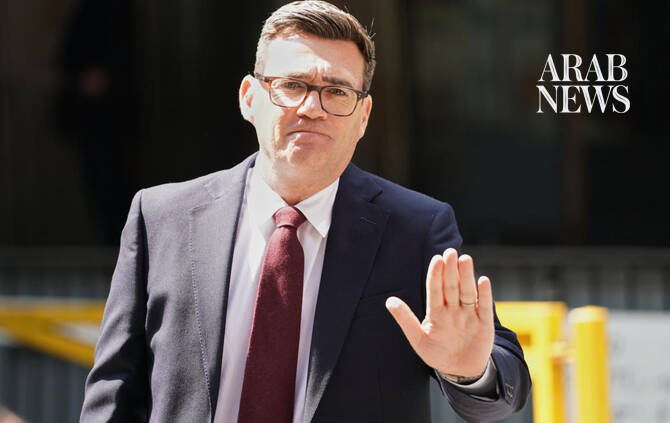

# New Labour leader Burnham vows to renew hope as next UK PM

Source: https://www.arabnews.com/node/2651273/world
Captured source: https://www.arabnews.com/node/2651273/world
Published: 2026-07-17T15:21:59+03:00
Modified: 2026-07-17T16:18:30+03:00
Author: AFP

## Summary

Andy Burnham vowed Friday to “give hope” back to the British people as he was confirmed as the ruling Labour party’s new leader, set to be the next UK prime minister.

## Image

## Video Or Embed URLs

- blob:https://www.arabnews.com/9f857eb1-d3c4-47df-bf81-c5799ba0f06a
- https://imasdk.googleapis.com/js/core/bridge3.777.0_en.html
- https://319ef1bdb1744c66ca9edc76fecdc8ce.safeframe.googlesyndication.com/safeframe/1-0-45/html/container.html
- https://static.addtoany.com/menu/sm.25.html
- about:blank
- https://www.google.com/recaptcha/api2/aframe
- https://cm.g.doubleclick.net/partnerpixels?gdpr=0&us_privacy=1---&gpp_sid=-1&url=https%3A%2F%2Fwww.arabnews.com%2Fnode%2F2651273%2Fworld

## Downloaded Video

- [02_new-labour-leader-burnham-vows-to-renew-hope-as-next-uk-pm.mp4](../../../rendered-clips/2026-07-17/02_new-labour-leader-burnham-vows-to-renew-hope-as-next-uk-pm.mp4)

## Text

https://arab.news/22pjv

Andy Burnham takes over from Keir Starmer, who resigned last month as premier after months of political turmoil, scandal and missteps

Center-left Labour retains an overwhelming majority in parliament after the 2024 elections

LONDON: Andy Burnham vowed Friday to “give hope” back to the British people as he was confirmed as the ruling Labour party’s new leader, set to be the next UK prime minister.

“People and places … have been waiting too long for politics to let them hope again ... We’re going to give them hope back,” he vowed at a special party conference.

“I am for us, for all of us,” he told cheering delegates.

Burnham takes over from Keir Starmer, who resigned last month as premier after months of political turmoil, scandal and missteps.

Center-left Labour retains an overwhelming majority in parliament after the 2024 elections, so the leader of the largest party becomes the country’s prime minister, without new polls being held.

It is only four weeks since ex-Manchester mayor Burnham sensationally returned as a member of parliament following a nine-year absence, determined to replace Starmer.

On Monday, he will become the UK’s seventh prime minister in a decade, with Labour MPs betting Burnham is the party’s best chance of reining in Nigel Farage’s anti-immigrant Reform UK party, tipped in the polls to win the next general election, expected in 2029.

Nicknamed “King of the North” for winning three successive elections to the Greater Manchester mayoralty, Burnham’s flagship idea is devolving powers to other cities in a bid to fire up Britain’s economy, including by setting up a “Number 10 North” office.

He said the past four decades since “the 1980s have not been kind to the places that built our party, nor to the communities across the UK in rural and coastal areas. So we pledge today, to them, to be better.”

“If we want an economy and a country that works for all people and places … then it requires a new path to the one we’ve been on for the last 40 years,” he said.

Hailing from the party’s so-called soft left, Burnham favors more public control of services and reindustrialization.

After facing no challengers, he becomes leader at his third attempt, following failed bids in 2010 and 2015.

Burnham, an MP between 2001 and 2017 and former government minister, has since reinvented himself as a man of the people, melding a relaxed folksy style with slick social media videos.

Labour MPs hope he can communicate with the public better than Starmer and that he is willing to take a more radical approach to reforming Britain’s battered public services.

“Let’s take a problem solving rather than a point scoring approach. Let’s have the courage to fix the big things that politics has neglected,” he told the conference.

New leader, old problems

He has vowed to boost the construction of public housing to try to resolve the homelessness crisis, and pump resources into social care.

Starmer returned Labour to power after 14 years in opposition in July 2024 with a landslide victory over the Conservatives, who had churned through five prime ministers in the tumult unleashed by the 2016 Brexit referendum.

But Starmer’s premiership quickly became characterised by domestic policy missteps and controversies, including his appointment of ex-Jeffrey Epstein associate Peter Mandelson as ambassador to Washington.

Disastrous local and regional election results in May heaped further pressure on Starmer, which became impossible to withstand after Burnham won a parliamentary by-election on June 18, allowing him to run for leader.

Burnham, regularly seen in his trademark dark T-shirt and casual jacket, has secured the backing of 379 of Labour’s 403 MPs, with no one mustering the 81 nominations required to challenge him.

But he will face the same unenviable challenges that beset Starmer: a tepid economy, high government borrowing costs, and irregular migrants arriving in small boats that have fueled support for Reform.

Unpredictable energy prices due to the US-Iran war and a volatile American president in Donald Trump also threaten to buffet his premiership.

Burnham, who will take office Monday after meeting head of state King Charles III, has vowed to stick to Labour’s 2024 election manifesto by not raising the country’s main taxes.

He will need to find the money from elsewhere to fill a £4.7-billion ($6.3-billion) gap over four years in the country’s defense investment plan and will also have to navigate the thorny issue of welfare reform.
