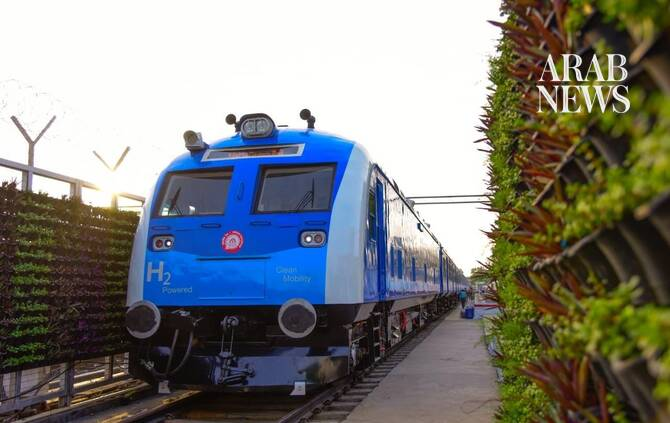

# India debuts first indigenous, hydrogen-powered train in clean energy push

Source: https://www.arabnews.com/node/2651274/world
Captured source: https://www.arabnews.com/node/2651274/world
Published: 2026-07-17T14:54:26+03:00
Modified: 2026-07-17T14:55:37+03:00
Author: Sanjay Kumar

## Summary

NEW DELHI: Indian Prime Minister Narendra Modi launched the country’s first hydrogen-powered train on Friday, making the country one of just a handful which have adopted the zero-emissions, clean fuel technology.

## Image

## Video Or Embed URLs

- blob:https://www.arabnews.com/48dabf3c-5bbe-462d-8358-4936fd897a99
- https://imasdk.googleapis.com/js/core/bridge3.777.0_en.html
- https://746eff17994bf212dc892f0d745a21c9.safeframe.googlesyndication.com/safeframe/1-0-45/html/container.html
- about:blank
- https://static.addtoany.com/menu/sm.25.html
- https://www.google.com/recaptcha/api2/aframe
- https://cm.g.doubleclick.net/partnerpixels?gdpr=0&us_privacy=1---&gpp_sid=-1&url=https%3A%2F%2Fwww.arabnews.com%2Fnode%2F2651274%2Fworld

## Downloaded Video

- [02_india-debuts-first-indigenous-hydrogen-powered-train-in-clean-energy-p.mp4](../../../rendered-clips/2026-07-17/02_india-debuts-first-indigenous-hydrogen-powered-train-in-clean-energy-p.mp4)

## Text

https://arab.news/vd2hy

India wants to achieve net-zero emissions on its railways by 2030

The 10-coach trainset has a capacity of 2,600 passengers

NEW DELHI: Indian Prime Minister Narendra Modi launched the country’s first hydrogen-powered train on Friday, making the country one of just a handful which have adopted the zero-emissions, clean fuel technology.

Developed by state-owned Indian Railways, the blue trainset uses hydrogen fuel cells to generate electricity onboard by combining hydrogen with oxygen. Instead of exhaust fumes, the vehicle emits only water and steam, making it a cleaner alternative to conventional diesel locomotives.

Modi flagged the hydrogen train, called the Namo Green Rail, on its 89-km route from the city of Jind to Sonipat in the northern state of Haryana, which borders the national capital of New Delhi.

“This is a major achievement in the direction of building a clean, green, and self-reliant India. This train, built with cutting-edge technology, is not only a symbol of India's technical capability but also an example for the entire world,” Modi wrote on X after the flag-off event.

The Namo Green Rail, powered by a 1,200-kilowatt hydrogen fuel cell propulsion system, places India alongside a select group of countries, including Germany, Japan, China and the US, which have deployed the zero-emissions technology in their rail networks.

According to the Ministry of Railways, the 10-coach trainset has a capacity of 2,600 passengers and is expected to operate at a maximum speed of 75 km per hour.

“Most hydrogen passenger trains currently operating globally comprise only two or three coaches and are primarily deployed on short regional routes,” the ministry said in a statement.

“Designed, engineered and integrated in India, the train has been developed using indigenous technology, reflecting the country's growing capabilities in advanced railway engineering.”

The train also comes with a dedicated hydrogen storage, refueling and operational infrastructure located in Jind.

India has allocated billions of dollars in investment in recent years, aimed at upgrading key infrastructure, improving safety and expanding capacity.

According to Trishant Dev, deputy program manager for climate change at the Center for Science and Environment, the indigenous development of Namo Green Rail “offers an opportunity to build domestic capabilities in fuel cells, electrolyzers and hydrogen fuel development, and creates a use-case for hydrogen deployment.”

It is “something that could support India's aims under the National Green Hydrogen Mission,” which seeks to accelerate decarbonization efforts, reduce dependence on fossil fuel imports and places India as a leader in green hydrogen.

The hydrogen train is part of India’s target of achieving net-zero carbon emissions in its railways by 2030.
