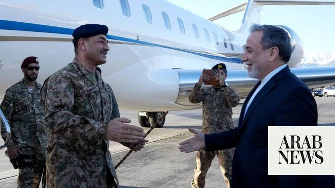

# Pakistan army chief arrives in Tehran as push grows for second round of US-Iran talks

Source: https://www.arabnews.com/node/2640035/middle-east
Captured source: https://www.arabnews.com/node/2640035/middle-east
Published: 2026-04-15T18:19:36+03:00
Modified: 2026-04-16T09:12:01+03:00
Author: Waseem Abbasi

## Summary

ISLAMABAD: A high-level military delegation led by army chief Field Marshal Asim Munir arrived in Tehran today, Wednesday, as Islamabad steps up efforts to revive talks between the United States and Iran after last week’s negotiations ended without a breakthrough. The April 11 talks in Islamabad marked the most senior direct engagement between US and Iranian officials in more

## Image

## Video Or Embed URLs

- blob:https://www.arabnews.com/ce6738bc-a43a-4032-a140-aa45998c46e1
- https://imasdk.googleapis.com/js/core/bridge3.770.1_en.html
- https://static.addtoany.com/menu/sm.25.html
- about:blank
- https://www.google.com/recaptcha/api2/aframe
- https://cm.g.doubleclick.net/partnerpixels?gdpr=0&us_privacy=1---&gpp_sid=-1&url=https%3A%2F%2Fwww.arabnews.com%2Fnode%2F2640035%2Fmiddle-east

## Downloaded Video

- Skipped: No candidate video URL could be downloaded.

## Text

https://arab.news/4enee

Officials say high-level military-led visit is in continuation of stalled Islamabad talks last weekend

Messages exchanged between US and Iran since via Pakistan as efforts continue to revive negotiations

ISLAMABAD: A high-level military delegation led by army chief Field Marshal Asim Munir arrived in Tehran today, Wednesday, as Islamabad steps up efforts to revive talks between the United States and Iran after last week’s negotiations ended without a breakthrough.

The April 11 talks in Islamabad marked the most senior direct engagement between US and Iranian officials in more than a decade, bringing together US Vice President JD Vance and Iranian Foreign Minister Abbas Araghchi and Parliamentary Speaker Mohammad Bagher Qalibaf. The marathon discussions, which stretched for more than 20 hours, ended without agreement as deep divisions persisted on key issues.

Since then, efforts have continued to secure a second round of talks, with messages exchanged between Tehran and Washington through Islamabad, officials and sources familiar with the process say. US President Donald Trump said on Tuesday he would prefer that follow-up talks take place in Pakistan and that they could happen within the next two days.

“Field Marshal Asim Munir ... and Mr.Mohsin Naqvi, Interior Minister, along with the delegation arrives at Tehran as part of the ongoing mediation efforts,” the military’s media wing said as it shared a photo with journalists of the army chief’s welcome in Tehran.

It was unclear who else was in the delegation apart from Munir and Naqvi. Two government officials Arab News spoke to declined to comment if the current Director General of Pakistan’s Inter-Services Intelligence was part of the visit.

During a press conference earlier on Wednesday, Iranian Foreign Ministry spokesman said Tehran was “most likely hosting a delegation from Pakistan” today.

“According to the sources, the delegation is carrying a new message from Washington for Tehran. The delegation is scheduled to meet with Iranian officials to discuss future negotiations,” Iranian state media reported.

Pakistan has played an intermediary role in recent weeks, facilitating contact between Washington and Tehran amid heightened tensions following the US-Israel war on Iran had began on Feb. 28 and a fragile ceasefire reached earlier this month.

The Islamabad talks on April 11 were aimed at building on that truce but failed to bridge differences over Iran’s nuclear program, sanctions relief and the future of the Strait of Hormuz, a key global energy route that Tehran has blocked since the war began and which Washington has vowed to reopen.

The US has pushed for strict limits on Iran’s nuclear activities, including curbs on uranium enrichment, while Tehran has insisted on its right to enrichment and demanded the lifting of sanctions and the unfreezing of its assets.

Differences also emerged during weekend’s talks over the scope of the ceasefire, with Iran seeking broader guarantees that would extend beyond the immediate conflict, a position rejected by the United States.

Officials say the latest Pakistani outreach to Tehran could help narrow these gaps or lay the groundwork for renewed negotiations, though no date or venue for a second round has been formally confirmed.
