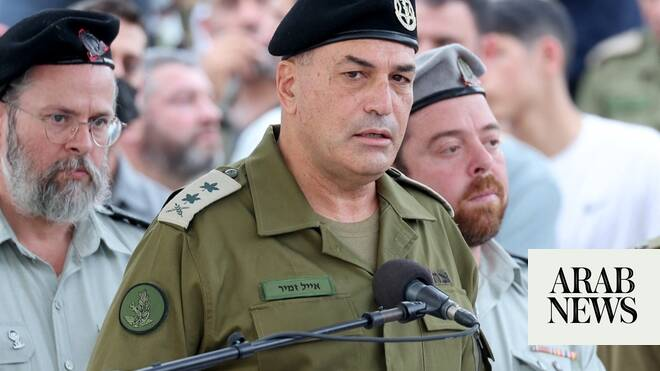

# Southern Lebanon ‘Hezbollah kill zone,’ Israel says

Source: https://www.arabnews.com/node/2640086/middle-east
Captured source: https://www.arabnews.com/node/2640086/middle-east
Published: 2026-04-16T06:50:11+03:00
Modified: 2026-04-16T13:17:31+03:00
Author: AFP

## Summary

BEIRUT: Israel declared southern Lebanon a “Hezbollah kill zone” on Wednesday, a day after historic peace talks between the two countries in Washington. The zone would extend from the border with Israel north to the Litani River, army chief of staff Eyal Zamir said. Meanwhile Israel killed at least three paramedics trying to rescue people injured in an earlier strike in the

## Image

## Video Or Embed URLs

- https://ff72b05181f786ebf4d4dd8317d43574.safeframe.googlesyndication.com/safeframe/1-0-45/html/container.html
- blob:https://www.arabnews.com/4b765d5c-5c93-4e4a-83c0-31d4928647bd
- https://imasdk.googleapis.com/js/core/bridge3.770.1_en.html
- about:blank
- https://static.addtoany.com/menu/sm.25.html
- https://sync.teads.tv/wigo-no-slot
- https://cm.g.doubleclick.net/partnerpixels?gdpr=0&us_privacy=1---&gpp_sid=-1&url=https%3A%2F%2Fwww.arabnews.com%2Fnode%2F2640086%2Fmiddle-east

## Downloaded Video

- [03_southern-lebanon-hezbollah-kill-zone-israel-says.mp4](../../../rendered-clips/2026-06-13/03_southern-lebanon-hezbollah-kill-zone-israel-says.mp4)

## Text

https://arab.news/ggfru

Since the start of its war with Hezbollah on March 2 Israel had killed 91 healthcare workers

BEIRUT: Israel declared southern Lebanon a “Hezbollah kill zone” on Wednesday, a day after historic peace talks between the two countries in Washington.

The zone would extend from the border with Israel north to the Litani River, army chief of staff Eyal Zamir said.

Meanwhile Israel killed at least three paramedics trying to rescue people injured in an earlier strike in the southern town of Mayfadun. The deadly attack was a “flagrant crime, which reflects the Israeli enemy’s determination to prevent paramedics from performing their life-saving work by any means,” the Health Ministry in Beirut said.

Since the start of its war with Hezbollah on March 2 Israel had killed 91 healthcare workers, the ministry said. The violence has killed more than 2,100 Lebanese people overall.

New Israeli strikes on Wednesday hit two vehicles on the coastal highway about 20 km south of Beirut, outside Hezbollah’s traditional strongholds. Firefighters extinguished a blaze in one van with as rescue workers recovered human remains from the wreckage. Hezbollah MP Hassan Fadlallah said the militant group's fighters were “preventing enemy soldiers from seizing control” of the key southern town of Bint Jbeil, 5 km north of the border. Wednesday’s attacks came a day after Lebanon and Israel held their first direct talks in decades in Washington, and agreed to hold further direct negotiations.
