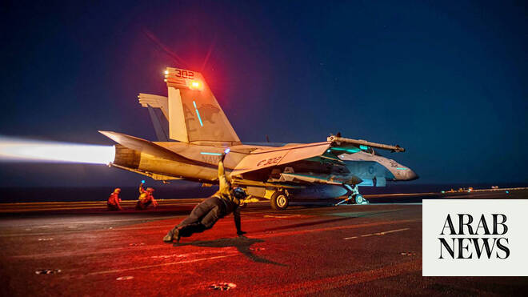

# US launches new strikes against Iran after three ships were hit in Strait of Hormuz

Source: https://www.arabnews.com/node/2650041/middle-east
Captured source: https://www.arabnews.com/node/2650041/middle-east
Published: 2026-07-08T00:47:50+03:00
Modified: 2026-07-08T13:04:08+03:00
Author: AP

## Summary

DUBAI, United Arab Emirates: The US military launched new strikes against Iran early Wednesday, hours after three merchant ships were struck in the Strait of Hormuz, in the latest exchange of fire to threaten the interim deal to end the fighting between the two countries. The renewed attacks were sure to add to the difficulty of the negotiations aimed at fully reopening the

## Image

## Video Or Embed URLs

- blob:https://www.arabnews.com/eacc17f6-530b-41bc-818e-2cbff7912f0c
- https://imasdk.googleapis.com/js/core/bridge3.774.0_en.html
- https://55d0665424f7407ab77c790c04f42f87.safeframe.googlesyndication.com/safeframe/1-0-45/html/container.html
- about:blank
- https://static.addtoany.com/menu/sm.25.html
- https://www.google.com/recaptcha/api2/aframe
- https://cm.g.doubleclick.net/partnerpixels?gdpr=0&us_privacy=1---&gpp_sid=-1&url=https%3A%2F%2Fwww.arabnews.com%2Fnode%2F2650041%2Fmiddle-east

## Downloaded Video

- [03_us-launches-new-strikes-against-iran-after-three-ships-were-hit-in-str.mp4](../../../rendered-clips/2026-07-08/03_us-launches-new-strikes-against-iran-after-three-ships-were-hit-in-str.mp4)

## Text

https://arab.news/mvu3b

American forces launched the strikes ‘to impose heavy costs for targeting and attacking commercial shipping’

DUBAI, United Arab Emirates: The US military launched new strikes against Iran early Wednesday, hours after three merchant ships were struck in the Strait of Hormuz, in the latest exchange of fire to threaten the interim deal to end the fighting between the two countries. The renewed attacks were sure to add to the difficulty of the negotiations aimed at fully reopening the strait, rolling back Tehran’s disputed nuclear program and reaching a permanent end to the war launched Feb. 28. In a statement posted to social media, US Central Command said American forces launched the strikes “to impose heavy costs for targeting and attacking commercial shipping crewed by innocent civilians in an international waterway.” “Iran’s demonstrated aggression was unwarranted, dangerous, and a clear violation of the ceasefire,” the command said in their statement.

A similar spate of Iranian attacks on shipping and US retaliation occurred late last month. Hours after the three tankers were struck by projectiles, and the United States revoked a license that had authorized the sale of Iranian oil as part of the interim deal to end the fighting between the US and Iran. The new assaults in the fuel-shipping waterway were the most in a single day since late April, according to the UN International Maritime Organization. The fresh attacks threatened to choke off the flow of traffic in the strait just as countries hoped to restore normal shipping practices and ease the global economic strain of the war.

A US official said the license was revoked because Iran’s actions in the strait were unacceptable and needed to be met with consequences. The official spoke with The Associated Press on the condition of anonymity to share insight into the reasoning behind the move. The Iranian Foreign Ministry condemned the US move to revoke the license, saying in a statement that it violates the interim deal and that “the US government bears responsibility for the consequences of this breach of commitment.” Iran’s deputy foreign minister, Kazem Gharibabadi, also said in a post on X that the new attacks by the US are a violation of that agreement. One tanker caught fire after getting hit One tanker was traveling off the coast of Oman when it was hit and caught fire, the United Kingdom Maritime Trade Operations center said. Iranian state television said the liquefied natural gas tanker came under attack after ignoring warnings but did not directly claim the assault. The other two ships sustained some damage, but no one was injured, and both continued on their way, the UK maritime agency said. Tehran, which has repeatedly declared that only its approved route through the strait is safe, is suspected of attacking other ships that have used another route close to the Omani shore. Location details provided by the UK agency showed that all three attacks occurred off the coast of Oman or the neighboring United Arab Emirates, making it likely that the ships were using the route near Oman. In peacetime, a fifth of all traded oil and natural gas passed through the channel. The license issued by the US authorized the production, delivery and sale of Iranian oil through Aug. 21. US Vice President JD Vance said at the time that lengthy talks with senior Iranian officials in Switzerland created a “good foundation for a successful final deal” to end the war. US sanctions on the purchase of Iranian oil had been in place since the 1979 Iranian Revolution. After the US and Israel launched the war, and after the closure of the strait, the US had authorized the temporary sale of Iranian oil at least twice as an incentive toward a deal. Meanwhile, talks between Iran and the US appeared to be on hold until after the burial of Iran’s Supreme Leader Ayatollah Ali Khamenei, who was killed at the beginning of the war. Qatar calls attack a violation of international law One tanker was carrying liquid natural gas south through the strait near Limah, Oman, when a projectile hit the left-side engine room and sparked a fire, the UK Maritime Trade Operations center said. Majed Al-Ansari, a spokesperson for the Qatari Foreign Ministry, said the Qatari tanker Al Rekayyat was targeted in an “unacceptable attack” on international navigation and global energy security. He called it a “serious and explicit violation” of international law. In a post on X, he said Qatar holds Iran “fully legally responsible.” Later Tuesday, the UK maritime agency reported that an oil tanker was hit on its left side as it exited the strait near the Omani-Emirati border. A third tanker was struck by a drone off Oman, the agency said. The Joint Maritime Information Center, a multinational body overseen by the US Navy, told shippers Monday that the route around Oman “has been expanded and remains available for all traffic.” Ships going to the north on the Iranian route must register with Tehran. Those going south work with Oman and the US Iran and the United States agreed as part of an interim deal to allow ships to pass without paying charges for 60 days. But Tehran insisted it must control the vessels’ routes and later charge fees for passage, which would upend decades of practice in the waterway. The US and many Gulf Arab states say they will not agree to Iran charging for passage through the strait. The data firm Kpler reported that at least 108 ships crossed through the strait last weekend using various routes. Mourners gather in Qom for Khamenei’s funeral Authorities flew Khamenei’s body to the Shiite seminary city of Qom, where mourners honored him Tuesday. Iranian state television aired live images of hundreds of thousands of people walking toward Jamkaran Mosque, just south of Qom, for the funeral service. Shiites believe the mosque once hosted Muhammad Al-Mahdi, the 12th and last Shiite imam, who disappeared in the 9th century and is supposed to one day reappear to bring justice to the world. Khamenei’s son, Iran’s new Supreme Leader Ayatollah Mojtaba Khamenei, has yet to make an appearance at the ceremonies, which began Saturday in Tehran. He is believed to be in hiding after reportedly being wounded in the airstrike that killed his father. Khamenei’s body arrived late Tuesday in Najaf, Iraq, where it was received by senior officials from both countries. Processions are planned for Wednesday in Najaf and Karbala, the two holy cities of Iraqi Shiism. Iraq has a sizable Shiite population and is home to major Shiite religious sites and centers of learning. Khamenei, who was 86, will then be returned to Iran to be buried Thursday at the Imam Reza shrine in Mashhad, his birthplace.
