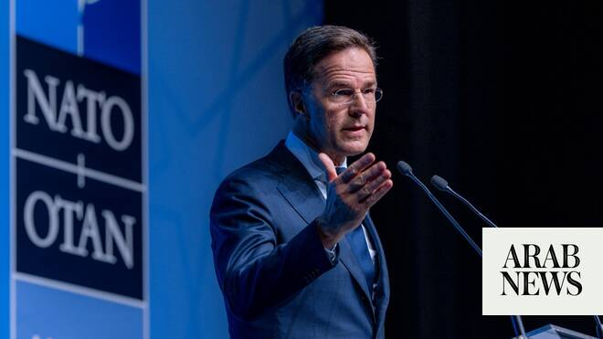

# New attacks on Iran were absolutely necessary, NATO chief says

Source: https://www.arabnews.com/node/2650061/middle-east
Captured source: https://www.arabnews.com/node/2650061/middle-east
Published: 2026-07-08T08:27:00+03:00
Modified: 2026-07-08T11:18:49+03:00
Author: Reuters

## Summary

ANKARA: The new attacks by the US on Iran were “absolutely necessary,” NATO Secretary ​General Mark Rutte said on Wednesday. The US military unleashed a new wave of strikes against Iran on Tuesday and revoked a license allowing Tehran to sell oil after three tankers were hit by projectiles in the Strait ‌of Hormuz, putting pressure ‌on an already ​fragile ‌ceasefire. “When

## Image

## Video Or Embed URLs

- blob:https://www.arabnews.com/ecd95f54-6be5-4642-908e-bbe082693955
- https://imasdk.googleapis.com/js/core/bridge3.776.0_en.html
- https://bd5add2990910b5617a8c41dc0b5db28.safeframe.googlesyndication.com/safeframe/1-0-45/html/container.html
- https://static.addtoany.com/menu/sm.25.html
- about:blank
- https://ep2.adtrafficquality.google/sodar/sodar2/255/runner.html
- https://www.google.com/recaptcha/api2/aframe
- https://cm.g.doubleclick.net/partnerpixels?gdpr=0&us_privacy=1---&gpp_sid=-1&url=https%3A%2F%2Fwww.arabnews.com%2Fnode%2F2650061%2Fmiddle-east

## Downloaded Video

- [03_new-attacks-on-iran-were-absolutely-necessary-nato-chief-says.mp4](../../../rendered-clips/2026-07-08/03_new-attacks-on-iran-were-absolutely-necessary-nato-chief-says.mp4)

## Text

https://arab.news/vsgqf

The US military unleashed a new wave of strikes against Iran

European ⁠leaders aim to convince Donald Trump ‌to re-commit ‌to the military alliance

ANKARA: The new attacks by the US on Iran were “absolutely necessary,” NATO Secretary ​General Mark Rutte said on Wednesday.

The US military unleashed a new wave of strikes against Iran on Tuesday and revoked a license allowing Tehran to sell oil after three tankers were hit by projectiles in the Strait ‌of Hormuz, putting pressure ‌on an already ​fragile ‌ceasefire.

“When ⁠you ​have a ⁠ceasefire and Iran is basically violating the ceasefire, I think it is totally crucial that the US forcefully react,” Rutte told reporters before a summit of NATO leaders in Ankara.

At their summit, European ⁠leaders aim to convince Donald Trump ‌to re-commit ‌to the military alliance, after ​the US president revived ‌his disputes with them over the ‌Iran war and Greenland.

Rutte said there could be no doubt over the “complete commitment of the United States to NATO,” which he said ‌also works to protect the United States.

“But there’s also the expectation ⁠that ⁠the Europeans and the Canadians will equalize their spending with the United States, which I think is completely fair,” he added.

“The good news is that this is the big win today. It’s the loss for Putin, it is a win for President Trump that the Europeans and the Canadians are doing ​exactly that.”
