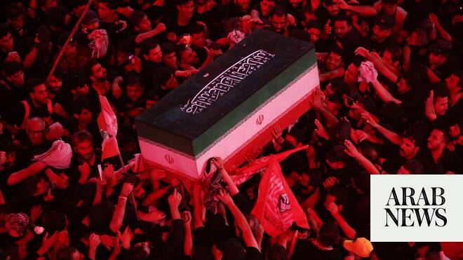

# Iran to bury slain Supreme Leader in culmination of mass funeral

Source: https://www.arabnews.com/node/2650210/middle-east
Captured source: https://www.arabnews.com/node/2650210/middle-east
Published: 2026-07-09T13:20:49+03:00
Modified: 2026-07-09T14:04:41+03:00
Author: Reuters

## Summary

DUBAI: Iran buries its slain Supreme Leader Ayatollah Ali Khamenei on Thursday at the country’s holiest shrine, with ​his son and successor Mojtaba Khamenei still hidden from public view after being disfigured in the strike that killed his father. The burial in Mashhad in northeast Iran follows a week of mass funeral processions, rallies and mourning ceremonies that has

## Image

## Video Or Embed URLs

- blob:https://www.arabnews.com/d899329a-83a5-4177-8d47-ab955bc96882
- https://imasdk.googleapis.com/js/core/bridge3.774.0_en.html
- https://1f05d493ee18c3abe9aa89259235ada6.safeframe.googlesyndication.com/safeframe/1-0-45/html/container.html
- about:blank
- https://static.addtoany.com/menu/sm.25.html
- https://www.google.com/recaptcha/api2/aframe
- https://cm.g.doubleclick.net/partnerpixels?gdpr=0&us_privacy=1---&gpp_sid=-1&url=https%3A%2F%2Fwww.arabnews.com%2Fnode%2F2650210%2Fmiddle-east

## Downloaded Video

- [03_iran-to-bury-slain-supreme-leader-in-culmination-of-mass-funeral.mp4](../../../rendered-clips/2026-07-09/03_iran-to-bury-slain-supreme-leader-in-culmination-of-mass-funeral.mp4)

## Text

https://arab.news/wa5aw

Mojtaba Khamenei not seen in public since his father’s death

Critical moment for Iran, months after anti-government protests

DUBAI: Iran buries its slain Supreme Leader Ayatollah Ali Khamenei on Thursday at the country’s holiest shrine, with ​his son and successor Mojtaba Khamenei still hidden from public view after being disfigured in the strike that killed his father.

The burial in Mashhad in northeast Iran follows a week of mass funeral processions, rallies and mourning ceremonies that has coincided with a renewed burst of conflict with the United States following weeks of truce.

Crowds marched through Mashhad on Thursday morning, the golden onion dome and minarets of the Shrine of Imam Reza glinting in the morning sun, as they waved Iranian flags, photographs of the late Khamenei and placards with revolutionary slogans.

As Khamenei’s body was transported around Iran and Iraq over the past week, the Islamic Republic’s clerical leaders encouraged huge crowds ‌to attend in ‌an effort to vaunt the might and ideological fire of their theocratic ​state. However, ‌despite ⁠it having ​survived ⁠a months-long blitz by its strongest enemies the United States and Israel, Iran faces huge internal challenges and the legacy of Khamenei’s 37-year rule is bitterly disputed.

‘Kill Trump’ placards appear at burial ceremony

The whereabouts of Mojtaba Khamenei, proclaimed Supreme Leader by a clerical assembly a week after his father’s death, has remained a mystery to Iranians. He has not appeared in public since the war began with the strike that killed Ali Khamenei on February 28, and while he has issued written statements, no image or video or voice recording of him has been issued.

He suffered debilitating injuries in ⁠that same strike, his face disfigured and limbs badly wounded.

Senior sources in Tehran ‌have said he is recovering but that he has not yet been ‌well enough to manage public appearances and state security services are ​also trying to limit his exposure in case of ‌more US attacks. As crowds jostled in Mashhad awaiting Khamenei’s funeral cortege, the crowd chanted slogans demanding revenge on ‌US President Donald Trump for his killing.

“I swear by the blood of the Supreme Leader, Trump, we will kill you!” they shouted, with women holding up placards reading “Kill Trump.” Khamenei’s remains, along with those of four family members killed alongside him, have already been paraded through Tehran, the Shiite Muslim clerical center of Qom, and the Iraqi shrine cities of Najaf and Karbala. At ‌each event, huge crowds have thronged the streets to the mournful accompaniment of sung Shiite laments and chanted revolutionary slogans.

Martydom holds a central place in Shiite ⁠theology and Khamenei’s death at ⁠the hands of foreign enemies has played into a religious and political tradition that runs deep through the Islamic Republic.

Khamenei’s long rule and disputed legacy

The funeral comes at a critical moment for Iran, turning the page of nearly four decades of Khamenei’s rule and months after the latest round of mass nationwide protests against the Islamic Republic.

Security forces put down that unrest, sparked by anger over the sanctions-throttled economy, by killing thousands of demonstrators in a wave of repression that echoed other bouts of violence over recent years. While analysts see Iran as having emerged from the war strategically strengthened, with its grip over the vital Strait of Hormuz intact, it has suffered widespread damage that has added to internal economic woes.

The late Khamenei was appointed supreme leader in 1989, a decade after the Islamic revolution, and over the decades he consolidated political, economic and military power in his office.

That effort, which ​increasingly marginalized the elected president and parliament, was conducted ​in concert with the Islamic Revolutionary Guard Corps that grew in influence throughout Khamenei’s rule.

Mojtaba Khamenei was appointed with the backing of the Guards, who are now seen as the dominant force in Iranian political and strategic thinking.
