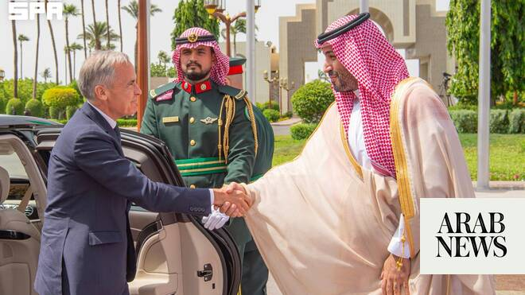

# Saudi crown prince receives Canadian PM in Jeddah

Source: https://www.arabnews.com/node/2650261/saudi-arabia
Captured source: https://www.arabnews.com/node/2650261/saudi-arabia
Published: 2026-07-09T16:47:05+03:00
Modified: 2026-07-09T22:48:43+03:00
Author: Arab News

## Summary

RIYADH: Saudi Arabia’s Crown Prince Mohammed bin Salman received Canada’s Prime Minister Mark Carney at Al-Salam Palace in Jeddah on Thursday. An official reception ceremony was held in Carney’s honor, the Saudi Press Agency reported. Later, the two leaders held an official session of talks during which they reviewed aspects of relations between their countries, areas of

## Image

## Video Or Embed URLs

- blob:https://www.arabnews.com/7dd5f04c-b954-4ef5-bea3-31f0720f1d64
- https://imasdk.googleapis.com/js/core/bridge3.774.0_en.html
- https://acb81f3c39d3ae2428e93bf59faeed93.safeframe.googlesyndication.com/safeframe/1-0-45/html/container.html
- about:blank
- https://static.addtoany.com/menu/sm.25.html
- https://www.google.com/recaptcha/api2/aframe
- https://cm.g.doubleclick.net/partnerpixels?gdpr=0&us_privacy=1---&gpp_sid=-1&url=https%3A%2F%2Fwww.arabnews.com%2Fnode%2F2650261%2Fsaudi-arabia

## Downloaded Video

- [03_saudi-crown-prince-receives-canadian-pm-in-jeddah.mp4](../../../rendered-clips/2026-07-09/03_saudi-crown-prince-receives-canadian-pm-in-jeddah.mp4)

## Text

https://arab.news/pr46t

“Canada is building a new partnership with the Kingdom of Saudi Arabia,” Carney said on arrival

Saudi Arabia and Canada condemned Iranian attacks on commercial vessels in Hormuz strait on July 7

RIYADH: Saudi Arabia’s Crown Prince Mohammed bin Salman received Canada’s Prime Minister Mark Carney at Al-Salam Palace in Jeddah on Thursday.

An official reception ceremony was held in Carney’s honor, the Saudi Press Agency reported.

Later, the two leaders held an official session of talks during which they reviewed aspects of relations between their countries, areas of cooperation, and opportunities to develop them in various sectors.

Regional and international developments and efforts made regarding them were also discussed.

The crown prince and Carney also witnessed the exchange of several memoranda of understanding.

The agreements included the establishment of a Saudi-Canadian Coordination Council and investment in artificial intelligence and skills development.

At the end of Carney’s visit, a joint statement was issued.

Both sides affirmed their confidence in a future characterized by deeper cooperation and shared prosperity, underpinned by mutual trust, close friendship, and a shared vision for advancing the partnership between Saudi Arabia and Canada.

They expressed their belief that strengthening this partnership will yield tangible mutual benefits and support the Kingdom's Vision 2030 and Canada’s goals of building a stronger and more resilient economy and diversifying its international partnerships.

They agreed that this partnership is based on trust, friendship, and a shared vision for addressing global challenges through practical, intensive, and tangible cooperation.

They noted the volume of trade between the two countries, which has exceeded $20 billion since 2020, and agreed to encourage mutual investments, increase non-oil trade, and support small and medium-sized enterprises.

Both sides agreed to begin negotiations on a double taxation avoidance agreement and welcomed the progress of ongoing negotiations on an investment protection and promotion agreement, with the aim of finalizing it by early 2027.

They agreed on the importance of cooperation between financial institutions in both countries to enhance the financing of strategic and major projects.

The Saudi side welcomed the significant interest shown by Canadian investors in visiting the Kingdom to explore available opportunities, and the Canadian side said it looked forward to welcoming Saudi investors at the first investment summit to be held in Toronto in September 2026.

With regards to regional security, both sides strongly condemned Iranian attacks on commercial vessels in the Strait of Hormuz on July 7, 2026.

They affirmed that these unacceptable attacks constitute an assault on the security and safety of international navigation and on the security of global energy supplies. The attacks also represent a grave violation of international law and norms, they said.

They stressed that such actions would escalate regional tensions, undermine confidence-building efforts, and threaten ongoing diplomatic negotiations aimed at enhancing security and stability in the region.

Both sides commended Pakistani and Qatari efforts that helped reach a memorandum of understanding between the US and Iran.

They further emphasized the importance of restoring safe and unrestricted navigation through the Strait of Hormuz, in accordance with international law, and returning it to its status quo prior to Feb. 28.

Earlier on Thursday, the prime minister met with the Kingdom’s Energy Minister Prince Abdulaziz bin Salman and Saudi Aramco CEO Amin H. Nasser to “identify new ways we can partner — and create major opportunities for our energy industries and workers,” Carney wrote on X.

On arrival in the Kingdom, Carney said: “Canada is building a new partnership with the Kingdom of Saudi Arabia — one that harnesses the ambition of our nations to build greater prosperity and opportunity for our people.”
