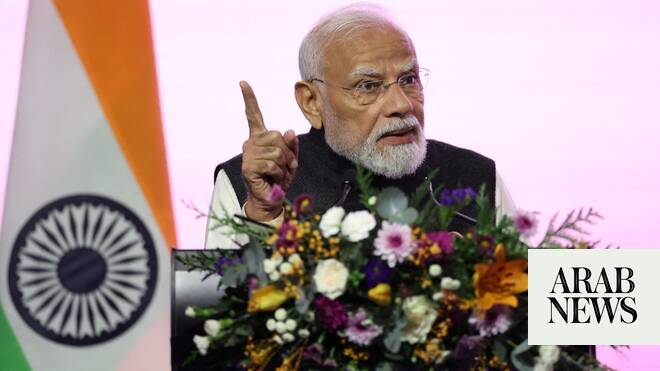

# Modi visits New Zealand as trade deal sparks India pushback

Source: https://www.arabnews.com/node/2650352/world
Captured source: https://www.arabnews.com/node/2650352/world
Published: 2026-07-10T12:45:52+03:00
Modified: 2026-07-10T12:56:40+03:00
Author: AFP

## Summary

WELLINGTON: India’s Prime Minister Narendra Modi lands in New Zealand on Friday touting a free trade deal that has sparked a backlash despite promises it will unlock jobs and economic riches. On the agenda are trade, tourism and sport — but recent undercurrents of anti-migrant sentiment risk tarnishing his trip to a nation long proud of its tolerance. New Zealand Prime

## Image

## Video Or Embed URLs

- blob:https://www.arabnews.com/d1bca317-2ab0-414f-9c71-12fb16221722
- https://imasdk.googleapis.com/js/core/bridge3.774.0_en.html
- https://dcb41fb57b0eeeea42f4ca8d59862be1.safeframe.googlesyndication.com/safeframe/1-0-45/html/container.html
- https://static.addtoany.com/menu/sm.25.html
- about:blank
- https://sync.teads.tv/wigo-no-slot
- https://www.google.com/recaptcha/api2/aframe
- https://cm.g.doubleclick.net/partnerpixels?gdpr=0&us_privacy=1---&gpp_sid=-1&url=https%3A%2F%2Fwww.arabnews.com%2Fnode%2F2650352%2Fworld

## Downloaded Video

- [03_modi-visits-new-zealand-as-trade-deal-sparks-india-pushback.mp4](../../../rendered-clips/2026-07-11/03_modi-visits-new-zealand-as-trade-deal-sparks-india-pushback.mp4)

## Text

https://arab.news/jnj9b

On the agenda are trade, tourism and sport but recent undercurrents of anti-migrant sentiment risk tarnishing his trip to a nation long proud of its tolerance

WELLINGTON: India’s Prime Minister Narendra Modi lands in New Zealand on Friday touting a free trade deal that has sparked a backlash despite promises it will unlock jobs and economic riches. On the agenda are trade, tourism and sport — but recent undercurrents of anti-migrant sentiment risk tarnishing his trip to a nation long proud of its tolerance. New Zealand Prime Minister Christopher Luxon celebrated the signing in April of the free trade deal with the world’s most populous nation, touting an export boom that would deliver jobs and investment in spades. The pact is widely expected to be approved by New Zealand’s parliament. But not everyone is happy at the prospect. Lawmakers in the populist New Zealand First Party, part of Luxon’s governing coalition, railed against parts of the agreement covering migration and visas. “I don’t care how much criticism we get, I am just never going to agree with a butter chicken tsunami coming to New Zealand,” government minister Shane Jones told a local radio show. An Indian community leader accused Jones of “outright racism.” A prominent evangelical preacher went even further when he heard Indian leader Modi would soon be arriving on New Zealand’s shores. Self-proclaimed “apostle” Brian Tamaki accused Modi of vilifying Christians in India — and suggested New Zealanders should retaliate in kind. “Let’s purge New Zealand of Hindus, Sikhs and Muslims,” Tamaki said on Instagram. “While we’re at it, if they’re burning churches down, why don’t we burn mosques and their temples down? Tit for tat,” he said, in comments condemned by New Zealand’s race relations commissioner as “utterly appalling.”

Indigenous Maori activist Che Wilson was earlier this year accused of insulting an Indian-born New Zealand lawmaker with a cultural “haka” performance that allegedly included several mocking references tinged by race. Massey University anthropologist Sita Venkateswar said Modi was visiting as Indian-New Zealanders were being singled out and “denigrated.” “A ‘butter chicken tsunami’, slurs set to a haka, graffiti on a school wall — South Asians are already the most frequent targets of racially motivated incidents in our data,” she told AFP. “That is real and it is wrong.” Modi will be in New Zealand for little more than a day, at the tail end of a July 6-11 tour that has also taken him to Indonesia and Australia. He will be attending an official ceremony at government house and a business and sport event in Auckland — the first visit to the country by an Indian leader in 40 years. The big event is expected to be Modi’s starring role before as many as 10,000 people from the Indian diaspora at a community event in Auckland’s Spark Arena. Despite the negative rhetoric about their ties from some quarters, New Zealand’s Luxon has been promoting a welcoming image for Modi’s visit to a country that is home to an Indian diaspora of about 300,000. “This visit is about celebrating a winning partnership between New Zealand and India — one that delivers for our people and supports greater prosperity and security for both our countries,” he said.
