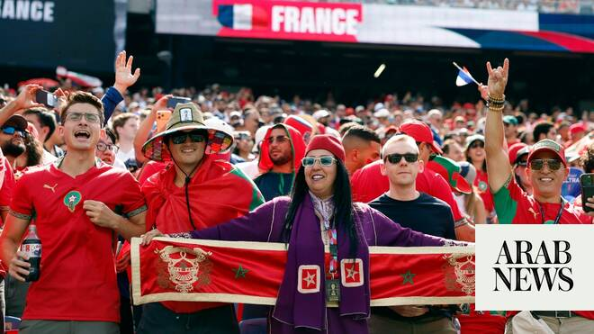

# World Cup dreams over, but Egypt and Morocco have made Arab fans proud

Source: https://www.arabnews.com/node/2650373/sport
Captured source: https://www.arabnews.com/node/2650373/sport
Published: 2026-07-10T11:53:39+03:00
Modified: 2026-07-10T13:44:45+03:00
Author: John Duerden

## Summary

LONDON: The Arab challenge at the 2026 World Cup ended this week but what a moment it was. At this tournament, Morocco and Egypt have done the region proud. Just 48 hours after the Pharaohs came within minutes of eliminating defending champions Argentina in a hugely exciting and controversial game, Morocco met France, the best team in the world. Les Bleus won 2-0 in the Boston

## Image

## Video Or Embed URLs

- blob:https://www.arabnews.com/e59e6c56-5d4c-4b38-8dbc-f8939843bdac
- https://imasdk.googleapis.com/js/core/bridge3.774.0_en.html
- https://22186d03aebb66353b374caee7e9a12b.safeframe.googlesyndication.com/safeframe/1-0-45/html/container.html
- https://static.addtoany.com/menu/sm.25.html
- about:blank
- https://www.google.com/recaptcha/api2/aframe
- https://cm.g.doubleclick.net/partnerpixels?gdpr=0&us_privacy=1---&gpp_sid=-1&url=https%3A%2F%2Fwww.arabnews.com%2Fnode%2F2650373%2Fsport

## Downloaded Video

- [03_world-cup-dreams-over-but-egypt-and-morocco-have-made-arab-fans-proud.mp4](../../../rendered-clips/2026-07-10/03_world-cup-dreams-over-but-egypt-and-morocco-have-made-arab-fans-proud.mp4)

## Text

https://arab.news/ge8n6

Runs by the Pharaohs and Atlas Lions prompted celebrations around the region but came to an end this week against the finalists from 4 years ago, Argentina and France

LONDON: The Arab challenge at the 2026 World Cup ended this week but what a moment it was. At this tournament, Morocco and Egypt have done the region proud.

For the latest updates, follow us @ArabNewsSport

Just 48 hours after the Pharaohs came within minutes of eliminating defending champions Argentina in a hugely exciting and controversial game, Morocco met France, the best team in the world. Les Bleus won 2-0 in the Boston sunshine on Thursday but the Atlas Lions have confirmed their status as a new powerhouse.

Morocco reached the last four in 2022 to be defeated by the French and the same happened this time at the quarterfinal stage. Now though, the two teams met as respected rivals.

The Reds shocked the world in Qatar by knocking out Spain and Portugal but now there is no doubt they are one of the big boys. That was shown in the 1-1 draw with Brazil in the opening game when Brazil were as satisfied as the Africans who then knocked out the Netherlands and eased past co-hosts Canada.

In truth, France were a level above, as they have been with everyone in this tournament. Bayern Munich midfielder Ismael Saibari was injured and a huge miss but even a full-strength team from any nation would struggle to stop a devastating attacking lineup of Kylian Mbappe, Ousmane Dembele, Desire Doue and Michael Olise.

Egypt’s World Cup may have ended in controversy with many feeling that Argentina were favored by the referee and the VAR team, but when the dust settles and emotions calm down, the overwhelming feeling should be pride. The Pharaohs gave 120 million of their compatriots three unforgettable weeks.

That game against Argentina was a classic. Egypt went toe-to-toe with the defending champions, with the mighty Lionel Messi, and took the lead. And then, in the second half, scored one of the best team goals you will ever see.

It was disallowed for a foul near Egypt’s penalty area. That has been the subject of much outrage but it should not be forgotten that soon after, the team did the same again. It was an astonishing example of what happens when you attack the big boys. Messi was in tears at the end. Those tears could easily have been tears of sadness.

In three previous appearances on the global stage, in 1938, 1990 and 2018, Egypt had failed to win a single game so it goes without saying that there had been no knockout stage appearance.

The Curse of the Pharaohs has been well and truly broken. It started with a 1-1 draw with Belgium, the top seeds of the group. Then came the long-awaited first victory, that 3-1 win against New Zealand. That sealed the place in the Round of 32 and after the draw with Iran came the dramatic penalty shootout victory against Australia.

Arab football fans, especially in Palestine and Libya, came out to watch the games. Egypt had made next to no impact on previous World Cups but that has not been the case this time. It is not just about Mohamed Salah. New stars have been created who are now known around the world, including Haissem Hassan, Mostafa Ziko and Mostafa Shobeir.

The World Cup has shown that fortune favors the brave. Teams that sit back and defend deep have tended to lose, though it is hard to do anything else against the French. Saudi Arabia, for example, should have been more aggressive in their games and then, perhaps the Green Falcons, may have joined their Arab rivals in the knockout stages.

There are other lessons too. Teams that export players to the best European leagues looked better equipped when the pressure was on at the World Cup. The likes of Qatar, Jordan and Iraq made mistakes at crucial moments against good teams and then, suddenly, the game was gone.

Morocco are the region’s best but also have a government that invests and sporting institutions that focus on the long-term. No doubt this team will be a contender on home soil in 2030.

Egypt have shown what they can do and need to keep moving forward. Some of their domestic-based standouts will surely be heading to Europe soon (Hassan is already there and is the subject of a lot of interest).

The challenge is to keep producing good young players at home to replace those departed stars and a virtuous cycle starts. Coaching education, facilities and working with private sectors are also crucial.

That is for the future as the feeling right now should be pride. The 2026 World Cup was a mixed bag for Arab fans but it ended with a bang and with two teams playing at the very highest level and earning the respect of tens of millions.
