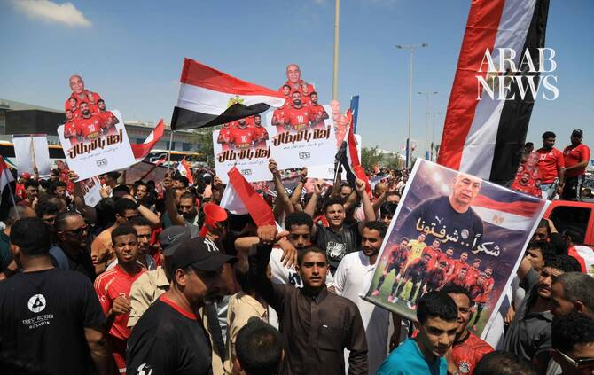

# Hundreds welcome Salah’s Egypt home after best World Cup run

Source: https://www.arabnews.com/node/2650403/sport
Captured source: https://www.arabnews.com/node/2650403/sport
Published: 2026-07-10T16:37:02+03:00
Modified: 2026-07-10T16:47:35+03:00
Author: AFP

## Summary

El Alamein, Egypt: Hundreds of euphoric supporters welcomed home Egypt’s national football team on Friday after the country’s best-ever performance at the World Cup, which ended with a thrilling last-16 exit to Argentina. A sea of fans dressed in red, white and black filled the grounds outside the airport in El-Alamein, where the Pharaohs boarded an open-top bus for a parade

## Image

## Video Or Embed URLs

- blob:https://www.arabnews.com/6b014441-964f-4ed5-a00b-8cf6902a625c
- https://imasdk.googleapis.com/js/core/bridge3.774.0_en.html
- https://4739ae3cf3acbb41a92b928d4b6dbfe9.safeframe.googlesyndication.com/safeframe/1-0-45/html/container.html
- about:blank
- https://static.addtoany.com/menu/sm.25.html
- https://www.google.com/recaptcha/api2/aframe
- https://cm.g.doubleclick.net/partnerpixels?gdpr=0&us_privacy=1---&gpp_sid=-1&url=https%3A%2F%2Fwww.arabnews.com%2Fnode%2F2650403%2Fsport

## Downloaded Video

- [03_hundreds-welcome-salah-s-egypt-home-after-best-world-cup-run.mp4](../../../rendered-clips/2026-07-12/03_hundreds-welcome-salah-s-egypt-home-after-best-world-cup-run.mp4)

## Text

https://arab.news/zukpx

El Alamein, Egypt: Hundreds of euphoric supporters welcomed home Egypt’s national football team on Friday after the country’s best-ever performance at the World Cup, which ended with a thrilling last-16 exit to Argentina. For the latest updates, follow us @ArabNewsSport A sea of fans dressed in red, white and black filled the grounds outside the airport in El-Alamein, where the Pharaohs boarded an open-top bus for a parade through the coastal city. “We are very happy with the team,” supporter Mohamed Gehad told AFP at the airport where he had traveled to welcome the players. “Their spirit was high, and ours is high as we welcome them.” Supporters waved Egyptian flags and Palestinian flags in support of nearby Gaza, as well as a poster of coach Hossam Hossan draping both flags over himself during the tournament. Egypt achieved their first-ever World Cup win before later reaching the last 16 teams at the global spectacle for the first time after beating Australia on penalties. They were painstakingly close to achieving one of the tournament’s great upsets against Argentina, leading 2-0 with just minutes left to play before the defending champions staged an astonishing 3-2 comeback win. But fans remained in high spirits, dancing to the beat of drums, singing patriotic songs and wearing shirts bearing the name of team captain and former Liverpool forward Mohamed Salah. Others held handwritten banners reading: “You made us proud, men.” “They reached a stage they had never reached before and we are proud of them,” another fan Eyad Ahmed told AFP.

For the latest updates, follow us @ArabNewsSport

As the team’s bus pulled away from the airport, flags rippled above the crowd and supporters surged alongside the vehicle until it disappeared from view. “I’ll do everything in my power to ensure this is a new beginning for Egyptian football on the international stage,” Salah wrote on social media during the celebrations. The players are expected to meet President Abdel Fattah El-Sisi on Saturday, who on social media thanked the team for its “honorable performance.” The Egyptian Football Association has also lodged a complaint against the officiating team from Tuesday’s match, with coach Hassan accusing officials of injustice despite FIFA refereeing chief Pierluigi Collina rejecting what he called “unfounded allegations.” Hassan drew praise in Gaza after waving a Palestinian flag on the pitch following Egypt’s victory over Australia and dedicating the win to the Palestinian people. At his pre-match press conference on Monday, Hassan said the suffering of the Palestinian people was a “shame on the world” as he called on football to do more to come to their aid. During the tournament, thousands of Palestinians gathered in makeshift cafes set up inside tents or built from corrugated metal salvaged from damaged buildings to watch Egypt’s matches.
