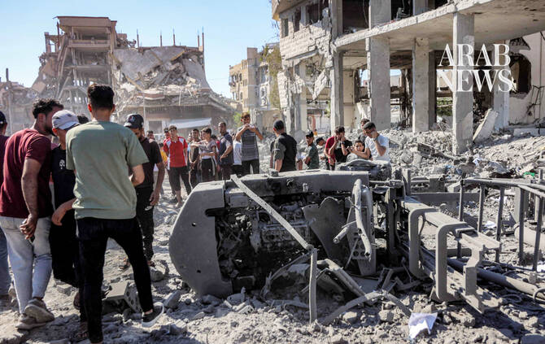

# EU, partners launch $1 billion scheme to help Gaza recover from war

Source: https://www.arabnews.com/node/2650716/middle-east
Captured source: https://www.arabnews.com/node/2650716/middle-east
Published: 2026-07-13T16:40:04+03:00
Modified: 2026-07-13T22:01:33+03:00
Author: ReutersWAFA

## Summary

BRUSSELS: The European Commission and more than a dozen countries launched an initiative on Monday to deliver €883.6 million ($1 ​billion) in aid projects to help Gaza recover from war. The small coastal enclave remains in ruins more than 2-1/2 years after the conflict was triggered by the October 2023 attack. A fragile ceasefire has been in place since last October, and ‌the

## Image

## Video Or Embed URLs

- blob:https://www.arabnews.com/97961dba-b774-4bdc-bf8e-1acb32ae6852
- https://imasdk.googleapis.com/js/core/bridge3.776.0_en.html
- https://67a3e66b6df32ad15e48930a5504ffe8.safeframe.googlesyndication.com/safeframe/1-0-45/html/container.html
- https://static.addtoany.com/menu/sm.25.html
- about:blank
- https://sync.teads.tv/wigo-no-slot
- https://www.google.com/recaptcha/api2/aframe
- https://cm.g.doubleclick.net/partnerpixels?gdpr=0&us_privacy=1---&gpp_sid=-1&url=https%3A%2F%2Fwww.arabnews.com%2Fnode%2F2650716%2Fmiddle-east

## Downloaded Video

- [03_eu-partners-launch-1-billion-scheme-to-help-gaza-recover-from-war.mp4](../../../rendered-clips/2026-07-14/03_eu-partners-launch-1-billion-scheme-to-help-gaza-recover-from-war.mp4)

## Text

https://arab.news/ygb4g

Funds would be used to clear debris left from Israel’s military offensive and rebuild basic services such as water and sanitation

PM Mohammed Mustafa stresses need to force Israel to release withheld Palestinian tax revenues

BRUSSELS: The European Commission and more than a dozen countries launched an initiative on Monday to deliver €883.6 million ($1 ​billion) in aid projects to help Gaza recover from war. The small coastal enclave remains in ruins more than 2-1/2 years after the conflict was triggered by the October 2023 attack. A fragile ceasefire has been in place since last October, and ‌the UN ‌has estimated the cost of ​rebuilding ‌work ⁠in ​Gaza at ⁠around $70 billion. The “Team Gaza Initiative,” launched at a meeting of aid donors in Brussels, will support projects such as restoring water and sanitation, removing debris and re-establishing health systems, the Commission said in a statement. Spain, Denmark, Britain, Germany, Norway, Finland, Italy, the Netherlands, France, ⁠Japan, Switzerland, Sweden and Belgium, the World ‌Bank and the European ‌Investment Bank are taking part in ​the initiative, along with ‌the commission itself, the statement said. Australia and ‌Canada were also expected to join. “Our objective is clear: to help build hope, resilience and a better future for the Palestinian people,” said Dubravka Suica, the European Commissioner ‌for the Mediterranean. The European Commission did not provide a breakdown of how much ⁠each ⁠partner would contribute to the new initiative. Israel’s devastating aerial and ground bombardment of Gaza displaced nearly the entire population of 2 million people, most of whom now live in tents or damaged buildings in a greatly reduced coastal strip of territory governed by Hamas. Israeli troops control nearly 70 percent of Gaza, patrolling what Prime Minister Benjamin Netanyahu describes as a buffer zone to deter Hamas attacks. ​ Netanyahu says Israel ​will not withdraw from the territory. Palestinian Prime Minister Mohammed Mustafa held talks in Brussels with the EU High Representative for Foreign Affairs and Security Policy and Vice President of the European Commission, Kaja Kallas, on the latest political developments and the situation on the ground in the Gaza Strip and the West Bank, including Jerusalem. The prime minister stressed the need to increase international pressure on Israel to release the withheld Palestinian tax revenues to enable the government to fulfill its obligations toward the Palestinian people and continue providing essential services. He also rejected any arrangements that undermine Palestinian financial rights. Mustafa briefed Kallas on the dangerous escalation in the West Bank, particularly settlers’ attacks and acts of violence against Palestinians, including attacks on villages and communities, which have reached unprecedented levels. Finance Minister Estefan Salameh, Palestine’s Ambassador to Belgium, Luxembourg, and the EU, Amal Jadou Shakaa, and Undersecretary of the Ministry of Foreign Affairs and Expatriates for Political Affairs, Ambassador Omar Awadallah, attended the meeting.
