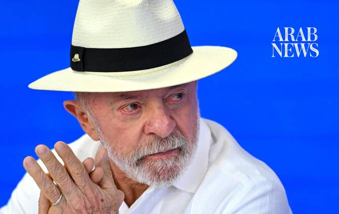

# Brazil’s Lula calls US plan for Hormuz fee ‘piracy’

Source: https://www.arabnews.com/node/2650804/world
Captured source: https://www.arabnews.com/node/2650804/world
Published: 2026-07-14T11:15:40+03:00
Modified: 2026-07-14T11:19:59+03:00
Author: AFP

## Summary

RIO DE JANEIRO, Brazil: Brazilian President Luiz Inacio Lula da Silva said Monday that plans by President Donald Trump to impose hefty fees on ships transiting the Strait of Hormuz would turn the United States into a “pirate” state. Trump vowed earlier to reinstate a blockade of Iran’s ports on the strait and slap a levy of 20 percent on all cargo shipped through Hormuz in

## Image

## Video Or Embed URLs

- blob:https://www.arabnews.com/759478a5-61c7-4007-82c3-990e1c688c17
- https://imasdk.googleapis.com/js/core/bridge3.776.0_en.html
- https://34bbc7165925187455bee19fab675bba.safeframe.googlesyndication.com/safeframe/1-0-45/html/container.html
- https://static.addtoany.com/menu/sm.25.html
- about:blank
- https://sync.teads.tv/wigo-no-slot
- https://www.google.com/recaptcha/api2/aframe
- https://cm.g.doubleclick.net/partnerpixels?gdpr=0&us_privacy=1---&gpp_sid=-1&url=https%3A%2F%2Fwww.arabnews.com%2Fnode%2F2650804%2Fworld

## Downloaded Video

- [03_brazil-s-lula-calls-us-plan-for-hormuz-fee-piracy.mp4](../../../rendered-clips/2026-07-14/03_brazil-s-lula-calls-us-plan-for-hormuz-fee-piracy.mp4)

## Text

https://arab.news/9mhbt

Donald Trump vowed earlier to reinstate a blockade of Iran’s ports on the Strait of Hormuz

He also said the US would slap a levy of 20 percent on all cargo shipped through Hormuz

RIO DE JANEIRO, Brazil: Brazilian President Luiz Inacio Lula da Silva said Monday that plans by President Donald Trump to impose hefty fees on ships transiting the Strait of Hormuz would turn the United States into a “pirate” state. Trump vowed earlier to reinstate a blockade of Iran’s ports on the strait and slap a levy of 20 percent on all cargo shipped through Hormuz in order to pay for keeping the narrow waterway open. Tehran started blocking the key conduit for petroleum shipments after the US and Israel launched attacks in late February, which prompted Washington to stop the shipping to and from Iranian ports. Those restrictions were eased after the two sides in June reached an interim agreement on ending the war, but Trump has vowed to snap them back after a fresh flare-up in fighting. Speaking at a public event in Sao Paulo state, Lula said: “President Trump tweeted that he will unblock the Strait of Hormuz. But for every ship unblocked, every ship removed from the strait, the oil owner must pay him 20 percent. “This used to be considered piracy,” Lula said. “A major nation like the United States, which I believe has fought against piracy for a long time, cannot now become a pirate,” he added, warning that the conflict was driving up the prices of basic foodstuffs in Brazil including beans, rice, tomatoes and onions, as well as fuel. Brazil’s 80-year-old veteran leftist leader is seeking a fourth term as president in October elections. His government announced a range of temporary measures to limit fuel price increases after the Iran war caused global oil prices to surge. Lula said revenues from a 12 percent tax on crude oil exports introduced in March were being used to mitigate the impact of the price hikes.
