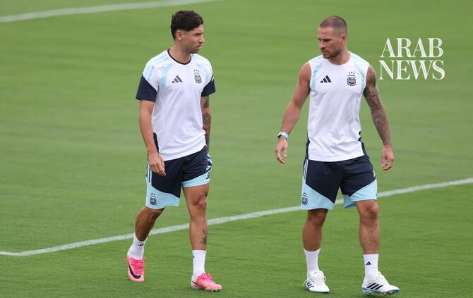

# England lacking Premier League physicality, says Mac Allister

Source: https://www.arabnews.com/node/2650908/sport
Captured source: https://www.arabnews.com/node/2650908/sport
Published: 2026-07-15T12:28:13+03:00
Modified: 2026-07-15T12:30:02+03:00
Author: Reuters

## Summary

ATLANTA: England have not ‌played with the same intensity that their players display week in and week out in the Premier League, but Argentina’s Alexis Mac Allister remains wary of the physical strength they will bring to Wednesday’s World Cup semifinal. The 27-year-old has played six seasons in the Premier League, winning the title with Liverpool last year, and said he had

## Image

## Video Or Embed URLs

- blob:https://www.arabnews.com/8ea2bd6c-1768-400b-a0d2-54788dc51c71
- https://imasdk.googleapis.com/js/core/bridge3.776.0_en.html
- https://c001eca59dcbff0373841991f3d943f5.safeframe.googlesyndication.com/safeframe/1-0-45/html/container.html
- https://static.addtoany.com/menu/sm.25.html
- about:blank
- https://sync.teads.tv/wigo-no-slot
- https://www.google.com/recaptcha/api2/aframe
- https://cm.g.doubleclick.net/partnerpixels?gdpr=0&us_privacy=1---&gpp_sid=-1&url=https%3A%2F%2Fwww.arabnews.com%2Fnode%2F2650908%2Fsport

## Downloaded Video

- [03_england-lacking-premier-league-physicality-says-mac-allister.mp4](../../../rendered-clips/2026-07-15/03_england-lacking-premier-league-physicality-says-mac-allister.mp4)

## Text

https://arab.news/p7w3c

“I play against most of them every weekend and it’s ‌clear they’re physically ‌very strong,” Mac Allister said

“It’s clear that the mental side is extremely important. I think, for us and for footballers in general, the mind is the most important thing”

ATLANTA: England have not ‌played with the same intensity that their players display week in and week out in the Premier League, but Argentina’s Alexis Mac Allister remains wary of the physical strength they will bring to Wednesday’s World Cup semifinal. For the latest updates, follow us @ArabNewsSport The 27-year-old has played six seasons in the Premier League, winning the title with Liverpool last year, and said he had noticed a difference in the potency of the English side at the World Cup in Canada, Mexico and the United States. “I play against most of them every weekend and it’s ‌clear they’re physically ‌very strong,” he said on Tuesday as ‌Argentina ⁠fine-tuned for the ⁠clash against England at the Atlanta Stadium. “That said, I think during this World Cup we’ve seen — I don’t know if I’d call it fatigue or not — but they haven’t played with the same intensity that characterises the Premier League. “I don’t know if that’s because of the heat, the weather or other factors, but they’re obviously ⁠a great team. We have enormous respect for ‌them, just as we have for ‌every national team we’ve faced.” Mac Allister said the battle against England ‌might, however, be won as much with the mind as with ‌the physical confrontation. “It’s clear that the mental side is extremely important. I think, for us and for footballers in general, the mind is the most important thing,” he said. “Obviously, there are tactical and footballing aspects ‌that define the sport, but the most important thing is combining those two. “We have great confidence ⁠in ourselves. ⁠We know exactly what we’re doing, and we’re not going to change our approach.” Argentina have already had some tight battles to get to the last four, squeezing past upstarts Cape Verde in the last-32, coming from 2-0 down to edge Egypt in the last-16 and needing extra time to dispose of 10-man Switzerland in the quarter-finals. “It’s true that perhaps we’ve suffered a little more than we would have liked, but that’s the World Cup. It always happens because there are great national teams,” Mac Allister added. “I expect tomorrow’s match to be played with great intensity and, of course, with a lot of nerves on all sides.”

For the latest updates, follow us @ArabNewsSport
