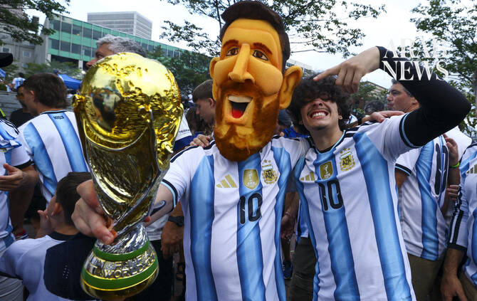

# Argentina and England collide with World Cup final spot at stake

Source: https://www.arabnews.com/node/2650952/sport
Captured source: https://www.arabnews.com/node/2650952/sport
Published: 2026-07-15T11:56:03+03:00
Modified: 2026-07-15T11:56:29+03:00
Author: AFP

## Summary

ATLANTA: Lionel Messi’s Argentina clash with England in a marquee World Cup semifinal on Wednesday, with Spain lying in wait after shattering French hopes of a third triumph. The fixture between two of the big beasts of global football is mouthwatering enough but is given added spice by long-standing political tensions. Lionel Scaloni’s Argentina are seeking to become the

## Image

## Video Or Embed URLs

- blob:https://www.arabnews.com/b47ae4fe-ffef-44ab-826f-9c29e8963e45
- https://imasdk.googleapis.com/js/core/bridge3.776.0_en.html
- https://8cd1109b8cff202104459d14305e4528.safeframe.googlesyndication.com/safeframe/1-0-45/html/container.html
- https://static.addtoany.com/menu/sm.25.html
- about:blank
- https://sync.teads.tv/wigo-no-slot
- https://www.google.com/recaptcha/api2/aframe
- https://cm.g.doubleclick.net/partnerpixels?gdpr=0&us_privacy=1---&gpp_sid=-1&url=https%3A%2F%2Fwww.arabnews.com%2Fnode%2F2650952%2Fsport

## Downloaded Video

- [03_argentina-and-england-collide-with-world-cup-final-spot-at-stake.mp4](../../../rendered-clips/2026-07-15/03_argentina-and-england-collide-with-world-cup-final-spot-at-stake.mp4)

## Text

https://arab.news/m4y9x

The fixture between two of the big beasts of global football is mouthwatering enough

Three-time champions Argentina will be taking on a different class of opponent in Atlanta

ATLANTA: Lionel Messi’s Argentina clash with England in a marquee World Cup semifinal on Wednesday, with Spain lying in wait after shattering French hopes of a third triumph. For the latest updates, follow us @ArabNewsSport The fixture between two of the big beasts of global football is mouthwatering enough but is given added spice by long-standing political tensions. Lionel Scaloni’s Argentina are seeking to become the first team since Brazil in 1962 to win back-to-back World Cups, which would be a staggering send-off for the incomparable Messi. The 39-year-old, joint top of the Golden Boot standings with eight goals, inspired his team to victory in Qatar in 2022 in what was expected to be his final hurrah on football’s biggest stage.

For the latest updates, follow us @ArabNewsSport

But he is back for more and has played a pivotal role in dragging his team to the semifinals, scoring in hard-fought 3-2 victories against Cape Verde and Egypt. Three-time champions Argentina will be taking on a different class of opponent in Atlanta compared with teams they have faced so far, even if England have only sparkled intermittently. Thomas Tuchel’s men have relied on the brilliance of Harry Kane and Jude Bellingham, who have scored 12 of England’s 13 goals. The sides will meet for the first time in a competitive match since the 2002 World Cup. Tuchel said he did not feel extra pressure despite the historic nature of the fixture as England target a first World Cup final since they won the tournament in 1966. “I don’t feel a burden,” he said. “We feel the tension and will be nervous but that is normal. “What I like is that I feel the players are really competitive, hungry and excited to play this match.” The German added that midfielder Declan Rice, who has been struggling with illness, was fit to start. Drama The history of the fixture is littered with drama. Their most storied World Cup encounter was a 2-1 victory for Argentina in the quarter-finals in Mexico in 1986, featuring two goals from Diego Maradona — one the infamous “Hand of God” goal and the other a dazzling solo effort. Twelve years later David Beckham was sent off in France as Argentina won on penalties. Matches between the teams take place against the backdrop of a lingering sovereignty dispute over the Falkland Islands, known in Spanish as the Malvinas, in the South Atlantic Ocean. Britain sent a military taskforce in 1982 to reclaim the islands after Argentine troops invaded. Argentina boss Lionel Scaloni has in recent days sought to take the sting out of the fixture. “The reality is this is a football match,” he said. “I am not going to mix everything up, especially regarding things that happened so long ago. “It was a very sad time in our history and we can’t do much about it. This is a football game, that’s all.” The two teams — both ranked by FIFA in the world’s top four — are competing for the right to face Spain in Sunday’s final in New Jersey. Luis de la Fuente’s team produced a masterclass in Arlington, Texas, on Tuesday to dispatch hot-shots France, who were widely tipped to win the World Cup for a third time after their swaggering attacking displays. But European champions Spain produced a clinical performance to ensure France manager Didier Deschamps would end his World Cup career with defeat. Mikel Oyarzabal opened the scoring for the 2010 winners with an emphatic penalty in the first half and Pedro Porro doubled their lead in the second half. “We started almost four years ago with an idea and we’ve been faithful to that idea and it’s brought us here,” said De la Fuente. “These players deserve everything,” he added. “Day after day they’ve shown their commitment, their solidarity, their generosity, their talent. They make the difficult look easy.”
