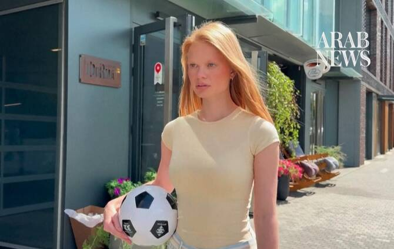

# Russian Haaland lookalike says viral video felt ‘like a dream’

Source: https://www.arabnews.com/node/2650978/offbeat
Captured source: https://www.arabnews.com/node/2650978/offbeat
Published: 2026-07-15T14:41:29+03:00
Modified: 2026-07-15T14:43:11+03:00
Author: AFP

## Summary

MOSCOW: Friends and family have for a few years told Russian model Anastasia Kostromina that she looked like Norwegian striker Erling Haaland, but it was not until he became the World Cup’s superstar that she decided to take that online. Earlier this month, she posted a video on Instagram highlighting the resemblance to Haaland — both in looks and mimicking some of his

## Image

## Video Or Embed URLs

- blob:https://www.arabnews.com/3ff17c45-e5c7-45dd-bc05-804267bc6084
- https://imasdk.googleapis.com/js/core/bridge3.776.0_en.html
- https://aa71feabdccf4ec3d229a248766664ed.safeframe.googlesyndication.com/safeframe/1-0-45/html/container.html
- https://static.addtoany.com/menu/sm.25.html
- about:blank
- https://sync.teads.tv/wigo-no-slot
- https://www.google.com/recaptcha/api2/aframe
- https://cm.g.doubleclick.net/partnerpixels?gdpr=0&us_privacy=1---&gpp_sid=-1&url=https%3A%2F%2Fwww.arabnews.com%2Fnode%2F2650978%2Foffbeat

## Downloaded Video

- [03_russian-haaland-lookalike-says-viral-video-felt-like-a-dream.mp4](../../../rendered-clips/2026-07-15/03_russian-haaland-lookalike-says-viral-video-felt-like-a-dream.mp4)

## Text

https://arab.news/nvygt

Russian model Anastasia Kostromina posted a video on Instagram highlighting the resemblance to Norwegian striker Erling Haaland

Haaland has been the social media sensation of the World Cup, with the Manchester City player now counting 68.8 million followers

MOSCOW: Friends and family have for a few years told Russian model Anastasia Kostromina that she looked like Norwegian striker Erling Haaland, but it was not until he became the World Cup’s superstar that she decided to take that online. Earlier this month, she posted a video on Instagram highlighting the resemblance to Haaland — both in looks and mimicking some of his now-trademark mannerisms and distinctive facial expressions. It soon spiraled and gathered 6.4 million likes. “At first, I did not even know what was happening, it felt like a dream,” Kostromina told AFP in Moscow, saying she “never expected” the video to go so viral. “But I’m happy about it anyway,” the 24-year-old added. Haaland, 25, has been the social media sensation of the World Cup, with the Manchester City player now counting 68.8 million followers on social media. Haaland sparkled at the tournament scoring seven times — including a double against Brazil in their last 16 match — as Norway reached the quarter-finals only to lose 2-1 to England. Kostromina had mixed feelings when she was first told she looked like the towering male footballer — but has now embraced it. “At first, to be honest, I didn’t even understand how I could possibly resemble a male football player. But then I started to take it with a sense of humor and now I’m completely fine with it.” Naturally, she was supporting Norway in the World Cup and was sad when they lost. “I was really rooting for them and was on the edge of my seat,” she said of their last game in the competition. Russia has been mostly banned from international sport since its 2022 Ukraine offensive and did not take part in the World Cup. Kostromina — who is represented by Moscow-based Motion Model Management — hoped that Haaland will “see my video, maybe even laugh.”
